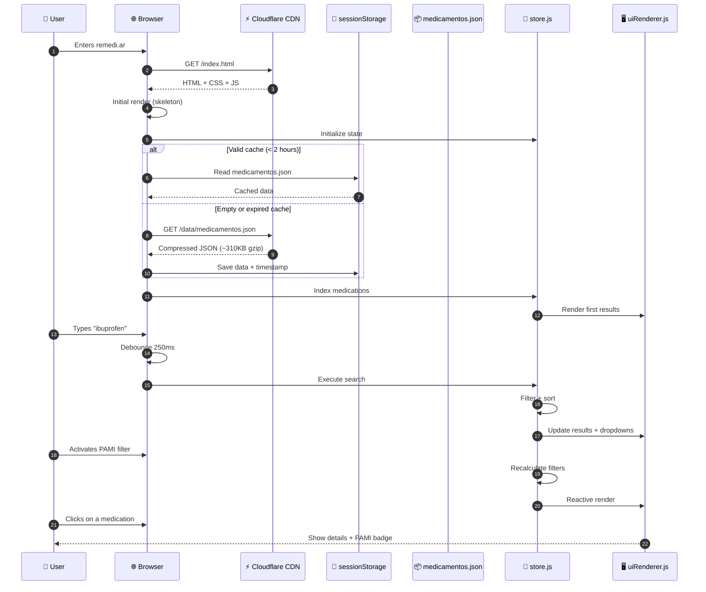
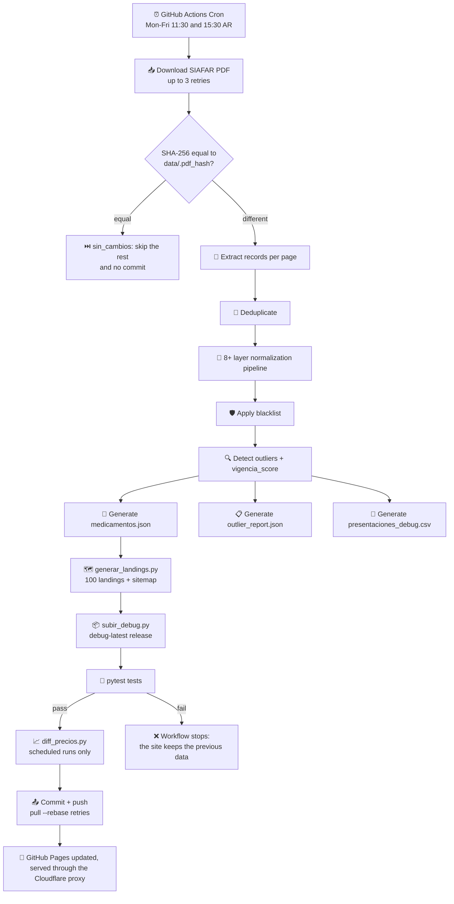
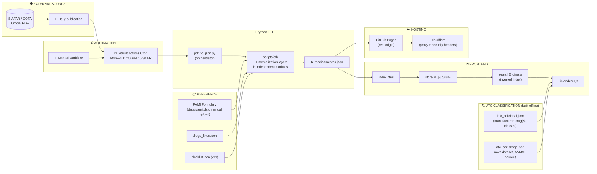
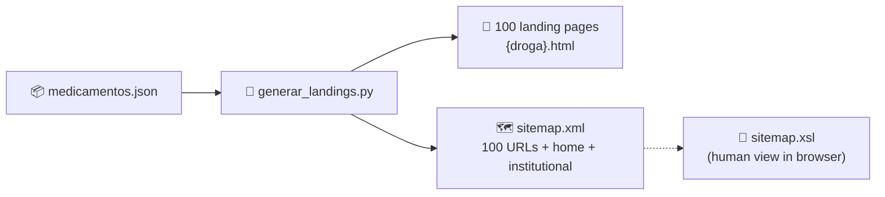
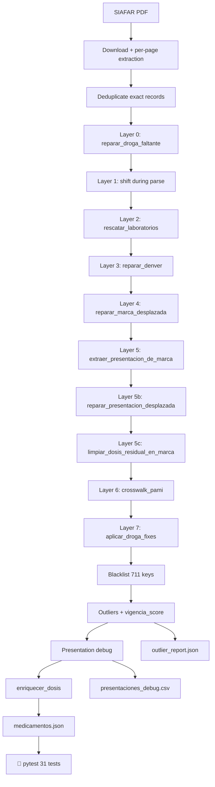
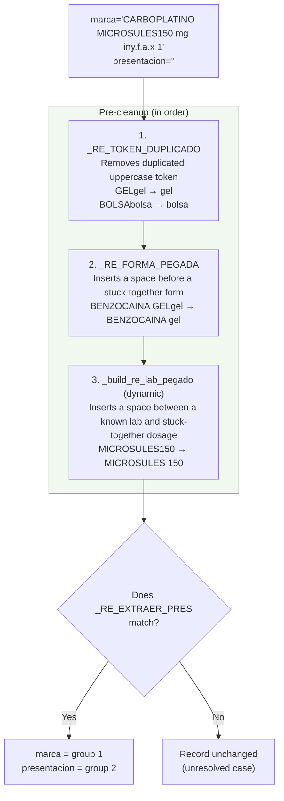
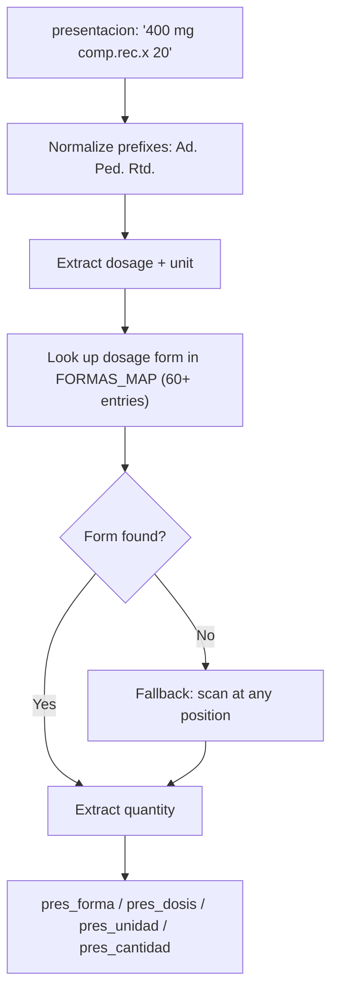
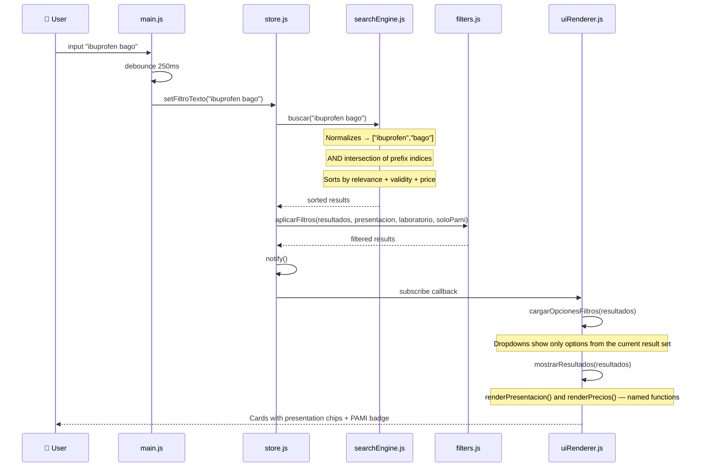
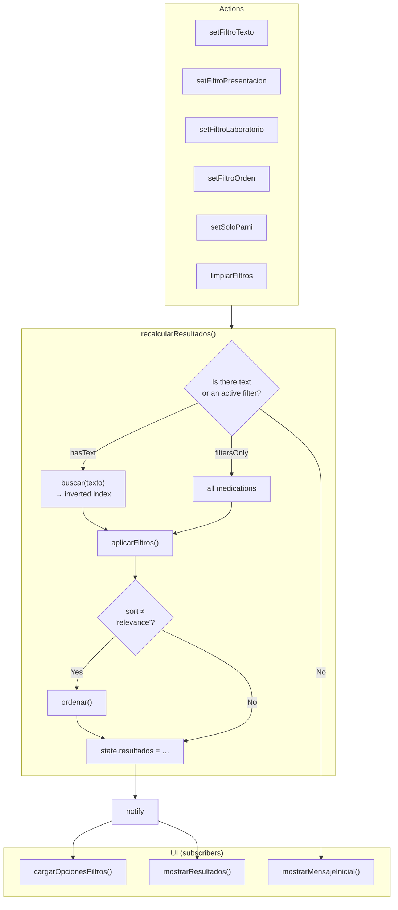
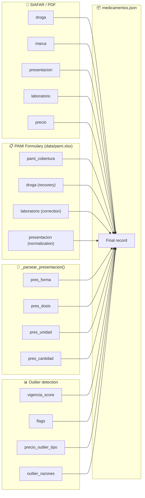

<p align="center">
  
</p>

# remedi.ar — Medication price search engine in Argentina

<p align="center">
  <strong>Medication price search engine in Argentina</strong><br>
  <em>Open source system that processes official SIAFAR/COFA/PAMI data and generates a price comparator updated automatically twice per business day.</em>
</p>

<p align="center">
  <a href="https://remedi.ar">https://remedi.ar</a> ·
  <a href="https://github.com/psbella/remediar">GitHub</a>
</p>

---

<p align="left">
<!-- Version -->


<br>
<!-- Hosting & License -->


<br>
<!-- Values -->


<br>
<!-- Frontend -->


<br>
<!-- Technologies -->


<br>
<!-- Backend / Automation -->


<br>
<!-- Data -->

<br>
<!-- Diagrams -->

<br>
<!-- Features -->


</p>

---

> 🇦🇷 **[Versión en español](./README.md)** — this is a 1:1 translation of the Spanish README. If anything looks out of sync between the two, the Spanish version is the source of truth (it's the maintainer's working language).

> **About this document:** reviewed on 2026-10-07 against version **2.5.3** of `main` (plus the "Sin publicar" entries of the [CHANGELOG](./CHANGELOG.md), which is written in Spanish). Figures were measured on the `data/medicamentos.json` generated on 2026-10-06 16:38 (Argentina time). When the code changes, this file is updated with it; when in doubt, the code wins.

---

# 📋 Table of Contents

- [✨ Live Demo](#-live-demo)
- [📊 Current Dataset](#-current-dataset)
- [🎯 General Operation](#-general-operation)
- [🧭 Project Principles](#-project-principles)
- [👤 User Flow](#-user-flow)
- [🧠 Search and Filtering Algorithm](#-search-and-filtering-algorithm)
- [🔄 Automatic Data Updates](#-automatic-data-updates)
- [📦 JSON Data Structure](#-json-data-structure)
- [⚡ Optimizations Implemented](#-optimizations-implemented)
- [⏱️ Response Times](#️-response-times)
- [🏗️ System Architecture](#️-system-architecture)
- [📁 Repository Structure](#-repository-structure)
- [🧰 Tech Stack](#-tech-stack)
- [🧠 Technical Decisions](#-technical-decisions)
- [💻 Local Execution](#-local-execution)
- [🐍 Python Scripts](#-python-scripts)
- [📊 Metrics and Performance](#-metrics-and-performance)
- [🔍 SEO and Metadata](#-seo-and-metadata)
- [🔒 Security and Privacy](#-security-and-privacy)
- [🔌 Unofficial API](#-unofficial-api)
- [👥 Contribution Guide](#-contribution-guide)
- [📊 Detailed Flow Diagrams](#-detailed-flow-diagrams)
- [🧩 Frontend Component Reference](#-frontend-component-reference)
- [🎨 CSS Style Guide](#-css-style-guide)
- [🔧 Workflow Documentation](#-workflow-documentation)
- [❓ Frequently Asked Questions (FAQ)](#-frequently-asked-questions-faq)
- [⚠️ Known Limitations](#️-known-limitations)
- [🗺️ Roadmap](#️-roadmap)
- [📄 License](#-license)
- [🙏 Data Source](#-data-source)

---

# ✨ Live Demo

| Environment | URL | Purpose |
|---|---|---|
| GitHub Pages (own domain, DNS on Cloudflare) | [remedi.ar](https://remedi.ar) | Production — hosted on GitHub |
| GitHub Pages (default domain) | [psbella.github.io/remediar](https://psbella.github.io/remediar/) | **Not a mirror:** because the repo has a [`CNAME`](./CNAME), this URL redirects to `remedi.ar` |
| Cloudflare Workers | [remediar.pablo-s-bella.workers.dev](https://remediar.pablo-s-bella.workers.dev/) | Static mirror ([`wrangler.toml`](./wrangler.toml)). Deployed **by hand** (`npx wrangler deploy`), so it may lag behind `main` |

> **Security headers:** `remedi.ar` and `www.remedi.ar` are proxied (orange cloud) on Cloudflare, with GitHub Pages as the origin. CSP, `X-Frame-Options`, and the rest of the security headers are applied via **Cloudflare Response Header Transform Rules** (dashboard), not from the repo's `_headers` file — that file is only processed by the Workers mirror. See [`_headers`](./_headers) for the detail of the replicated values.

---

---

# 📊 Current Dataset

Measured on 2026-10-07 against the run of 2026-10-06 16:38 (Argentina time).

| Metric | Value |
|---|---|
| Records | 13,129 |
| Distinct active ingredients (`droga` field) | 1,819 |
| Laboratories (distinct values, includes truncated variants from the PDF) | 198 |
| JSON size | ~3.9 MB |
| Gzip size | ~310 KB |
| With PAMI coverage | 6,890 (52.5%); coverage values present: 40, 50, 60, 80 and 100% |
| Price to verify (`vigencia_score < 50`) | 107 |
| Keys in `blacklist.json` | 711 (679 excluded in the last run) |
| Records with a parsed presentation (`pres_forma`) | 12,931 (98.5%) |
| Entries in `info_adicional.json` | 11,085 (2,855 inferred from the active ingredient) |
| Price changes in `data/historico/precios.json` | 6,970 |
| Landing pages / URLs in `sitemap.xml` | 100 / 104 |
| Updates | Twice per business day (11:30 and 15:30 Argentina time), only if SIAFAR published a different PDF |
| Automated tests | 31 (run post-ETL, before the commit) |

---

# 🎯 General Operation

The system is made up of three main layers:

## 1️⃣ Extraction and processing

- GitHub Actions runs an automated workflow twice a day (Monday to Friday: `30 14` and `30 18` UTC, i.e. 11:30 and 15:30 Argentina time)
- The official PDF is downloaded from SIAFAR / COFA (up to 3 retries). If its SHA-256 matches `data/.pdf_hash`, nothing new was published: the rest of the pipeline is skipped and nothing is committed
- Python extracts and normalizes the records through an 8+ layer pipeline
- Data is cross-referenced against the PAMI formulary (`data/pami.xlsx`, versioned and refreshed by hand roughly once a month) to enrich coverage
- `medicamentos.json` is generated

---

## 2️⃣ Distribution

- The project is 100% static
- GitHub Pages serves the content as the origin (own domain `remedi.ar` via Cloudflare DNS; the default domain `psbella.github.io/remediar` redirects to the own domain because of the `CNAME`)
- Cloudflare acts as a proxy in front of `remedi.ar`/`www.remedi.ar`: CDN, TLS, and a Transform Rule that injects the security headers (GitHub Pages doesn't support custom headers)
- An additional mirror runs on Cloudflare Workers (`remediar.pablo-s-bella.workers.dev`), serving the same static assets independently (deployed by hand, not from the workflow)
- There's no persistent backend or database

---

## 3️⃣ SPA Frontend

- `index.html` loads the application
- Data is downloaded once and indexed in memory
- Search happens entirely client-side
- UI state is reactive via `store.js` (pub/sub pattern)

---

# 🧭 Project Principles

- Free access to medication information
- No advertising
- Usage analytics with Google Analytics 4 (first-party cookies, no personal data and no advertising)
- Performance first
- Mobile first
- Open source
- Simple and transparent infrastructure
- Public, auditable data

---

# 👤 User Flow



---

# 🧠 Search and Filtering Algorithm

## Initial indexing

`searchEngine.js` builds a prefix inverted index over `droga` (drug), `marca` (brand) and `laboratorio` (lab). For every token of 2 or more characters, all of its prefixes are generated, mapped to sets of indices in the medications array.

```javascript
for (const palabra of txt.split(/\s+/)) {
    for (let k = 2; k <= palabra.length; k++) {
        const pref = palabra.slice(0, k);
        if (!indice[pref]) indice[pref] = new Set();
        indice[pref].add(i);
    }
}
```

The search performs an AND intersection across all entered terms — "ibuprofen bago" returns only records that contain both tokens.

---

## Relevance ranking

Results are sorted by three cascading criteria:

1. **Text relevance** — score based on the field where the match occurs:

| Match | Score |
|---|---|
| Exact drug | +100 |
| Drug starts with the term | +80 |
| Drug contains the term | +50 |
| Exact brand | +40 |
| Brand starts with the term | +25 |
| Brand contains the term | +15 |
| Lab contains the term | +5 |

2. **vigencia_score** (validity score) — reliable-priced products first
3. **price** — ascending as a final tiebreaker

Records with `vigencia_score < 50` always go to the bottom, regardless of the relevance score: in the code, that split is the **first** comparison of the sort. With several terms, text relevance is computed from the **first term**; the others only narrow the set (AND intersection).

The list is shown capped at **300 cards**; the counter shows the real total.

---

# 🔄 Automatic Data Updates

## Workflow



---

## Normalization pipeline (8+ layers)

The parser applies cascading corrections to resolve the structural issues in the SIAFAR PDF:

| Layer | Function | Description |
|---|---|---|
| 0 | `reparar_droga_faltante()` | When the PDF omits the active-ingredient line, all fields shift. Splits merged drug+brand using a dictionary of truncated prefixes |
| 1 | Detection during parse | Detects records with 4 fields instead of 5 during PDF extraction |
| 2 | `rescatar_laboratorios()` | Recovers `laboratorio="Desconocido"` (Unknown) by looking for the lab as a suffix in `presentacion` |
| 3 | `reparar_denver()` | Denver Farma uses drug+lab as the brand name; splits merged brand and presentation (DENCR., DF variants) |
| 4 | `reparar_marca_desplazada()` | When `marca` starts with a digit and `presentacion` is empty, reverses the shift |
| 5 | `extraer_presentacion_de_marca()` | Extracts the presentation merged into the brand field. Before the cut regex: (1) splits labs stuck together without a space (`_build_re_lab_pegado()`, dynamic per dataset); (2) splits dosage forms stuck together (`_RE_FORMA_PEGADA`); (3) removes uppercase+lowercase duplicates (`_RE_TOKEN_DUPLICADO`) |
| 5b | `reparar_presentacion_desplazada()` | Splits presentation+lab merged in the lab field (3 sub-patterns: 2A, 2B, 2C) |
| 5c | `limpiar_dosis_residual_en_marca()` | Cleans the numeric dosage left stuck to the lab name in `marca` |
| 6 | `crosswalk_pami()` | Cross-references against the PAMI formulary (`data/pami.xlsx`, versioned and uploaded by hand when PAMI updates it; if the file is missing, the crosswalk is skipped with a log warning): recovers empty drug, corrects lab, normalizes `presentacion`, adds `pami_cobertura` (discards values outside 0-100). Matches by brand+presentation, by dose/quantity and by base brand + dose |
| 7 | `aplicar_droga_fixes()` | Applies manual corrections from `data/droga_fixes.json` |

> **Actual execution order** in `pdf_to_json.py`: download → parsing (Layer 1) → deduplication of exact records → Layer 0 → 2 → 3 → 4 → 5 → 5b → 5c → 6 → 7 → blacklist → `calcular_vigencia` → presentation debug → `enriquecer_dosis` (adds `pres_forma`, `pres_dosis`, `pres_unidad`, `pres_cantidad`, with dose rescues from the brand and from PAMI) → persistence. Layer 1 is the 4-field line detection that happens inside parsing (`parser.py`).
>
> Each of these functions lives in its own module inside `scripts/etl/` (see [`scripts/etl/` Package](#scriptsetl-package-normalization-layers)); `pdf_to_json.py` only orchestrates the execution order.

---

## Outliers and `vigencia_score`

Thresholds live in `scripts/etl/config.py` (`OUTLIER_CONFIG`). Only **abnormally low** prices are detected:

| Condition | Flag | `vigencia_score` | `precio_outlier_tipo` |
|---|---|---|---|
| Invalid price or ≤ 0 | `precio_obsoleto` | 20 | `invalido` |
| Price < ARS 1,800 | `precio_bajo` | ≤ 45 | `bajo_absoluto` |
| Price < 10% of its drug's median | `precio_obsoleto` | 20 | `bajo_critico` |
| Drug with ≥ 3 records and price < 25% of the median | `precio_sospechoso` | ≤ 35 | `bajo_relativo` |
| Drug with ≥ 3 records and price below the Tukey fence (Q1 − 1.5·IQR) | `precio_sospechoso` | ≤ 40 | `bajo_iqr` |
| Price per unit < 20% of the drug+brand group median | `precio_sospechoso` | ≤ 35 | `inconsistencia_escala` |

A record with no anomalies has `vigencia_score = 100`. In the frontend, `< 50` means "price to verify".

---

## GitHub Actions Workflow

`.github/workflows/actualizar-precios.yml`, as it is on `main`:

```yaml
name: 🔃 Actualizar precios
on:
  schedule:
    - cron: '30 14 * * 1-5'  # 11:30 Argentina
    - cron: '30 18 * * 1-5'  # 18:30 Argentina
  workflow_dispatch:

permissions:
  contents: write

concurrency:
  group: repo-main-write
  cancel-in-progress: false

jobs:
  update:
    runs-on: ubuntu-latest
    timeout-minutes: 15
    steps:
      - name: Checkout
        uses: actions/checkout@3d3c42e5aac5ba805825da76410c181273ba90b1 # v7
      - name: Setup Python
        uses: actions/setup-python@5fda3b95a4ea91299a34e894583c3862153e4b97 # v7.0.0
        with:
          python-version: '3.11'
          cache: 'pip'
      - name: Instalar dependencias
        run: pip install -r requirements.txt
      - name: Ejecutar pdf_to_json.py
        id: pdf_to_json
        run: python scripts/pdf_to_json.py
      - name: Generar landings + sitemap
        if: steps.pdf_to_json.outputs.sin_cambios != 'true'
        run: python scripts/generar_landings.py
      - name: Subir debug a GitHub Releases
        if: steps.pdf_to_json.outputs.sin_cambios != 'true'
        env:
          GITHUB_TOKEN: ${{ secrets.GITHUB_TOKEN }}
        run: python scripts/subir_debug.py
      - name: Verificar sanidad del output
        if: steps.pdf_to_json.outputs.sin_cambios != 'true'
        run: pytest tests/ -v
      - name: Diff de precios
        if: github.event_name == 'schedule' && steps.pdf_to_json.outputs.sin_cambios != 'true'
        env:
          GITHUB_TOKEN: ${{ secrets.GITHUB_TOKEN }}
        run: python scripts/diff_precios.py
      - name: Commit y push
        if: steps.pdf_to_json.outputs.sin_cambios != 'true'
        run: |
          git config user.name "github-actions[bot]"
          git config user.email "actions@github.com"
          git add data/medicamentos.json
          git add data/historico/precios.json
          git add data/outlier_report.json
          git add data/presentaciones_debug.csv
          git add data/.pdf_hash
          git add *.html
          git add sitemap.xml
          git commit -m "Actualizar precios $(TZ="America/Argentina/Buenos_Aires" date +'%Y-%m-%d')" || echo "No changes"

          # Reintenta pull --rebase + push hasta 3 veces: el concurrency group
          # de arriba serializa las corridas de ESTE workflow entre si, asi que
          # el unico conflicto posible es un push manual a main mientras corre
          # el job. Si el rebase queda a medias, se aborta antes de reintentar
          # -- si el conflicto es real (mismo archivo, misma linea), esto no
          # lo resuelve solo: agota los 3 intentos y falla el job a proposito,
          # para que alguien lo mire (probado ambos casos antes de mergear).
          intentos=0
          hasta=3
          while [ "$intentos" -lt "$hasta" ]; do
            intentos=$((intentos + 1))
            if git pull --rebase origin "${{ github.ref_name }}" && git push origin "${{ github.ref_name }}"; then
              echo "Push OK en el intento $intentos."
              exit 0
            fi
            echo "Intento $intentos de $hasta fallo (rebase o push). Abortando rebase si quedo a medias..."
            git rebase --abort 2>/dev/null || true
            sleep $((intentos * 5))
          done
          echo "No se pudo pushear despues de $hasta intentos."
          exit 1
```

> ⚠️ **Mind the schedule:** `30 18 * * 1-5` is in UTC and equals **15:30** Argentina time (UTC−3); the `# 18:30 Argentina` comment in the file does not match that (and the generated landings say "10:30 and 18:00"). If 18:30 was the intent, the right cron would be `30 21 * * 1-5`.

---

# 📦 JSON Data Structure

## Sample record

```json
{
  "droga": "ibuprofeno",
  "marca": "IBUPIRAC",
  "presentacion": "400 mg comp.x 20",
  "laboratorio": "Pfizer",
  "precio": 9800.50,
  "pami_cobertura": 60,
  "pres_forma": "COMPRIMIDOS",
  "pres_dosis": "400",
  "pres_unidad": "MG",
  "pres_cantidad": "20",
  "vigencia_score": 100,
  "flags": [],
  "precio_outlier_tipo": null,
  "outlier_razones": []
}
```

---

## Fields

| Field | Type | Description |
|---|---|---|
| `droga` | string | Active ingredient (generic name) |
| `marca` | string | Brand name |
| `presentacion` | string | Dosage, dosage form and quantity |
| `laboratorio` | string | Manufacturing lab |
| `precio` | number | Retail price in ARS (source: SIAFAR) |
| `pami_cobertura` | number (optional) | PAMI coverage percentage (40, 50, 60, 80 or 100). **The key is absent** if the product is not in the formulary |
| `pres_forma` | string\|null | Parsed dosage form (e.g. `"COMPRIMIDOS RECUBIERTOS"`, `"JARABE"`) |
| `pres_dosis` | string\|null | Numeric dosage (e.g. `"400"`, `"500"`) |
| `pres_unidad` | string\|null | Dosage unit (e.g. `"MG"`, `"ML"`, `"UI"`) |
| `pres_cantidad` | string\|null | Unit count (e.g. `"20"`, `"100 ml"`) |
| `vigencia_score` | number | Price reliability score (0-100). < 50 = outlier |
| `flags` | array | Anomaly tags (`precio_bajo`, `precio_sospechoso`, `precio_obsoleto`) |
| `precio_outlier_tipo` | string\|null | Detected outlier category |
| `outlier_razones` | array | Description of why it's an outlier |

---

## Reference files

| File | Description |
|---|---|
| `data/pami.xlsx` | PAMI formulary, **versioned in git and uploaded by hand** (PAMI updates it roughly once a month; it is not downloaded on every run so CI does not depend on their portal being up). Source: [PAMI open data](https://datos.pami.org.ar/dataset/medicamentos-para-afiliados). Used for: (1) coverage by brand+presentation, (2) recovering missing drug, (3) correcting lab, (4) normalizing the `presentacion` field |
| `data/droga_fixes.json` | Manual brand→drug corrections for cases not solvable with regex |
| `data/blacklist.json` | 711 manually excluded keys (edited from the admin panel). Keys use the format `droga\|marca\|presentacion\|laboratorio` in lowercase |
| `data/outlier_report.json` | Detailed outlier report from the last run |
| `data/.pdf_hash` | SHA-256 of the last processed PDF. If the new PDF is identical, the workflow skips the rest of the pipeline |
| `data/historico/precios.json` | **Incremental** history: only additions, removals and price changes from each scheduled run (`scripts/diff_precios.py`, only records with `vigencia_score ≥ 50`). It is published data today; the site does not display it yet |
| `data/presentaciones_debug.csv` | Parser audit: `presentacion_original` vs. parsed fields (`forma`, `dosis`, `unidad`, `cantidad`) |
| `.debug/medicamentos.pretty.json` | `indent=2` formatted version of the dataset, for local debugging only — **not published** on the site nor versioned in git |

### ATC and additional-info datasets (v2.4.0+)

| File | Description |
|---|---|
| `data/atc/atc_por_droga.json` | Drug → ATC code map. Used by the "+ Info" modal. |
| `data/atc/atc_niveles.json` | ATC hierarchy, levels 1-4. Used to decode codes in the UI. |
| `data/info-adicional/info_adicional.json` | Lab, drugs, ATC, therapeutic classes. Loaded in the background. Entries with `"inferido": true` are derived from the active ingredient, not the product. |
| `data/info-adicional/faltantes_atc.csv` | Compositions that still have no ATC, sorted by number of medications affected (`scripts/listar_droga_sin_info.py`). |

### How to add a correction to `droga_fixes.json`

`droga_fixes.json` is manually editable — no need to touch the code to cover new brands missing an active ingredient in the PDF.

Two supported formats:

```json
// Drug only (the brand is already parsed correctly)
"FORXIGA": "dapagliflozina"

// Drug + brand correction (drug and brand were merged)
"DICLOFENAC POTÁSICO, PARACETAM KINALGIN P": {
  "droga": "diclofenac potásico, paracetamol",
  "marca": "KINALGIN P"
}
```

The key is always the value of the `marca` or `droga` field in uppercase exactly as it appears in the JSON. The workflow applies it automatically on every run.

---

# ⚡ Optimizations Implemented

## ✅ "+ Info" modal with ATC classification

Each medication shows a "+ info" button that opens a modal with the lab, drugs, therapeutic classes and ATC code (ANMAT + WHOCC). Data is loaded in the background from `data/info-adicional/info_adicional.json` via `js/infoAdicional.js` + `js/atcClasificacion.js`. For "inferred" entries the modal says the classification is general to the active ingredient.

## ✅ In-memory search

The JSON is loaded once and indexed in memory with a prefix inverted index. No additional requests for each search.

## ✅ Centralized state

`store.js` controls search, filters, sorting and reactive rendering with a manual pub/sub pattern — no external dependencies.

## ✅ Debounce

Search waits 250ms after the last keystroke to avoid saturating the index.

## ✅ sessionStorage cache

Data is stored in `sessionStorage` with a 2-hour TTL. The `remedios_data_v2` key allows invalidating the cache on deploys without breaking active sessions.

## ✅ Contextual dropdowns

When searching for a medication, the presentation and lab filters update to show only the options available in the current results.

## ✅ Mobile first

CSS optimized for mobile, tablet and desktop with no external frameworks.

## ✅ Bounded rendering

At most 300 cards per query to avoid blocking the main thread (the counter shows the real total). Outliers (`vigencia_score < 50`) always appear last, regardless of the selected sort order.

## ✅ Text-free filters

Selecting a lab or presentation from the dropdown shows results even if the search field is empty.

## ✅ Full PWA

Service Worker with a network-first strategy for data and cache-first for static assets. SVG + PNG icons (192×192 and 512×512) for installation on all devices.

## ✅ HTTP header security

CSP via HTTP header (not a meta tag) with SHA256 hashes of the executable inline scripts (GA config and Service Worker registration, plus a transitional hash of the previous GA one). `style-src` with no `unsafe-inline` (styles migrated to external CSS). `X-Frame-Options`, `X-Content-Type-Options`, `Referrer-Policy`, `Permissions-Policy` and `Access-Control-Allow-Origin: *` for the public JSON (declared in `_headers`; GitHub Pages also serves open CORS by default — verifiable with `curl -sI https://remedi.ar/data/medicamentos.json`). ⚠️ In production (`remedi.ar`/`www.remedi.ar`) these headers are applied by a Cloudflare Response Header Transform Rule, not the repo's `_headers` file — [see why](#why-github-pages--cloudflare-as-a-proxy).

## ✅ Sharing medications

Every card has a "Share" button that opens the native share menu on mobile or copies the link to the clipboard on desktop. Every medication has a unique hash URL (`remedi.ar/#droga--marca--laboratorio--presentacion`). When opening a shared link, the medication appears highlighted at the top with a teal glow and similar products below. Share events are logged in GA4.

## ✅ Automated sanity tests

31 pytest tests run after every ETL update and before the commit. If any fails, the workflow stops and the site keeps serving the previous data. 12 validate business-quality thresholds (record count, % of empty fields, price range), 1 validates the full structural contract of the JSON against a [versioned JSON Schema](./tests/medicamentos.schema.json), and 18 are unit tests of the pure functions in scripts/etl/ — if the ETL changes the shape of the output or breaks a repair function, one of these will catch it.

```
============================= test session starts ==============================
platform linux -- Python 3.11.15, pytest-9.1.1, pluggy-1.6.0
collected 31 items
tests/test_etl_modulos.py::test_limpiar_precio_formato_argentino PASSED  [  3%]
tests/test_etl_modulos.py::test_limpiar_precio_valores_invalidos PASSED  [  6%]
tests/test_etl_modulos.py::test_es_precio PASSED                        [  9%]
tests/test_etl_modulos.py::test_make_key_normaliza_case_y_espacios PASSED [ 12%]
tests/test_etl_modulos.py::test_parece_corrupta_texto_limpio_no_marca_nada PASSED [ 16%]
tests/test_etl_modulos.py::test_parece_corrupta_detecta_mojibake_clasico PASSED [ 19%]
tests/test_etl_modulos.py::test_parece_corrupta_detecta_variantes_que_el_filtro_viejo_no_veia PASSED [ 22%]
tests/test_etl_modulos.py::test_filtrar_blacklist_excluye_por_key PASSED [ 25%]
tests/test_etl_modulos.py::test_filtrar_blacklist_vacia_no_toca_nada PASSED [ 29%]
tests/test_etl_modulos.py::test_calcular_stats_por_droga_mediana_correcta PASSED [ 32%]
tests/test_etl_modulos.py::test_evaluar_outlier_precio_invalido PASSED   [ 35%]
tests/test_etl_modulos.py::test_evaluar_outlier_precio_normal_no_marca_nada PASSED [ 38%]
tests/test_etl_modulos.py::test_evaluar_outlier_precio_criticamente_bajo PASSED [ 41%]
tests/test_etl_modulos.py::test_separar_droga_marca_con_prefijo_conocido PASSED [ 45%]
tests/test_etl_modulos.py::test_separar_droga_marca_sin_match_devuelve_none PASSED [ 48%]
tests/test_etl_modulos.py::test_reparar_denver_variante_a_presentacion_pegada_a_marca PASSED [ 51%]
tests/test_etl_modulos.py::test_reparar_denver_no_toca_otros_laboratorios PASSED [ 54%]
tests/test_etl_modulos.py::test_deduplicar_elimina_solo_duplicados_exactos PASSED [ 58%]
tests/test_etl_sanidad.py::test_cantidad_minima PASSED                  [ 61%]
tests/test_etl_sanidad.py::test_cantidad_maxima PASSED                  [ 64%]
tests/test_etl_sanidad.py::test_campos_presentes PASSED                 [ 67%]
tests/test_etl_sanidad.py::test_precios_positivos PASSED                [ 70%]
tests/test_etl_sanidad.py::test_precio_mediana_razonable PASSED         [ 74%]
tests/test_etl_sanidad.py::test_drogas_vacias PASSED                    [ 77%]
tests/test_etl_sanidad.py::test_laboratorios_desconocidos PASSED        [ 80%]
tests/test_etl_sanidad.py::test_marcas_vacias PASSED                    [ 83%]
tests/test_etl_sanidad.py::test_vigencia_score_rango PASSED             [ 87%]
tests/test_etl_sanidad.py::test_pami_cobertura_rango PASSED             [ 90%]
tests/test_etl_sanidad.py::test_estructura_raiz PASSED                  [ 93%]
tests/test_etl_sanidad.py::test_fecha_presente PASSED                   [ 96%]
tests/test_schema.py::test_schema_valido PASSED                         [100%]
31 passed in 1.58s
```
---

# ⏱️ Response Times

This project does not publish fixed "reference" timings: they depend on the device, the network and the moment of measurement. What is verifiable in the code and data:

| Item | Value |
|---|---|
| One-time download of `medicamentos.json` | ~310 KB gzipped (~3.9 MB uncompressed) |
| Browser data cache | `sessionStorage`, 2 h TTL (`remedios_data_v2`), plus the Service Worker |
| Search debounce | 250 ms |
| Search | 100% in memory, no per-query requests |
| Cards rendered per query | at most 300 |

To measure real timings, use [PageSpeed Insights](https://pagespeed.web.dev/analysis?url=https%3A%2F%2Fremedi.ar) (lab and field data) or Lighthouse in Chrome DevTools.

---

# 🏗️ System Architecture



---

# 📁 Repository Structure

```text
remediar/
├── index.html
├── manifest.json
├── requirements.txt
├── pyproject.toml        # Ruff config
├── package.json          # site version + axe-core/puppeteer for the checks
├── package-lock.json
├── eslint.config.js
├── robots.txt
├── sitemap.xml           # generated by scripts/generar_landings.py
├── sitemap.xsl           # turns sitemap.xml into a readable HTML table in the browser
├── sw.js
├── privacidad.html
├── terminos.html
├── about.html
├── admin-panel.html      # internal panel (outliers/blacklist), noindex, GitHub PAT auth
├── mantenimiento.html    # maintenance page, copied to index.html via workflow
├── {droga}.html          # 100 SEO landing pages (one per drug), generated
├── README.md, README.en.md
├── CHANGELOG.md, ROADMAP.md, CONTRIBUTING.md, SECURITY.md, LICENSE
├── _headers              # expected headers (applied in prod by Cloudflare)
├── wrangler.toml         # Cloudflare Workers mirror
├── .assetsignore         # what Wrangler does NOT upload as assets
├── CNAME, .nojekyll      # GitHub Pages
├── humans.txt, favicon.ico
├── .gitignore
│
├── css/
│   ├── style.css
│   ├── admin-panel.css
│   └── mantenimiento.css
│
├── img/
│   ├── favicon.svg
│   ├── logo_banner.svg
│   ├── icon-192.png
│   ├── icon-512.png
│   └── og-image.png
│
├── js/
│   ├── main.js
│   ├── store.js
│   ├── dataLoader.js
│   ├── filters.js
│   ├── searchEngine.js
│   ├── uiRenderer.js
│   ├── utils.js
│   ├── about.js
│   ├── admin-panel.js
│   ├── atcClasificacion.js          # ATC hierarchy per drug for the +Info modal
│   ├── infoAdicional.js             # "+Info" modal data (lab, drug, therapeutic classes)
│   └── landing.js                   # shared by the 100 landing pages and the institutional pages
│
├── data/
│   ├── medicamentos.json
│   ├── outlier_report.json
│   ├── presentaciones_debug.csv
│   ├── blacklist.json
│   ├── droga_fixes.json
│   ├── pami.xlsx                    # versioned, uploaded by hand (~once a month)
│   ├── .pdf_hash                    # SHA-256 of the last processed PDF
│   ├── historico/
│   │   └── precios.json             # incremental price changes (diff_precios.py)
│   ├── atc/
│   │   ├── atc_por_droga.json       # ATC classification per drug
│   │   └── atc_niveles.json         # level 1-4 hierarchy
│   └── info-adicional/
│       ├── info_adicional.json      # lab, drugs, therapeutic classes
│       ├── faltantes_atc.csv        # compositions without ATC (report)
│       └── enriquecer_info_adicional_por_droga.py
│
├── scripts/
│   ├── pdf_to_json.py               # ETL orchestrator
│   ├── generar_landings.py          # generates 100 landings + sitemap.xml
│   ├── diff_precios.py              # incremental price history
│   ├── github_release_helper.py     # release helper
│   ├── subir_debug.py
│   ├── traducir_atc_who.py          # fills atc_por_droga.json from the WHO ATC/DDD index
│   ├── aplicar_atc_tabla_oms.py     # fills info_adicional.json ATC from an ATC table
│   ├── listar_droga_sin_info.py     # report of compositions without ATC
│   ├── checks/
│   │   ├── a11y-check.mjs
│   │   └── headers-check.mjs
│   ├── mantenimiento/
│   │   └── fix_blacklist_encoding.py
│   └── etl/
│       ├── config.py
│       ├── parser.py
│       ├── reparaciones.py
│       ├── droga_fixes.py
│       ├── presentacion.py
│       ├── pami.py
│       ├── blacklist.py
│       ├── outliers.py
│       ├── enriquecimiento.py
│       └── utils.py
│
├── tests/
│   ├── conftest.py
│   ├── test_etl_modulos.py          # 18 unit tests of scripts/etl/
│   ├── test_etl_sanidad.py          # 12 output sanity tests
│   ├── test_schema.py               # 1 contract test (JSON Schema)
│   └── medicamentos.schema.json
│
└── .github/
    ├── workflows/
    │   ├── actualizar-precios.yml
    │   ├── maintenance-on.yml
    │   ├── maintenance-off.yml
    │   ├── accessibility.yml
    │   ├── js-syntax-check.yml
    │   ├── headers-check.yml
    │   └── codeql.yml
    ├── ISSUE_TEMPLATE/              # bug, dato_incorrecto, idea
    ├── PULL_REQUEST_TEMPLATE.md
    └── dependabot.yml
```

---

# 🧰 Tech Stack

| Layer | Technology |
|---|---|
| Frontend | HTML5 + CSS3 + Vanilla JS (ES Modules) |
| UI state | Manual pub/sub pattern (`store.js`) |
| ETL backend | Python 3.11 |
| PDF parsing | PyMuPDF |
| PAMI crosswalk | pandas + openpyxl |
| Data | Static JSON |
| CI/CD | GitHub Actions |
| Testing | pytest |
| Lint | Ruff (Python) + ESLint (JS) — configured to run by hand; not run in CI |
| Hosting | GitHub Pages (origin) + Cloudflare (proxy/DNS) + Cloudflare Workers (mirror) |
| SEO | JSON-LD + Open Graph + Twitter Cards |
| Cache | sessionStorage (2h TTL) + Service Worker |
| Security | CSP via HTTP header + SHA256 hashes |
| Analytics | Google Analytics 4 |
| PWA | Service Worker + Web App Manifest |

---

# 🧠 Technical Decisions

## Why Vanilla JS?

- Zero runtime dependencies
- Better load time
- No security updates needed for transitive dependencies
- Simple long-term maintenance

## Why plain JSON instead of a database?

- Static hosting at practically zero cost
- Extremely efficient CDN
- Lower operational complexity
- The dataset (~13,000 records) fits perfectly in memory

## Why 8+ normalization layers?

The SIAFAR PDF doesn't have a strict tabular schema. Different labs omit fields, merge drug+brand with no separator, or shift the presentation into the lab field. The layers are applied in cascade from lower to higher complexity, ensuring each correction doesn't interfere with the previous ones.

## Why GitHub Pages + Cloudflare as a proxy?

- GitHub Pages is free, reliable, and already hosts the repo — zero extra infrastructure to maintain
- **Important**: GitHub Pages **doesn't support a `_headers` file** for custom HTTP headers (that convention belongs to Cloudflare Pages/Netlify, not GitHub Pages). The repo's [`_headers`](./_headers) file documents the desired values, but what actually applies them on `remedi.ar`/`www.remedi.ar` is a **Cloudflare Response Header Transform Rule**, configured in the dashboard (not in the repo) — see the note in the Architecture section
- Cloudflare as a proxy (orange cloud) adds a global CDN, managed HTTPS, and the ability to inject those headers without touching the origin
- The Cloudflare Workers mirror (`remediar.pablo-s-bella.workers.dev`) serves as an independent backup (deployed by hand): being Workers Static Assets, it does natively process the repo's `_headers`, so that file isn't entirely orphaned

---

# 💻 Local Execution

## Python (development server)

```bash
git clone https://github.com/psbella/remediar.git
cd remediar
python -m http.server 8000
```

## Node.js

```bash
npx http-server -p 8000 --cors -c-1
```

## Running the ETL manually

```bash
pip install -r requirements.txt
python scripts/pdf_to_json.py
```

## Running the tests

```bash
pytest tests/ -v
```

## Quality checks (optional)

```bash
# Lint (configured; not run in CI)
pip install ruff && ruff check .
npm install && npx eslint js/

# Accessibility with axe-core
npm install && npm run a11y        # core pages
A11Y_FULL=1 npm run a11y           # every .html in the root
```

## Docker (example)

The repo does not ship a `Dockerfile`; to serve the static site with nginx, this is enough:

```dockerfile
FROM nginx:alpine
COPY . /usr/share/nginx/html
```

```bash
docker build -t remediar .
docker run -p 8080:80 remediar
```

---

# 🐍 Python Scripts

| Script | Function |
|---|---|
| `scripts/pdf_to_json.py` | Orchestrator: chains the `scripts/etl/` layers in order and persists `medicamentos.json`, `outlier_report.json` and `presentaciones_debug.csv`. No longer contains the layer logic itself — just the flow. If the PDF did not change (same SHA-256) it stops before parsing. |
| `scripts/diff_precios.py` | Compares `data/medicamentos.json` against the one in `HEAD` (the previous commit) and appends the changes — additions, removals and price changes — to `data/historico/precios.json`. Only considers records with `vigencia_score ≥ 50`. Runs on every scheduled run, before the commit. It replaced the old `snapshot_semanal.py` (a weekly snapshot uploaded to GitHub Releases) in 2.5.0. |
| `scripts/generar_landings.py` | Generates the 100 static landing pages (one per drug) from `medicamentos.json`, and regenerates `sitemap.xml` with all 100 URLs. See [Landing pages (long-tail SEO)](#landing-pages-long-tail-seo). |
| `scripts/github_release_helper.py` | Shared functions to create/fetch GitHub releases and upload/replace/verify assets. Used by `subir_debug.py`, not run directly. |
| `scripts/checks/headers-check.mjs` | Compares the HTTP headers served by `remedi.ar` and `www.remedi.ar` against the `/*` block of `_headers`. Unlike `a11y-check.mjs`, it **exits with an error** on any divergence: it is a security check. |
| `scripts/checks/a11y-check.mjs` | Accessibility check with axe-core + Puppeteer against the static pages served locally. Doesn't block CI (same policy as Ruff/ESLint in this repo) — warns, doesn't break the build. |
| `scripts/mantenimiento/fix_blacklist_encoding.py` | One-off repair for entries with corrupted encoding in `blacklist.json`, via cross-reference and git history. Run manually, not part of the automated pipeline. |
| `scripts/traducir_atc_who.py` | Fills `data/atc/atc_por_droga.json` from the official WHO (WHOCC) ATC/DDD index: generates Spanish candidates through INN suffix rules, matches them only against drugs present in `medicamentos.json`, and requires manual review (`--dry-run` available). |
| `scripts/aplicar_atc_tabla_oms.py` | Parses an HTML table of ATC codes and fills the `atc` field of `info_adicional.json` for single active ingredients that appear **exactly once** in the table (unambiguous). Does not touch `clases_terapeuticas`. |
| `scripts/listar_droga_sin_info.py` | Writes `data/info-adicional/faltantes_atc.csv`: compositions without ATC, sorted by number of medications affected. |
| `data/info-adicional/enriquecer_info_adicional_por_droga.py` | Extends `info_adicional.json` by active-ingredient consensus: if every AlfaBeta entry for a single drug agrees, it copies ATC and classes to products with no data and marks them `"inferido": true`. It does not propagate lab or validity. |
| `tests/test_etl_sanidad.py` | 12 sanity tests over the ETL output: record count, required fields, price ranges, data quality and JSON structure |
| `tests/test_etl_modulos.py` | 18 unit tests of the pure functions in `scripts/etl/` |
| `tests/test_schema.py` | 1 contract test: validates the whole JSON against `tests/medicamentos.schema.json` |

### `scripts/etl/` Package (normalization layers)

| Module | Function |
|---|---|
| `etl/config.py` | Constants and paths shared by all ETL modules |
| `etl/parser.py` | SIAFAR PDF download, parsing into a medication list, and deduplication of exact records |
| `etl/reparaciones.py` | Repair layers for fields badly parsed from the PDF (shifted labs, Denver Farma merges, shifted brand, shifted presentation) |
| `etl/droga_fixes.py` | Manual drug fixes and repair of records with a missing drug |
| `etl/presentacion.py` | Extraction of presentation merged into brand, cleanup of residual dosage, and generation of the presentation debug file |
| `etl/pami.py` | Crosswalk against the current PAMI formulary to recover drug and correct lab |
| `etl/blacklist.py` | Loading and filtering of the medication blacklist |
| `etl/outliers.py` | Detection of outlier/obsolete prices and validity calculation |
| `etl/enriquecimiento.py` | Enrichment of records with presentation and dosage fields |
| `etl/utils.py` | Basic parsing and cleanup helpers |

---

# 📊 Metrics and Performance

Lighthouse scores and Core Web Vitals are not published as fixed figures in this README: they change with every measurement and the README cannot say when or under what conditions they were taken. What the repository verifies automatically in CI:

| Check | How | Blocking? |
|---|---|---|
| Accessibility (WCAG via axe-core) | `accessibility.yml` + `a11y-check.mjs` | No (warns) |
| Syntax of all JS | `js-syntax-check.yml` (`node --check`) | Yes |
| Security headers in production | `headers-check.yml` | Fails on divergence |
| Dataset quality | `pytest` (31 tests) | Yes: blocks the commit |
| Static security analysis | `codeql.yml` | — |

For perceived performance, the current Core Web Vitals interactivity metric is **INP** (it replaced FID in March 2024); measure it with [PageSpeed Insights](https://pagespeed.web.dev/analysis?url=https%3A%2F%2Fremedi.ar).

---

# 🔍 SEO and Metadata

## Implementations

- JSON-LD (`WebSite` + `Organization` + `SearchAction`) on the home page
- Open Graph
- Twitter Cards
- Sitemap.xml (+ HTML viewer via XSL, see below)
- robots.txt with `crawl-delay` for aggressive bots
- 100 static landing pages for long-tail SEO (see below)

## Landing pages (long-tail SEO)

In addition to the SPA (`index.html`), the site publishes **100 static pages**, one per drug (`omeprazol.html`, `metformina.html`, `ibuprofeno.html`, etc.), aimed at capturing long-tail searches like *"price of X in Argentina"* that don't index well against a SPA whose content loads via JS.

- Generated by `scripts/generar_landings.py` from `data/medicamentos.json` — never edited by hand
- Each landing includes: price summary (min/avg/max), a product table, an FAQ, related medicines, JSON-LD (`Drug` + `AggregateOffer`, `FAQPage` and `BreadcrumbList`), and its own Open Graph/Twitter metadata
- They share `js/landing.js` (back-to-top, table scroll hint, footer search) instead of inline JS, covered by `script-src 'self'` in the CSP without needing a hash
- The same script regenerates `sitemap.xml` with all 100 URLs (priority `0.9`) + home (`1.0`) + institutional pages (`0.5`/`0.3`)
- A manual mapping (`SLUG_A_DROGA_REAL` in the script) resolves cases where the URL slug doesn't textually match the dataset's `droga` field (accents, comma-separated combos, truncation from the source PDF)



Runs automatically as part of `actualizar-precios.yml`, right after `pdf_to_json.py` — the 100 landings and the sitemap are regenerated on every run in which SIAFAR published a different PDF (not only when the drug catalog changes). `robots.txt` blocks `/scripts/` and `/logs/`, sets a `Crawl-delay` for AhrefsBot and SemrushBot and blocks MJ12bot, GPTBot and ClaudeBot.

## Readable sitemap (`sitemap.xsl`)

`sitemap.xml` references an XSL stylesheet (`<?xml-stylesheet type="text/xsl" href="/sitemap.xsl"?>`) that renders the XML as an HTML table when opened in a browser. Crawlers (including Google) ignore that instruction and parse the raw XML unchanged — it's purely for manual inspection (Search Console, debugging). View the underlying XML with `view-source:` before the URL.

## JSON-LD Example

```json
{
  "@context": "https://schema.org",
  "@type": "WebSite",
  "name": "remedi.ar",
  "potentialAction": {
    "@type": "SearchAction",
    "target": {
      "@type": "EntryPoint",
      "urlTemplate": "https://remedi.ar/?q={search_term_string}"
    },
    "query-input": "required name=search_term_string"
  }
}
```

---

# 🔒 Security and Privacy

## Privacy

- There are no accounts, forms or backend, and no personal data is collected
- The site uses **Google Analytics 4**, which sets first-party cookies (a random identifier) for usage statistics. There is no advertising and there are no advertising cookies
- The URL reported to GA is `origin + path` (no query string or hash), so searches and shared products do not travel in the URL
- Using the "Share" button sends the drug and brand name to GA
- Full details are in the [privacy policy](https://remedi.ar/privacidad.html)
- The entire frontend is publicly auditable

## Headers and CSP

- **Content Security Policy** via HTTP header: `default-src 'self'`; `script-src 'self'` plus SHA256 hashes of the executable inline scripts in `index.html` (Google Analytics config, Service Worker registration and a transitional hash of the previous GA one) and `https://www.googletagmanager.com`; `style-src 'self'` (no `unsafe-inline`). The JSON-LD script needs no hash: it is not executable JavaScript. If an inline script is edited, the hash must be updated in `_headers` **and** in the Cloudflare Transform Rule
- `X-Frame-Options: DENY`, `X-Content-Type-Options: nosniff`, `Referrer-Policy`, `Permissions-Policy` and HSTS
- In production they are applied by a Cloudflare Response Header Transform Rule (not the `_headers` file). `headers-check.yml` compares production against `_headers` weekly and fails on divergence. The per-asset `Cache-Control` values in `_headers` are **not** replicated in production
- **CORS** open on `/data/medicamentos.json` for external consumption (`Access-Control-Allow-Origin: *`)
- `robots.txt` explicitly blocks GPTBot and ClaudeBot

## Admin panel and the `main` branch

- `admin-panel.html` (`noindex`) is the only surface with write permissions: it edits `blacklist.json` through the GitHub API. It requires a Personal Access Token typed in by hand and kept only in browser memory (never in the repo or in `localStorage`); without a token no action can be performed. It is served with the same CSP as the rest of the site
- `main` has no branch protection, on purpose (see [About the `main` branch](#about-the-main-branch))
- Threat model and how to report a vulnerability: [`SECURITY.md`](./SECURITY.md). CodeQL and Dependabot (`pip`, `github-actions`, `npm`) are active; all actions are pinned by commit SHA

---

# 🔌 Unofficial API

The medication JSON is public and freely accessible under the MIT license.

## Endpoints

| Method | URL |
|---|---|
| GET | https://remedi.ar/data/medicamentos.json |
| GET | https://raw.githubusercontent.com/psbella/remediar/main/data/medicamentos.json |

## JavaScript

```javascript
const response = await fetch('https://remedi.ar/data/medicamentos.json');
const { medicamentos } = await response.json();

// Filter by drug with PAMI coverage
const conPami = medicamentos.filter(m => m.pami_cobertura > 0);

// Calculate PAMI copay
const copago = m => Math.round(m.precio * (1 - m.pami_cobertura / 100));

// Filter by dosage form
const comprimidos = medicamentos.filter(m => m.pres_forma?.includes('COMPRIMIDOS'));
```

## Python

```python
import pandas as pd

df = pd.read_json("https://remedi.ar/data/medicamentos.json")
meds = pd.json_normalize(df['medicamentos'])

# Filter only those with PAMI coverage
con_pami = meds[meds['pami_cobertura'].notna()]
```

---

# 👥 Contribution Guide

## Reporting an issue

- **Is a price, lab or PAMI coverage wrong?** Open an issue with the ["🩺 Incorrect price or data"](.github/ISSUE_TEMPLATE/dato_incorrecto.md) template — this is the most useful kind of report for this project.
- **Something not working on the site?** Use the ["🐛 Site bug"](.github/ISSUE_TEMPLATE/bug.md) template.
- **An idea or improvement?** ["💡 Idea or improvement"](.github/ISSUE_TEMPLATE/idea.md) template — check the [Roadmap](#️-roadmap) first in case it's already noted.

## Flow

```bash
git clone https://github.com/psbella/remediar.git
git checkout -b feature/new-feature
# make changes
git commit -m "feat: description of the change"
git push origin feature/new-feature
# open a Pull Request (auto-filled with the repo template)
```

Before opening the PR: if you touched the ETL, run `pytest tests/` and confirm the 31 tests pass (12 sanity + 1 schema + 18 unit tests of scripts/etl/); if you touched JS/CSS/HTML, test the change in the browser — reading the diff isn't enough. It's also a good idea to run `ruff check .` (Python) and `eslint js/` (JS) — they don't block CI yet, but they help catch errors before merging.

## Commit conventions

| Type | Use |
|---|---|
| `feat` | New feature |
| `fix` | Bug fix |
| `docs` | Documentation |
| `perf` | Performance |
| `refactor` | Restructuring with no behavior change |
| `chore` | Maintenance / cleanup |
| `security` | Security changes |

## About the `main` branch

`main` doesn't have branch protection enabled. This is a conscious decision: the repo has a single collaborator with write access, and GitHub doesn't allow exempting the `github-actions` bot from protection rules on personal accounts — enabling it would have broken the automated workflow that pushes twice a day. If another collaborator with write access is ever added, this gets reevaluated.

## ⚠️ Watch out for the Service Worker when touching static assets

If you modify `index.html`, `css/style.css` or any file in `js/`, **remember to bump `CACHE_NAME` in `sw.js`** (currently `remediar-v36`; e.g. `remediar-v36` → `remediar-v37`). Those files are precached by the Service Worker (`CACHE_STATIC`), so without the bump, users who already visited the site will keep seeing the old version indefinitely, with no visible error — nothing updates until the browser decides to revalidate the cache on its own.

---

# 📊 Detailed Flow Diagrams

## Complete ETL pipeline



---

## Layer 5 detail: extraer_presentacion_de_marca



The `_build_re_lab_pegado` regex is built dynamically on every run from the labs already present in the dataset. This avoids maintaining a hardcoded list that goes stale.

---

## Presentation parser



| Generated field | Example |
|---|---|
| `pres_forma` | `"COMPRIMIDOS RECUBIERTOS"` |
| `pres_dosis` | `"400"` |
| `pres_unidad` | `"MG"` |
| `pres_cantidad` | `"20"` |

Current coverage: **~98.5%** (12,931 of 13,129 records have `pres_forma`). The `data/presentaciones_debug.csv` file allows auditing unresolved cases after each run.

---

## Lifecycle of a search



---

## Store's reactive flow



---

## Anatomy of a record



---

# 🧩 Frontend Component Reference

## store.js

- Global reactive state with a pub/sub pattern (`suscribirse` / `notificar`)
- Filters: text, lab, presentation, sort order, PAMI-only
- No text or active filters → `resultados = []` (shows initial message)
- Active filters with no text → starts from the full dataset and applies filters
- Validity-aware sorting: `vigencia_score < 50` always at the bottom

## uiRenderer.js

- Renders cards with the active ingredient in uppercase
- Presentation chips: uses `pres_forma` / `pres_dosis` / `pres_unidad` / `pres_cantidad` from the JSON when available; falls back to `parsearPresentacion()` (JS) otherwise
- With PAMI mode active, shows the estimated copay as the main price and the retail price as a secondary reference
- PAMI chip formatted as "PAMI coverage 60% · $4,000"
- Skeleton loaders + error/empty messages
- Automatic scroll-to-top past 300px of scroll
- Modular rendering: `renderPresentacion(med)` and `renderPrecios(med, soloPami)` are named functions — no anonymous IIFEs in template literals
- `hashMedicamento(med)`: generates a unique hash per medication (`droga--marca--laboratorio--presentacion`) for deep links
- `compartirMedicamento(med)`: `navigator.share` on mobile, clipboard fallback on desktop, with a GA4 event
- Highlighted card with a permanent teal glow and a "Shared product" badge when opening a shared link
- "Similar products" separator between the highlighted card and the results by drug

## utils.js

- `normalizar()`: lowercase + strips accents for search
- `formatearPrecio()`: ARS formatting with `toLocaleString`
- `escapeHtml()`: escapes `&`, `<`, `>`, `"`, `'` to prevent XSS
- `normalizarLaboratorio()`: resolves labs truncated by the PDF
- `parsearPresentacion()`: JS fallback parser (60+ forms in `FORMAS_MAP`)
- `extraerFiltros()`: builds sets of valid presentations and labs for dropdowns
- `calcularEstadisticas()`: totals of medications, drugs and PAMI coverage (used by `about.html` and the home page number strip)

## dataLoader.js

- Cache with `sessionStorage` (key `remedios_data_v2`, 2-hour TTL)
- Fetch with `priority: 'high'`
- Silent fallback if `sessionStorage` is blocked

## searchEngine.js

- Prefix inverted index over `droga`, `marca` and `laboratorio`
- Normalized multi-term AND search (no accents, lowercase)
- Ranking by text relevance (drug > brand > lab), `vigencia_score` and price
- Records with `vigencia_score < 50` pushed to the bottom
- Text relevance is computed from the first search term

## infoAdicional.js

- Loads `data/info-adicional/info_adicional.json` in the background (`sessionStorage` cache, key `info_adicional_v1`, 2-hour TTL)
- It is secondary data: if loading fails it returns `{}` and the main list is untouched

## atcClasificacion.js

- Loads `atc_niveles.json` and `atc_por_droga.json` and resolves each active ingredient's ATC hierarchy (`obtenerClasificacionPorDroga()`)
- Normalizes drug names: glued salts, known truncations, acids and combinations with exception rules

## landing.js and about.js

- `landing.js`: behavior shared by the 100 landings and the institutional pages (back to top, table scroll, footer search)
- `about.js`: loads the dynamic numbers of `about.html`

## admin-panel.js

- Internal outlier and blacklist panel (see [Security](#-security-and-privacy)); reads/writes `blacklist.json` through the GitHub API

## filters.js

- `aplicarFiltros()`: filtering by presentation, lab and PAMI
- `ordenar()`: validity-aware sorting (`vigencia_score < 50` always at the bottom)
- Uses `esLaboratorioCorrupto()` (from `utils.js`): labs with numeric or presentation-like values in the lab field never match a lab filter

---

# 🎨 CSS Style Guide

## Main variables

```css
:root {
  --teal:          #007E7E;
  --teal-dark:     #005f5f;
  --teal-darker:   #003f3f;
  --teal-light:    #e6f2f2;
  --teal-accent:   #0e7490;
  --text-1:        #111111;
  --text-4:        #666666;
  --r-sm: 8px; --r-md: 12px; --r-lg: 16px;
}
```

## Responsive

A main mobile-first breakpoint at `600px` — there's no separate intermediate tablet level, the mobile layout extends up to desktop (there is also a one-off adjustment at `900px`).

| Breakpoint | Size |
|---|---|
| Mobile | ≤ 600px |
| Desktop | > 600px |

---

# 🔧 Workflow Documentation

All actions are pinned by commit SHA.

| Workflow | Trigger | Function |
|---|---|---|
| `actualizar-precios.yml` | Cron `30 14 * * 1-5` and `30 18 * * 1-5` (UTC; 11:30 and 15:30 Argentina time) + manual | Main ETL: downloads the PDF, generates the JSON, landings and sitemap, uploads debug, runs tests, computes the price diff (scheduled runs only) and commits. If the PDF did not change, every step after `pdf_to_json.py` is skipped |
| `maintenance-on.yml` | Manual | Replaces `index.html` with the maintenance page (backup in `index.html.bak`) |
| `maintenance-off.yml` | Manual | Restores `index.html` from the backup |
| `codeql.yml` | Push/PR to `main` + weekly cron (Saturday 01:33 UTC) | Static security analysis (CodeQL) over JS, Python, and the GitHub Actions workflows themselves |
| `js-syntax-check.yml` | Push/PR to `main` touching `js/**` or `scripts/checks/**` + manual | Runs `node --check` over all JS. Unlike ESLint/axe in this repo, this DOES block the build — a syntax error breaks JS loading across the whole site, it is not a style matter |
| `headers-check.yml` | Push to `main` touching `_headers` or `scripts/checks/headers-check.mjs` + weekly cron (Sunday 06:00 UTC) + manual | Runs `scripts/checks/headers-check.mjs`. Like js-syntax-check it is a security check and fails on any divergence (it does not merely warn like accessibility.yml) |
| `accessibility.yml` | Push/PR to `main` touching any `*.html`, `css/style.css`, `js/**`, or the check itself + weekly cron (Sunday 05:00 UTC) + manual | Runs `scripts/checks/a11y-check.mjs` (axe-core + Puppeteer). Fast mode (`index.html`, `about.html`, `terminos.html`, `privacidad.html`) on push/PR/manual; full mode (all .html) only on the weekly run. `admin-panel.html` is always excluded. Does not block the build — it warns |
| `dependabot.yml` (config, not a workflow) | Weekly | Proposes updates for `requirements.txt` (pip), the actions used in the workflows (`github-actions`), and `package.json` (`npm` — `axe-core`/`puppeteer`, used only by `a11y-check.mjs`) |

`actualizar-precios`, `maintenance-on` and `maintenance-off` share the `repo-main-write` concurrency group so they never write to `main` at the same time.

| `actualizar-precios.yml` parameter | Value |
|---|---|
| Schedule | 11:30 and 15:30 AR (Monday to Friday) |
| Runtime | Ubuntu latest |
| Timeout | 15 minutes |
| Python | 3.11 (`cache: 'pip'` on `setup-python`) |
| Dependencies | See `requirements.txt` |
| Manual trigger | Yes (`workflow_dispatch`) |
| Pull before push | Yes (`git pull --rebase`, with retries) |
| Tests | pytest before every commit |
| Price history | `diff_precios.py` on every scheduled run (incremental, in `data/historico/precios.json`) |

---

# ❓ Frequently Asked Questions (FAQ)

## Where does the data come from?

From the official PDF published by SIAFAR / COFA. The workflow checks it twice per business day and only reprocesses it if the PDF changed.

## What is vigencia_score?

A score from 0 to 100 indicating price reliability. It's calculated from each drug's median and interquartile range (IQR), an absolute price floor and scale-inconsistency detection (see the threshold table in [Automatic Data Updates](#-automatic-data-updates)). A score < 50 indicates the price is likely an outlier (stale, zero, or statistically anomalous relative to the drug's median).

## What does the PAMI chip mean?

It shows the coverage and the estimated copay in a single chip: **"PAMI coverage 60% · $4,000"**.

The copay is calculated as `price × (1 - coverage / 100)`.

```
SIAFAR retail price: $10,000
PAMI coverage:        60%
Estimated copay:      $10,000 × (1 - 0.60) = $4,000
```

It's an approximation — the real copay may vary because the coverage percentage comes from the PAMI formulary while the base price is SIAFAR's updated retail price.

## How often is it updated?

Twice per business day (11:30 and 15:30 Argentina time), Monday to Friday. If SIAFAR did not publish a new PDF, nothing is updated.

## Does it have advertising?

No.

## Does it have tracking?

No personal data is collected and there is no advertising. We do use Google Analytics 4 (with first-party cookies) to understand site usage; the URLs it receives do not include search parameters. See the [privacy policy](https://remedi.ar/privacidad.html).

## Can the JSON be used freely?

Yes, under the MIT license. The endpoint is enabled with `Access-Control-Allow-Origin: *`.

## How does the link for sharing a medication work?

Every medication has a unique hash URL: `remedi.ar/#droga--marca--laboratorio--presentacion`. When opened, the app shows that medication highlighted at the top with similar products below. The "Share" button on each card opens the native menu on mobile or copies the link on desktop.

## Is there a price history?

Yes, as data (the site does not display it yet). Since version 2.5.0, every scheduled run appends to `data/historico/precios.json` only what changed since the previous run (additions, removals and price changes, with their date), and that file is versioned in the repo itself. Before that, a weekly snapshot was published in the [Releases](https://github.com/psbella/remediar/releases) section (`historial-YYYY-MM`).

---

# ⚠️ Known Limitations

| Limitation | Description |
|---|---|
| 11 records without a presentation | 7 are brands for which the SIAFAR PDF carries no presentation (ASFARADIL, DEXALERGIN, FEMIDEN, KETOSTERIL, SIGNORINA, VAXNEUVANCE, VIXALERG): the data is not in the source. The other 4 are cases the parser does not resolve yet: the presentation ended up inside `marca` (`COMP.REC.X 10`, `COMP.REC.X 28`, `COMP.X 30`, `CÁPS. X 30`). |
| `pami.xlsx` is refreshed by hand | The formulary is uploaded manually roughly once a month. If it is not refreshed, coverage may go stale; if the file is missing, the PAMI crosswalk is skipped. |
| Business days only, and only if the PDF changed | There are no weekend updates, and data is reprocessed only when SIAFAR publishes a different PDF. |
| 300-card cap | Each query renders at most 300 results; the counter shows the total. |
| Workers mirror is manual | It is deployed by hand (`npx wrangler deploy`), so it may lag behind `main`. |
| `pami_cobertura` is approximate | The percentage comes from the PAMI formulary (which updates less frequently) applied to SIAFAR's current retail price. The real copay may differ. |
| SIAFAR prices in ARS | With Argentine inflation, prices may become stale between runs. `vigencia_score` helps identify the most suspicious records. |
| SIAFAR PDF with no fixed schema | Different labs apply their own semantics to the PDF. The 8+ layer pipeline resolves known patterns; new cases may appear in future runs. |
| SIAFAR's SSL | The SIAFAR server has a certificate with an incomplete chain. SSL verification uses `certifi` as the CA bundle. |

---

# 🗺️ Roadmap

## Short term

- ~~SSL verification fix for SIAFAR download~~ ✅
- ~~Automated ETL tests~~ ✅
- ~~Refactor IIFEs in uiRenderer.js~~ ✅
- ~~Share medications via deep link~~ ✅
- ~~Incremental price history (`diff_precios.py`)~~ ✅
- Dosage-form filter in the UI (using `pres_forma`, already available in the JSON)
- Price history (frontend visualization)

## Medium term

- Integration with a REST API for medication prices (access management under Law 27,275 in progress, referred to the Ministry of Health on 07/14/2026)
- IOMA as a second crosswalk source
- Documented public REST API
- Statistical dashboard of price variation
- Instagram with automatically generated content

## Long term

- Historical price evolution
- Native mobile app
- Real-time pharmacy integration

---

# 📄 License

[MIT License](https://opensource.org/license/mit). Free use for personal and commercial projects with attribution. Full text in [`LICENSE`](./LICENSE).

---

# 🙏 Data Source

Data provided by [SIAFAR / COFA](https://siafar.com/precios/pdf/) (prices) and the [official PAMI formulary](https://datos.pami.org.ar/dataset/medicamentos-para-afiliados) (coverage).

The supplementary information for each product (lab, drugs, therapeutic classes) comes from AlfaBeta data; entries marked `inferido` are derived from the active ingredient. ATC classification starts from [ANMAT's official ATC codes page](https://www.anmat.gob.ar/atc/CodigosATC.asp), extracted into the own [Codigos-ATC-ANMAT](https://github.com/psbella/Codigos-ATC-ANMAT) dataset (`data/atc/atc_por_droga.json` / `atc_niveles.json`). Coverage is completed with the official [WHO Collaborating Centre for Drug Statistics Methodology (WHOCC) ATC/DDD index](https://atcddd.fhi.no/atc_ddd_index/), obtained via the [fabkury/atcd](https://github.com/fabkury/atcd) scraper (license [CC BY-NC-SA 4.0](https://creativecommons.org/licenses/by-nc-sa/4.0/), non-commercial use). English drug names are cross-matched against the local dataset using standard INN suffix rules (see `scripts/traducir_atc_who.py`).

---

## 🌐 Project Links

| Resource | URL |
|---|---|
| Production | https://remedi.ar |
| GitHub Pages (default domain, redirects to production) | https://psbella.github.io/remediar/ |
| Mirror (Cloudflare Workers, manual deploy) | https://remediar.pablo-s-bella.workers.dev/ |
| Repository | https://github.com/psbella/remediar |
| Actions / CI | https://github.com/psbella/remediar/actions |
| medicamentos.json | https://remedi.ar/data/medicamentos.json |
| Sitemap | https://remedi.ar/sitemap.xml |
| Privacy policy | https://remedi.ar/privacidad.html |
| Terms and conditions | https://remedi.ar/terminos.html |
| How it works | https://remedi.ar/about.html |

---

<p align="center">
  <strong>Made with ❤️ to make medication more accessible in Argentina.</strong>
</p>
