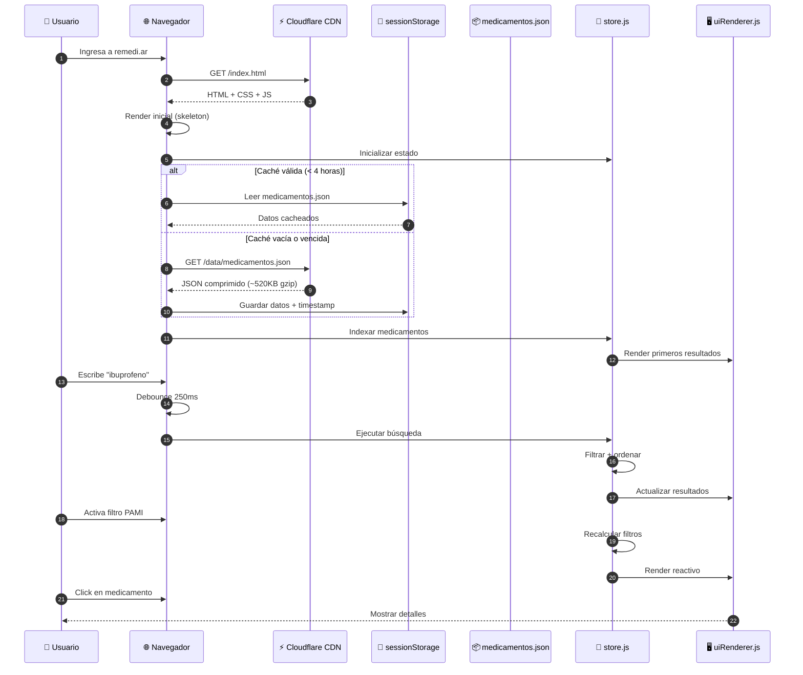
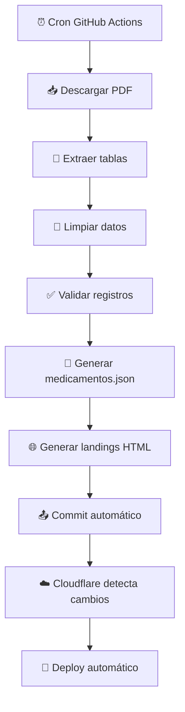
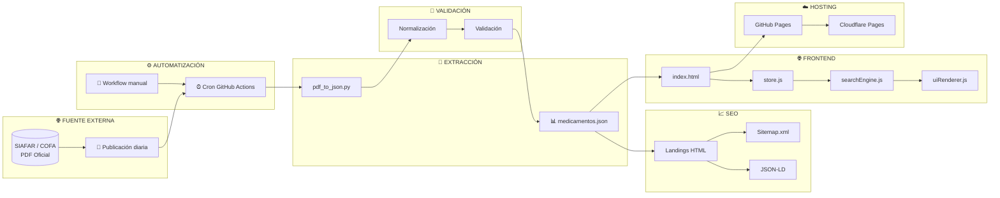
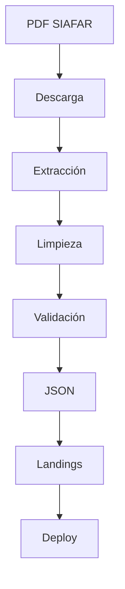
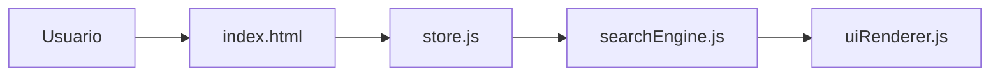

# 💊 remediar — Buscador de precios de medicamentos en Argentina

<p align="center">

<!-- Hosting & License -->


<br>

<!-- Valores -->


<br>

<!-- Frontend -->


<br>

<!-- Tecnologías -->


<br>

<!-- Backend / Automation -->


<br>

<!-- Diagramas -->


</p>

> 🔍 Comparador de precios de medicamentos en Argentina.  
> Datos actualizados automáticamente dos veces al día desde fuentes oficiales (SIAFAR / COFA).

---

# 📋 Tabla de Contenidos

- [✨ Demo en Vivo](#-demo-en-vivo)
- [🎯 Funcionamiento General](#-funcionamiento-general)
- [👤 Flujo del Usuario](#-flujo-del-usuario)
- [🧠 Algoritmo de Búsqueda y Filtrado](#-algoritmo-de-búsqueda-y-filtrado)
- [🔄 Actualización Automática de Datos](#-actualización-automática-de-datos)
- [📦 Estructura de Datos JSON](#-estructura-de-datos-json)
- [⚡ Optimizaciones Implementadas](#-optimizaciones-implementadas)
- [⏱️ Tiempos de Respuesta](#️-tiempos-de-respuesta)
- [🏗️ Arquitectura del Sistema](#️-arquitectura-del-sistema)
- [📁 Estructura del Repositorio](#-estructura-del-repositorio)
- [🧰 Stack Tecnológico](#-stack-tecnológico)
- [💻 Ejecución Local](#-ejecución-local)
- [🐍 Scripts Python](#-scripts-python)
- [📊 Métricas y Rendimiento](#-métricas-y-rendimiento)
- [🔍 SEO y Metadatos](#-seo-y-metadatos)
- [📚 Documentación Completa](#-documentación-completa)
- [🔌 API No Oficial](#-api-no-oficial)
- [👥 Guía de Contribución](#-guía-de-contribución)
- [📊 Diagramas de Flujo Detallados](#-diagramas-de-flujo-detallados)
- [🧩 Referencia de Componentes Frontend](#-referencia-de-componentes-frontend)
- [🎨 Guía de Estilos CSS](#-guía-de-estilos-css)
- [🔧 Documentación de Workflows](#-documentación-de-workflows)
- [❓ Preguntas Frecuentes (FAQ)](#-preguntas-frecuentes-faq)
- [🗺️ Roadmap](#️-roadmap)
- [📄 Licencia](#-licencia)
- [🙏 Fuente de Datos](#-fuente-de-datos)

---

# ✨ Demo en Vivo

| Entorno | URL | Propósito |
|---|---|---|
| GitHub Pages | https://psbella.github.io/remediar/ | Desarrollo y respaldo |
| Cloudflare Pages | https://remedi.ar | Producción principal |

---

# 🎯 Funcionamiento General

El sistema se compone de tres capas principales:

## 1️⃣ Extracción y procesamiento

- GitHub Actions ejecuta un workflow automático dos veces al día
- Se descarga el PDF oficial desde SIAFAR / COFA
- Python extrae tablas y líneas del PDF
- Los datos se limpian y validan
- Se genera `medicamentos.json`
- Se crean 56+ landings HTML estáticas SEO

---

## 2️⃣ Distribución

- El proyecto es 100% estático
- GitHub Pages funciona como backup
- Cloudflare Pages distribuye el contenido globalmente mediante CDN
- No existe backend persistente ni base de datos tradicional

---

## 3️⃣ Frontend SPA

- `index.html` carga la aplicación
- Los datos se descargan una sola vez
- Se indexan en memoria
- La búsqueda ocurre completamente del lado cliente
- El estado UI es reactivo mediante `store.js`

---

# 👤 Flujo del Usuario



---

# 🧠 Algoritmo de Búsqueda y Filtrado

## Indexación inicial

```javascript
function buildSearchIndex(medicamentos) {
  const drogasSet = new Set();
  const drogaToIndices = new Map();

  medicamentos.forEach((item, idx) => {
    const droga = normalizeString(item.droga);

    drogasSet.add(droga);

    if (!drogaToIndices.has(droga)) {
      drogaToIndices.set(droga, []);
    }

    drogaToIndices.get(droga).push(idx);
  });

  return { drogasSet, drogaToIndices };
}
```

---

## Debounce

```javascript
let debounceTimer;

searchInput.addEventListener('input', (e) => {
  clearTimeout(debounceTimer);

  debounceTimer = setTimeout(() => {
    performSearch(e.target.value);
  }, 250);
});
```

---

## Filtrado principal

```javascript
function performSearch(query, filters) {
  let results = [...store.rawData];

  if (query) {
    const normalized = normalizeString(query);

    results = results.filter(item =>
      normalizeString(item.droga).includes(normalized) ||
      normalizeString(item.laboratorio).includes(normalized)
    );
  }

  if (filters.pamiOnly) {
    results = results.filter(item => item.pami > 0);
  }

  if (filters.sortBy === 'price_asc') {
    results.sort((a, b) => a.precio - b.precio);
  }

  renderResults(results.slice(0, 50));
}
```

---

## Complejidades

| Operación | Complejidad | Tiempo estimado |
|---|---|---|
| Indexación | O(n) | ~80ms |
| Búsqueda | O(n) | ~25-50ms |
| Ordenamiento | O(n log n) | ~60ms |
| Filtro PAMI | O(n) | ~15ms |

---

# 🔄 Actualización Automática de Datos

## Workflow



---

## Workflow GitHub Actions

```yaml
name: Actualizar precios

on:
  schedule:
    - cron: '30 13,21 * * 1-5'

  workflow_dispatch:

jobs:
  update-prices:
    runs-on: ubuntu-latest

    steps:
      - uses: actions/checkout@v4

      - uses: actions/setup-python@v5
        with:
          python-version: '3.11'

      - run: pip install pandas pdfplumber requests

      - run: python scripts/pdf_to_json.py

      - run: git add .
      - run: git commit -m "Actualización automática"
      - run: git push
```

---

# 📦 Estructura de Datos JSON

## Ejemplo

```json
[
  {
    "droga": "IBUPROFENO",
    "presentacion": "400 mg COMPRIMIDOS x 20",
    "laboratorio": "Pfizer",
    "precio": 1250.50,
    "pami": 850.30,
    "fecha_actualizacion": "2026-05-27"
  }
]
```

---

## Campos

| Campo | Tipo | Descripción |
|---|---|---|
| droga | string | Principio activo |
| presentacion | string | Dosis y formato |
| laboratorio | string | Laboratorio fabricante |
| precio | number | Precio normal |
| pami | number | Precio PAMI |
| fecha_actualizacion | string | Fecha ISO |

---

# ⚡ Optimizaciones Implementadas

## ✅ Búsqueda en memoria

El JSON se carga una sola vez y se indexa.

---

## ✅ Estado centralizado

`store.js` controla:

- búsqueda
- filtros
- ordenamiento
- render reactivo

---

## ✅ Debounce

La búsqueda espera 250ms luego de la última tecla.

---

## ✅ Caché

Los datos se almacenan en `sessionStorage` durante 4 horas.

---

## ✅ Mobile first

CSS optimizado para:

- móviles
- tablets
- desktop

---

## ✅ Lazy loading

Los datos se descargan luego del primer render.

---

## ✅ Renderizado progresivo

- 50 resultados iniciales
- botón “Ver más”
- evita bloquear el hilo principal

---

# ⏱️ Tiempos de Respuesta

| Métrica | Valor |
|---|---|
| FCP | 0.8 - 1.2s |
| LCP | 1.5 - 2.0s |
| TTI | 1.8 - 2.5s |
| Búsqueda | 25 - 100ms |
| TTFB | 50 - 150ms |

---

# 🏗️ Arquitectura del Sistema



---

# 📁 Estructura del Repositorio

```text
remediar/
├── index.html
├── style.css
├── manifest.json
├── robots.txt
├── sitemap.xml
├── privacidad.html
├── terminos.html
├── README.md
├── _headers
├── .nojekyll
│
├── img/
│   └── favicon.svg
│
├── js/
│   ├── main.js
│   ├── dataLoader.js
│   ├── filters.js
│   ├── searchEngine.js
│   ├── uiRenderer.js
│   ├── utils.js
│   └── core/
│       └── store.js
│
├── data/
│   └── medicamentos.json
│
├── scripts/
│   └── pdf_to_json.py
│
├── .github/workflows/
│   └── update-prices.yml
│
└── [56+ landings HTML]
```

---

# 🧰 Stack Tecnológico

| Capa | Tecnología |
|---|---|
| Frontend | HTML5 + CSS3 + Vanilla JS |
| Backend ETL | Python 3 |
| Parsing PDF | PyMuPDF / pdfplumber |
| Datos | JSON |
| CI/CD | GitHub Actions |
| Hosting | GitHub Pages + Cloudflare |
| SEO | JSON-LD + Open Graph |
| Caché | sessionStorage |

---

# 💻 Ejecución Local

## Python

```bash
git clone https://github.com/psbella/remediar.git

cd remediar

python -m http.server 8000
```

---

## Node.js

```bash
npx http-server -p 8000 --cors -c-1
```

---

## Docker

```dockerfile
FROM nginx:alpine

COPY . /usr/share/nginx/html
```

```bash
docker build -t remediar .
docker run -p 8080:80 remediar
```

---

# 🐍 Scripts Python

| Script | Función |
|---|---|
| pdf_to_json.py | Convierte PDF a JSON |
| generar_landings.py | Crea landings SEO |
| validate_data.py | Limpia y valida |
| download_pdf.py | Descarga PDF oficial |

---

# 📊 Métricas y Rendimiento

| Métrica | Valor |
|---|---|
| Lighthouse Performance | 94-96 |
| Accessibility | 98 |
| Best Practices | 100 |
| SEO | 100 |
| CLS | 0.02 |
| FID | 12ms |

---

# 🔍 SEO y Metadatos

## Implementaciones

- JSON-LD
- Drug schema
- Offer schema
- BreadcrumbList
- Open Graph
- Twitter Cards
- Sitemap.xml
- robots.txt
- Landings estáticas indexables

---

## Ejemplo JSON-LD

```json
{
  "@context": "https://schema.org",
  "@type": "Drug",
  "name": "Ibuprofeno",
  "activeIngredient": "Ibuprofeno"
}
```

---

# 📚 Documentación Completa

- API No Oficial
- Guía de Contribución
- Diagramas Mermaid
- Referencia Frontend
- Guía CSS
- Workflows
- FAQ
- Roadmap

---

# 🔌 API No Oficial

## Endpoints

| Método | URL |
|---|---|
| GET | https://remedi.ar/data/medicamentos.json |
| GET | https://raw.githubusercontent.com/psbella/remediar/main/data/medicamentos.json |

---

## JavaScript

```javascript
const response = await fetch(
  'https://remedi.ar/data/medicamentos.json'
);

const medicamentos = await response.json();
```

---

## Python

```python
import pandas as pd

df = pd.read_json(
  "https://remedi.ar/data/medicamentos.json"
)

print(df.head())
```

---

# 👥 Guía de Contribución

## Flujo

```bash
git checkout -b feature/nueva-funcion

git commit -m "feat: agregar filtro"

git push
```

---

## Convenciones

| Tipo | Ejemplo |
|---|---|
| feat | Nueva funcionalidad |
| fix | Corrección |
| docs | Documentación |
| perf | Performance |

---

# 📊 Diagramas de Flujo Detallados

## Pipeline completo



---

## Frontend



---

# 🧩 Referencia de Componentes Frontend

## store.js

- Estado global
- Filtros
- Ordenamiento
- Eventos reactivos

---

## uiRenderer.js

- Render tarjetas
- Render resultados
- Skeleton loaders
- Mensajes error

---

## dataLoader.js

- Caché
- sessionStorage
- Refresh manual

---

# 🎨 Guía de Estilos CSS

## Sistema de diseño

```css
:root {
  --color-primary: #0088cc;
  --color-success: #00a86b;
  --border-radius: 8px;
}
```

---

## Responsive

| Breakpoint | Tamaño |
|---|---|
| Mobile | < 640px |
| Tablet | 641px - 1024px |
| Desktop | > 1024px |

---

# 🔧 Documentación de Workflows

| Parámetro | Valor |
|---|---|
| Schedule | 10:30 / 18:00 ARG |
| Runtime | Ubuntu |
| Python | 3.11 |
| Trigger manual | Sí |

---

# ❓ Preguntas Frecuentes (FAQ)

## ¿De dónde salen los datos?

Del PDF oficial publicado por SIAFAR / COFA.

---

## ¿Cada cuánto se actualiza?

Dos veces al día.

---

## ¿Tiene publicidad?

No.

---

## ¿Tiene tracking?

No.

---

## ¿Se puede usar el JSON libremente?

Sí, bajo licencia MIT.

---

# 🗺️ Roadmap

## Corto plazo

- Historial de precios
- Alertas
- Comparador de farmacias

---

## Mediano plazo

- API REST pública
- Dashboard estadístico
- Evolución histórica

---

## Largo plazo

- Integración farmacias tiempo real
- App móvil
- Geolocalización

---

# 📄 Licencia

MIT License.

Uso libre para proyectos personales y comerciales.

---

# 🙏 Fuente de Datos

Datos proporcionados por:

- SIAFAR
- COFA

---

# ❤️ Agradecimientos

Hecho con ❤️ para que los medicamentos sean más accesibles en Argentina.
