# 💊 remedi.ar — Buscador de precios de medicamentos (Argentina)

<p align="center">
  <!-- Hosting & License -->


<br>
<!-- Valores -->


<br>
<!-- Frontend -->


<br>
<!-- Tecnologías -->


<br>
<!-- Backend / Automation -->


<br>
<!-- Diagramas -->

</p>

> **Buscador de precios de medicamentos en Argentina. Precio público + PAMI. Actualizado 2 veces al día desde fuentes oficiales (Siafar / COFA).**

---

## 📡 Demo en producción

**🔗 https://psbella.github.io/remedios/**

---

## 🔍 Cómo funciona

### Flujo de usuario

1. El usuario escribe el nombre de un medicamento, principio activo o laboratorio
2. El sistema busca en tiempo real sobre los `medicamentos.json` (~25k registros)
3. Los resultados se filtran automáticamente mientras escribe
4. Se pueden aplicar filtros adicionales por presentación y laboratorio
5. Los resultados se ordenan por precio (menor a mayor o viceversa)
6. Cada tarjeta muestra:
   - Marca comercial
   - Laboratorio
   - Precio público (ARS)
   - Presentación y dosis
  
   ---

### Algoritmo de búsqueda

```javascript
// Versión simplificada del core
function buscar(termino) {
  return medicamentos.filter(m => 
    m.droga.toLowerCase().includes(termino) ||
    m.marca.toLowerCase().includes(termino) ||
    m.laboratorio.toLowerCase().includes(termino)
  );
}
```

### Actualización de datos

1. **Fuente oficial:** Siafar / COFA (Colegio de Farmacéuticos)
2. **Frecuencia:** 2 veces por día
3. **Proceso:**
   - Descarga del último PDF desde SIAFAR
   - pdf_to_csv.py convierte a medicamentos.csv
   - csv_to_json.py genera medicamentos.json con scoring de vigencia
   - generar_landings.py actualiza las páginas estáticas
   - GitHub Actions automatiza todo el proceso
  
     ---

### Estructura de datos (medicamentos.json)

```json
{
  "droga": "paracetamol",
  "marca": "TAFIROL",
  "presentacion": "500 mg comp.x 30",
  "laboratorio": "Genomma Lab.",
  "precio": 9304.65,
  "vigencia_score": 100,
  "flags": []
}
```

---

### Optimizaciones implementadas

- Búsqueda en memoria: El JSON se carga una sola vez y se indexa
- Estado centralizado: Store.js maneja la UI de forma reactiva
- Debounce: La búsqueda espera 250ms después de la última tecla
- Cache: Los datos se guardan en sessionStorage por 4 horas
- Mobile first: CSS adaptado para pantallas chicas y grandes
- Lazy loading: Los datos se cargan después del primer render

---

### Tiempos de respuesta

| Acción | Tiempo |
|--------|--------|
| Carga inicial (caché frío) | < 2s |
| Búsqueda en memoria | < 50ms |
| Aplicar filtros | < 30ms |
| Renderizado de resultados | < 100ms |

---

## 🧠 Arquitectura

🔄 **CICLO COMPLETO DEL SISTEMA**  
> `SIAFAR` → `PDF` → `GitHub Actions` → `CSV` → `Limpieza` → `JSON` → `Landings` → `Frontend` → `SEO` → `GitHub Pages` → `Cloudflare` → `Cron` → `SIAFAR` (vuelve a empezar)

```mermaid
flowchart LR
    subgraph ONE["🌐 FUENTE EXTERNA"]
        A[("SIAFAR / COFA<br>Precios de medicamentos")]
        B["📄 PDF diario<br>(2 veces al día)"]
    end

    subgraph TWO["⚙️ GITHUB ACTIONS"]
        C["⏰ Cron trigger<br>10:30 / 18:00 ARG<br>Lunes a Viernes"]
        D["🔄 Workflow dispatch<br>(manual)"]
    end

    subgraph THREE["🐍 EXTRACCIÓN"]
        E["pdf_to_csv.py<br>Descarga el PDF<br>Extrae líneas"]
        F[("📊 medicamentos.csv<br>🔥 FUENTE DE VERDAD<br>Campos planos")]
    end

    subgraph FOUR["🧹 LIMPIEZA"]
        G["🧼 Normalizar laboratorios<br>Corregir truncados<br>Eliminar corruptos"]
        H["✅ Validación<br>Precios > 0<br>Drogas no vacías"]
    end

    subgraph FIVE["📦 CONVERSIÓN"]
        I["csv_to_json.py<br>CSV → JSON"]
        J[("💾 medicamentos.json<br>2.5 MB / 12.100 registros<br>Frontend")]
    end

    subgraph SIX["🌐 GENERACIÓN"]
        K["generar_landings.py<br>Lee JSON<br>Crea páginas"]
        L["📄 16 landings HTML<br>Ibuprofeno, Paracetamol...<br>+ JSON-LD"]
    end

    subgraph SEVEN["💻 FRONTEND"]
        M["index.html<br>SPA"]
        N["store.js<br>Estado centralizado<br>Búsqueda / Filtros / Orden"]
        O["uiRenderer.js<br>Tarjetas de precios<br>PAMI"]
        P["utils.js<br>Limpieza frontend"]
    end

    subgraph EIGHT["📈 SEO"]
        Q["🔍 JSON-LD<br>Drug + Offer + FAQ<br>BreadcrumbList"]
        R["🗺️ Sitemap.xml<br>Open Graph<br>Twitter Cards"]
    end

    subgraph NINE["☁️ HOSTING"]
        S["🐙 GitHub Pages<br>psbella.github.io/..."]
        T["⛅ Cloudflare Pages<br>remedi.ar"]
    end

    subgraph TEN["🔄 ACTUALIZACIÓN AUTOMÁTICA"]
        U["⏰ Cron automático<br>GitHub Actions<br>(10:30 / 18:00 ARG)"]
        V["🌐 Redeploy<br>Cloudflare Pages<br>(detección automática)"]
    end

    A --> B --> C
    D --> C
    C --> E
    E --> F
    F --> G
    G --> H
    H --> I
    I --> J
    J --> K
    K --> L
    L --> Q
    L --> R
    J --> M
    M --> N
    N --> O
    O --> P
    M --> S
    S --> T
    T --> U
    U --> V
    V --> A

    style A fill:#e53935,stroke:#b71c1c,stroke-width:2px,color:#fff
    style B fill:#e53935,stroke:#b71c1c,stroke-width:2px,color:#fff
    style F fill:#ff9800,stroke:#e65100,stroke-width:3px,color:#000
    style J fill:#008B8B,stroke:#004d4d,stroke-width:2px,color:#fff
    style T fill:#008B8B,stroke:#004d4d,stroke-width:2px,color:#fff
    style U fill:#008B8B,stroke:#004d4d,stroke-width:2px,color:#fff
    style V fill:#008B8B,stroke:#004d4d,stroke-width:2px,color:#fff
```



---

## 📁 Estructura real del repositorio

```
remediar-refactor/
│
├── index.html                      # Página principal (SPA)
├── style.css                       # Estilos globales + responsive
├── manifest.json                   # PWA manifest
├── robots.txt                      # SEO (bloqueo de bots)
├── sitemap.xml                     # Mapa del sitio
├── privacidad.html                 # Política de privacidad
├── terminos.html                   # Términos y condiciones
├── _headers                        # Headers HTTP (Cloudflare)
│
├── img/
│   └── favicon.svg                 # Favicon + logo (38x38)
│
├── js/
│   ├── main.js                     # Orquestador principal
│   ├── dataLoader.js               # Carga de JSON con caché
│   ├── searchEngine.js             # Motor de búsqueda
│   ├── filters.js                  # Filtros
│   ├── uiRenderer.js               # Renderizado de tarjetas
│   ├── utils.js                    # Utilidades
│   └── core/
│       └── store.js                # Estado centralizado
│
├── data/
│   ├── medicamentos.csv            # Fuente de datos (editable)
│   └── medicamentos.json           # Base de datos (~12,000 registros)
│
├── scripts/
│   ├── pdf_to_csv.py               # Extrae datos del PDF a CSV
│   ├── csv_to_json.py              # Convierte CSV a JSON con scoring
│   └── generar_landings.py         # Genera landings SEO
│
├── .github/workflows/
│   └── update-prices.yml           # Actualización automática
│
└── landings HTML (60+ archivos generados automáticamente)
    ├── ibuprofeno.html
    ├── paracetamol.html
    ├── amoxicilina.html
    ├── omeprazol.html
    └── ...
```

---

## ⚙️ Stack tecnológico

| Capa               | Tecnología                          |
|--------------------|-------------------------------------|
| **Frontend**       | HTML5, CSS3 (vanilla)               |
| **JavaScript**     | ES6+ modules (import/export nativo) |
| **CSS**            | Custom properties + Flexbox         |
| **Datos**          | JSON (1.78 MB, ~25k registros)      |
| **Hosting**        | GitHub Pages                        |
| **Automatización** | Python 3.x    GitHub Actions        |

---

## 🚀 Ejecutar local

```bash
git clone https://github.com/psbella/remedios.git
cd remedios
python3 -m http.server 8000
# Abrir http://localhost:8000
```

> ⚠️ **Importante:** No abrir directo con `file://` por CORS.

---

## 🤖 Scripts Python

```bash
# Generar CSV desde el último PDF de SIAFAR
python scripts/pdf_to_csv.py

# Generar JSON desde CSV (con scoring de vigencia)
python scripts/csv_to_json.py

# Generar landing pages (60+)
python scripts/generar_landings.py
```

---

## 📊 Métricas

| Métrica                    | Valor                      |
|----------------------------|----------------------------|
| Tamaño del JSON            | ~2.1 MB                    |
| Registros de medicamentos  | ~12,000                    |
| Tiempo de carga (caché frío)| < 2s                      |
| Búsqueda en memoria        | < 50ms                     |
|   Landings generadas                 |60+|

---

## 🔒 SEO y metadatos

- ✅ Canonical URL: `https://remedi.ar/`
- ✅ Schema.org WebSite con SearchAction
- ✅ Meta tags Open Graph
- ✅ Sitemap.xml con 20+ URLs
- ✅ Robots.txt optimizado
- ✅ Landings dedicadas por medicamento
- ✅ JSON-LD en landings (Drug, FAQ, BreadcrumbList)

---

## 🤝 Contribuciones

```bash
git checkout -b feature/nueva-funcionalidad
git commit -m "feat: agregar nueva funcionalidad"
git push origin feature/nueva-funcionalidad
# Abrir Pull Request
```

---

## 📄 Licencia

**MIT License** — Libre para uso, modificación y distribución.

---

## 🙏 Fuente de datos

[Datos proporcionados por Siafar / COFA](https://siafar.com/datos)

---

<p align="center">
  <b>Hecho con ❤️ para que los medicamentos sean más accesibles en Argentina</b>
</p>
