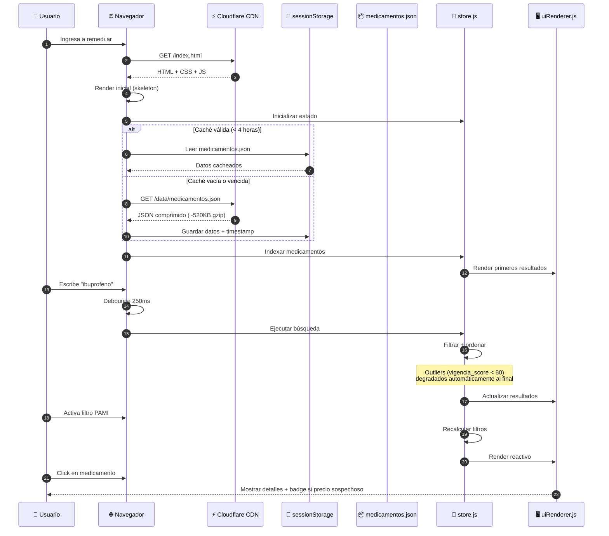
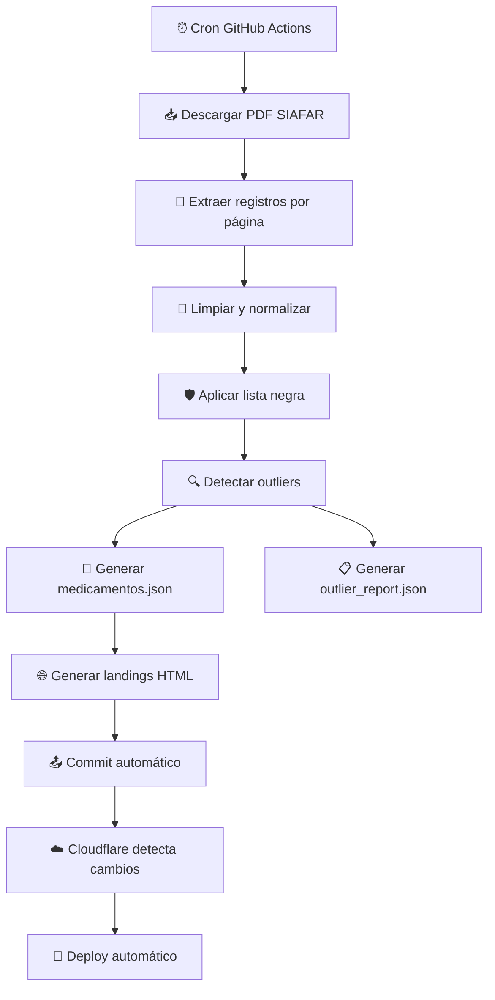
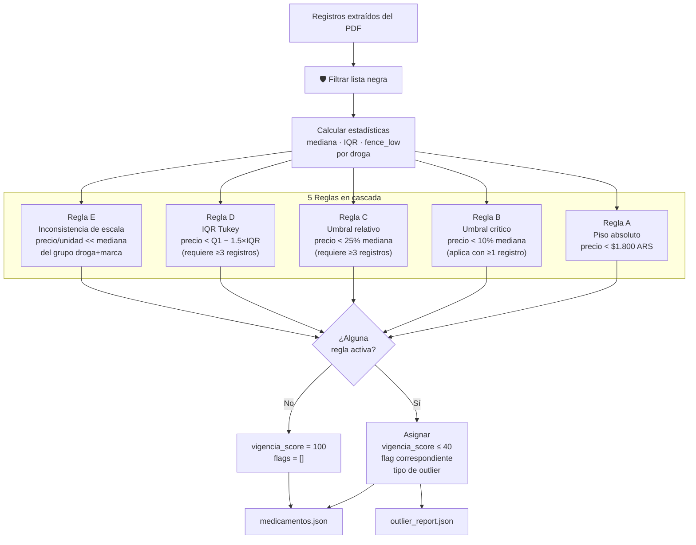
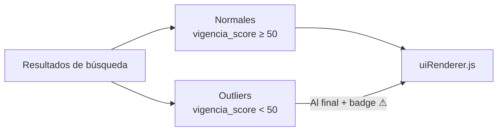
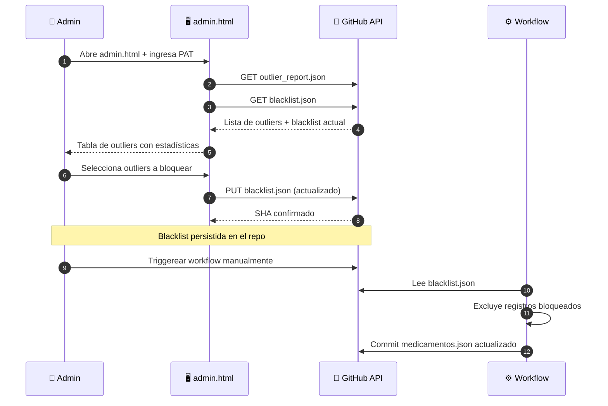
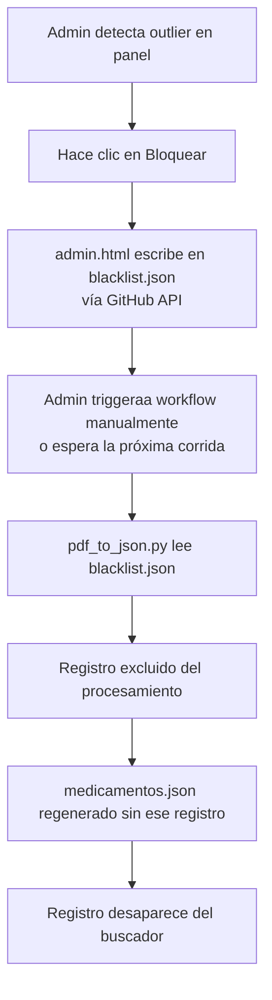
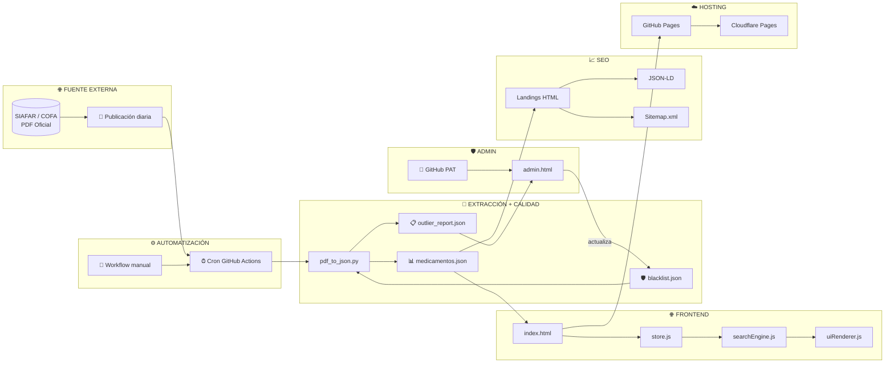
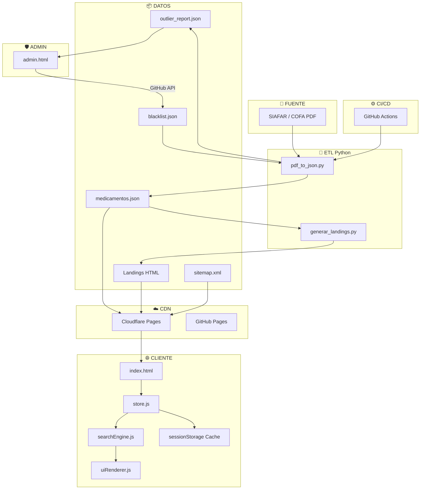
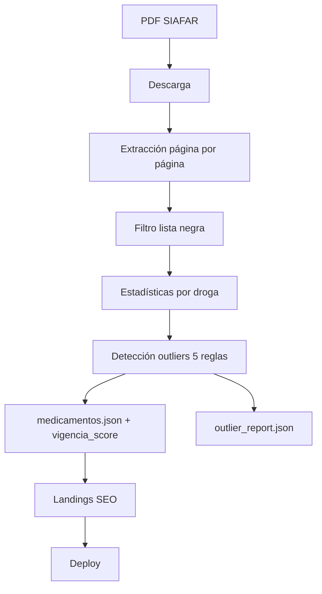
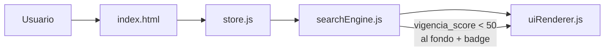

<p align="center">
  
</p>

# remediar — Buscador de precios de medicamentos en Argentina

<p align="center">
  <strong>Buscador de precios de medicamentos en Argentina</strong><br>
  <em>Sistema open source que procesa datos oficiales de SIAFAR/COFA y genera un comparador de precios de medicamentos con actualización automática dos veces al día.</em>
</p>

<p align="center">
  <a href="https://remedi.ar">https://remedi.ar</a> ·
  <a href="https://github.com/psbella/remediar">GitHub</a>
</p>

---

<p align="center">

<!-- Hosting & License -->


<br>

<!-- Valores -->


<br>

<!-- Frontend -->


<br>

<!-- Tecnologías -->


<br>

<!-- Backend / Automation -->


<br>

<!-- Diagramas -->


</p>

---

# 📋 Tabla de Contenidos

- [✨ Demo en Vivo](#-demo-en-vivo)
- [📊 Dataset actual](#-dataset-actual)
- [🎯 Funcionamiento General](#-funcionamiento-general)
- [🧭 Principios del Proyecto](#-principios-del-proyecto)
- [👤 Flujo del Usuario](#-flujo-del-usuario)
- [🧠 Algoritmo de Búsqueda y Filtrado](#-algoritmo-de-búsqueda-y-filtrado)
- [🔄 Actualización Automática de Datos](#-actualización-automática-de-datos)
- [📦 Estructura de Datos JSON](#-estructura-de-datos-json)
- [🚨 Detección de Precios Outliers](#-detección-de-precios-outliers)
- [🛡️ Panel de Administración](#️-panel-de-administración)
- [⚡ Optimizaciones Implementadas](#-optimizaciones-implementadas)
- [⏱️ Tiempos de Respuesta](#️-tiempos-de-respuesta)
- [🏗️ Arquitectura del Sistema](#️-arquitectura-del-sistema)
- [📁 Estructura del Repositorio](#-estructura-del-repositorio)
- [🧰 Stack Tecnológico](#-stack-tecnológico)
- [🧠 Decisiones Técnicas](#-decisiones-técnicas)
- [💻 Ejecución Local](#-ejecución-local)
- [🐍 Scripts Python](#-scripts-python)
- [📊 Métricas y Rendimiento](#-métricas-y-rendimiento)
- [🔍 SEO y Metadatos](#-seo-y-metadatos)
- [🔒 Seguridad y Privacidad](#-seguridad-y-privacidad)
- [📚 Documentación Completa](#-documentación-completa)
- [🔌 API No Oficial](#-api-no-oficial)
- [👥 Guía de Contribución](#-guía-de-contribución)
- [📊 Diagramas de Flujo Detallados](#-diagramas-de-flujo-detallados)
- [🧩 Referencia de Componentes Frontend](#-referencia-de-componentes-frontend)
- [🎨 Guía de Estilos CSS](#-guía-de-estilos-css)
- [🔧 Documentación de Workflows](#-documentación-de-workflows)
- [❓ Preguntas Frecuentes (FAQ)](#-preguntas-frecuentes-faq)
- [🗺️ Roadmap](#️-roadmap)
- [📄 Licencia](#-licencia)
- [🙏 Fuente de Datos](#-fuente-de-datos)

---

# ✨ Demo en Vivo

| Entorno | URL | Propósito |
|---|---|---|
| GitHub Pages | https://psbella.github.io/remediar/ | Desarrollo y respaldo |
| Cloudflare Pages | https://remedi.ar | Producción principal |

---

# 📊 Dataset actual

| Métrica | Valor |
|---|---|
| Registros | ~12.100 |
| Drogas únicas | ~460 |
| Landings SEO | 56+ |
| Tamaño JSON | ~2.5 MB |
| Tamaño gzip | ~520 KB |
| Actualizaciones | 2 veces/día |

---

# 🎯 Funcionamiento General

El sistema se compone de tres capas principales:

## 1️⃣ Extracción y procesamiento

- GitHub Actions ejecuta un workflow automático dos veces al día
- Se descarga el PDF oficial desde SIAFAR / COFA
- Python extrae tablas y líneas del PDF
- Los datos se limpian, validan y analizan estadísticamente
- Se detectan precios outliers y se aplica la lista negra
- Se genera `medicamentos.json` con scores de vigencia
- Se genera `outlier_report.json` para el panel de administración
- Se crean 56+ landings HTML estáticas SEO

---

## 2️⃣ Distribución

- El proyecto es 100% estático
- GitHub Pages funciona como backup
- Cloudflare Pages distribuye el contenido globalmente mediante CDN
- No existe backend persistente ni base de datos tradicional

---

## 3️⃣ Frontend SPA

- `index.html` carga la aplicación
- Los datos se descargan una sola vez
- Se indexan en memoria
- La búsqueda ocurre completamente del lado cliente
- El estado UI es reactivo mediante `store.js`
- Los resultados con precios sospechosos se degradan automáticamente al final

---

# 🧭 Principios del Proyecto

- Acceso libre a información de medicamentos
- Sin publicidad invasiva
- Sin tracking
- Performance primero
- Mobile first
- Open source
- Infraestructura simple y transparente
- Datos públicos y auditables

---

# 👤 Flujo del Usuario



---

# 🧠 Algoritmo de Búsqueda y Filtrado

## Indexación inicial

```javascript
function buildSearchIndex(medicamentos) {
  const drogasSet = new Set();
  const drogaToIndices = new Map();

  medicamentos.forEach((item, idx) => {
    const droga = normalizeString(item.droga);

    drogasSet.add(droga);

    if (!drogaToIndices.has(droga)) {
      drogaToIndices.set(droga, []);
    }

    drogaToIndices.get(droga).push(idx);
  });

  return { drogasSet, drogaToIndices };
}
```

---

## Debounce

```javascript
let debounceTimer;

searchInput.addEventListener('input', (e) => {
  clearTimeout(debounceTimer);

  debounceTimer = setTimeout(() => {
    performSearch(e.target.value);
  }, 250);
});
```

---

## Filtrado principal

```javascript
function performSearch(query, filters) {
  let results = [...store.rawData];

  if (query) {
    const normalized = normalizeString(query);

    results = results.filter(item =>
      normalizeString(item.droga).includes(normalized) ||
      normalizeString(item.laboratorio).includes(normalized)
    );
  }

  if (filters.pamiOnly) {
    results = results.filter(item => item.pami > 0);
  }

  if (filters.sortBy === 'price_asc') {
    results.sort((a, b) => a.precio - b.precio);
  }

  renderResults(results.slice(0, 50));
}
```

---

## Ordenamiento con vigencia

Los resultados se ordenan en tres niveles: primero por relevancia textual, luego por `vigencia_score`, y finalmente por precio ascendente. Los medicamentos con `vigencia_score < 50` (outliers) siempre se envían al fondo de los resultados, independientemente del criterio de orden activo.

```javascript
// searchEngine.js — criterio de ordenamiento
return resultados.sort((a, b) => {
  const vigA = a.vigencia_score ?? 100;
  const vigB = b.vigencia_score ?? 100;

  // Sospechosos siempre al fondo
  if ((vigA < 50) !== (vigB < 50)) return vigA < 50 ? 1 : -1;

  // Entre normales: relevancia textual
  const relA = scoreRelevancia(a, termino);
  const relB = scoreRelevancia(b, termino);
  if (relA !== relB) return relB - relA;

  // Desempate: precio ascendente
  return (a.precio || 0) - (b.precio || 0);
});
```

---

## Complejidades

| Operación | Complejidad | Tiempo estimado |
|---|---|---|
| Indexación | O(n) | ~80ms |
| Búsqueda | O(n) | ~25-50ms |
| Ordenamiento | O(n log n) | ~60ms |
| Filtro PAMI | O(n) | ~15ms |

---

# 🔄 Actualización Automática de Datos

## Workflow



---

## Workflow GitHub Actions

```yaml
name: Actualizar precios

on:
  schedule:
    - cron: '30 13,21 * * 1-5'   # 10:30 y 18:00 ARG, días hábiles
  workflow_dispatch:

jobs:
  update:
    runs-on: ubuntu-latest
    steps:
      - uses: actions/checkout@v4
      - uses: actions/setup-python@v5
        with:
          python-version: '3.11'
      - run: pip install pymupdf
      - run: python scripts/pdf_to_json.py
      - run: python scripts/generar_landings.py
      - name: Commit y push
        run: |
          git config user.name "github-actions[bot]"
          git config user.email "actions@github.com"
          git add data/medicamentos.json
          git add data/outlier_report.json
          git add *.html
          git commit -m "Actualizar precios $(date +'%Y-%m-%d')" || echo "No changes"
          git pull origin main --rebase
          git push origin main
```

---

# 📦 Estructura de Datos JSON

## medicamentos.json

```json
{
  "fecha": "2026-05-28 10:30:00",
  "fuente": "https://siafar.com/precios/pdf/",
  "total": 12100,
  "blacklisted": 3,
  "medicamentos": [
    {
      "droga": "ibuprofeno",
      "marca": "IBUPROFENO RICHMOND",
      "presentacion": "400 mg comp.x 20",
      "laboratorio": "Richmond",
      "precio": 2850.50,
      "vigencia_score": 100,
      "flags": [],
      "precio_outlier_tipo": null,
      "outlier_razones": []
    }
  ]
}
```

---

## Campos

| Campo | Tipo | Descripción |
|---|---|---|
| `droga` | string | Principio activo (lowercase) |
| `marca` | string | Nombre comercial (uppercase) |
| `presentacion` | string | Dosis, forma y cantidad |
| `laboratorio` | string | Laboratorio fabricante |
| `precio` | number | Precio en ARS |
| `vigencia_score` | number | Score de confianza 0-100 |
| `flags` | array | `precio_bajo` / `precio_sospechoso` / `precio_obsoleto` |
| `precio_outlier_tipo` | string\|null | Tipo de anomalía detectada |
| `outlier_razones` | array | Detalle técnico de la detección |

---

## outlier_report.json

Generado en cada corrida del workflow. Consumido exclusivamente por el panel de administración.

```json
{
  "timestamp": "2026-05-28T10:30:00-03:00",
  "total_registros": 12100,
  "total_outliers": 47,
  "outliers": [
    {
      "droga": "abacavir",
      "marca": "VIROCAVIR",
      "presentacion": "300 mg comp.rec.x 60",
      "laboratorio": "Savant Pharma",
      "precio": 9029.60,
      "precio_outlier_tipo": "bajo_critico",
      "razones": ["precio $9.029,60 < 10% mediana $106.983,97"],
      "mediana_droga": 106983.97,
      "n_droga": 5
    }
  ]
}
```

---

# 🚨 Detección de Precios Outliers

## Contexto

El PDF de SIAFAR incluye registros históricos sin fecha por fila, mezclados con los actuales. Medicamentos desactualizados desde 2018 pueden aparecer con precios que hoy son irrisorios por inflación. El sistema detecta estas anomalías estadísticamente y las degrada en los resultados de búsqueda.

---

## Pipeline de detección



---

## Reglas de detección

| Regla | Condición | Flag asignado | Score | Requisito |
|---|---|---|---|---|
| A — Piso absoluto | `precio < $1.800` | `precio_bajo` | 45 | Siempre |
| B — Umbral crítico | `precio < 10% mediana` | `precio_obsoleto` | 20 | ≥ 1 registro |
| C — Umbral relativo | `precio < 25% mediana` | `precio_sospechoso` | 35 | ≥ 3 registros |
| D — IQR Tukey | `precio < Q1 − 1.5×IQR` | `precio_sospechoso` | 40 | ≥ 3 registros |
| E — Escala | `PPU < 20% mediana PPU grupo` | `precio_sospechoso` | 35 | ≥ 2 variantes |

---

## Ejemplos reales detectados

| Medicamento | Precio detectado | Mediana droga | Ratio | Tipo |
|---|---|---|---|---|
| VIROCAVIR (abacavir) | $9.029,60 | $106.983,97 | 8,4% | `bajo_critico` |
| MAXVAN acetilcisteína 20 sobres | $1.122,00 | — | — | `inconsistencia_escala` |

---

## Efecto en el frontend

Los registros con `vigencia_score < 50` son degradados automáticamente:

- Aparecen **al final** de los resultados de búsqueda, por debajo de todos los resultados normales
- Reciben un **badge de advertencia** visible (`⚠ Precio a verificar`, `⚠ Precio posiblemente desactualizado`)
- No se eliminan del buscador: el usuario puede verlos con advertencia explícita



---

# 🛡️ Panel de Administración

## Descripción

`admin.html` es una página estática que permite revisar y gestionar los precios outliers detectados en cada corrida del workflow. No requiere servidor ni base de datos: todo opera vía GitHub API usando un Personal Access Token.

---

## Flujo de administración



---

## Características del panel

- **Autenticación** vía GitHub PAT (solo permisos `contents:write` sobre el repo)
- **Vista de outliers** con precio detectado, mediana de la droga, ratio y tipo de anomalía
- **Filtros** por tipo: todos / críticos / sospechosos / en lista negra
- **Selección masiva** para bloquear múltiples registros en un solo commit
- **Desbloqueo individual** de registros previamente bloqueados
- **Stats en tiempo real**: total de outliers, críticos, en lista negra, fecha de última corrida
- **Sin persistencia local**: el token vive solo en memoria mientras dura la sesión

---

## Configuración del PAT

1. GitHub → Settings → Developer settings → Personal access tokens → **Fine-grained tokens**
2. Repository access: solo `psbella/remediar`
3. Permissions → Contents: **Read and Write**
4. Copiar el token generado

> El token se ingresa cada vez que se abre el panel y no se almacena en ningún lado.

---

## blacklist.json

Persistida en `data/blacklist.json` dentro del repo. Cada entrada usa como clave la combinación `droga|marca|presentacion|laboratorio`.

```json
{
  "abacavir|virocavir|300 mg comp.rec.x 60|savant pharma": {
    "droga": "abacavir",
    "marca": "VIROCAVIR",
    "presentacion": "300 mg comp.rec.x 60",
    "laboratorio": "Savant Pharma",
    "precio_detectado": 9029.60,
    "tipo": "bajo_critico",
    "motivo": "precio $9.029,60 < 10% mediana $106.983,97",
    "bloqueado_en": "2026-05-28T10:30"
  }
}
```

---

## Ciclo completo de un bloqueo



---

# ⚡ Optimizaciones Implementadas

## ✅ Búsqueda en memoria

El JSON se carga una sola vez y se indexa.

---

## ✅ Estado centralizado

`store.js` controla búsqueda, filtros, ordenamiento y render reactivo.

---

## ✅ Debounce

La búsqueda espera 250ms luego de la última tecla.

---

## ✅ Caché

Los datos se almacenan en `sessionStorage` durante 4 horas.

---

## ✅ Mobile first

CSS optimizado para móviles, tablets y desktop.

---

## ✅ Lazy loading

Los datos se descargan luego del primer render.

---

## ✅ Renderizado progresivo

50 resultados iniciales con botón "Ver más", evitando bloquear el hilo principal.

---

## ✅ Degradación de outliers

Los precios con `vigencia_score < 50` se envían al fondo automáticamente sin costo adicional de procesamiento en el cliente.

---

# ⏱️ Tiempos de Respuesta

| Métrica | Valor |
|---|---|
| FCP | 0.8 - 1.2s |
| LCP | 1.5 - 2.0s |
| TTI | 1.8 - 2.5s |
| Búsqueda | 25 - 100ms |
| TTFB | 50 - 150ms |

---

# 🏗️ Arquitectura del Sistema



---

## Arquitectura técnica detallada



---

# 📁 Estructura del Repositorio

```text
remediar/
├── index.html                          # SPA principal
├── admin.html                          # Panel de administración de outliers
├── style.css
├── manifest.json
├── robots.txt
├── sitemap.xml
├── privacidad.html
├── terminos.html
├── README.md
├── _headers
├── .nojekyll
│
├── img/
│   └── favicon.svg
│
├── js/
│   ├── main.js
│   ├── dataLoader.js
│   ├── filters.js
│   ├── searchEngine.js                 # Índice invertido + ranking con vigencia_score
│   ├── uiRenderer.js                   # Badges de precio sospechoso
│   ├── utils.js
│   └── core/
│       └── store.js
│
├── data/
│   ├── medicamentos.json               # Dataset principal (generado por workflow)
│   ├── outlier_report.json             # Reporte de outliers (generado por workflow)
│   └── blacklist.json                  # Lista negra de precios (gestionada por admin)
│
├── scripts/
│   ├── pdf_to_json.py                  # Extracción PDF + detección outliers + blacklist
│   └── generar_landings.py
│
├── .github/workflows/
│   └── update-prices.yml
│
└── [56+ landings HTML]                 # Una por droga, generadas automáticamente
```

---

# 🧰 Stack Tecnológico

| Capa | Tecnología |
|---|---|
| Frontend | HTML5 + CSS3 + Vanilla JS |
| Backend ETL | Python 3.11 |
| Parsing PDF | PyMuPDF (fitz) |
| Detección outliers | Python stdlib (statistics) |
| Datos | JSON |
| CI/CD | GitHub Actions |
| Hosting | GitHub Pages + Cloudflare |
| SEO | JSON-LD + Open Graph |
| Caché | sessionStorage |
| Admin API | GitHub Contents API |

---

# 🧠 Decisiones Técnicas

## ¿Por qué Vanilla JS?

- Menor tamaño final
- Mejor tiempo de carga
- Sin dependencias pesadas
- SEO más simple
- Mantenimiento sencillo

## ¿Por qué JSON plano y no base de datos?

- Hosting estático
- Costos prácticamente cero
- CDN extremadamente eficiente
- Menor complejidad operacional

## ¿Por qué Cloudflare Pages?

- CDN global
- Excelente latencia en Argentina
- Deploy automático
- HTTPS gratuito

## ¿Por qué mediana y no media para detección de outliers?

La media se distorsiona con los mismos outliers que se quieren detectar. Si una droga tiene 4 registros a $100.000 y uno a $9.000, la media baja a $83.000 haciendo al outlier menos detectable. La mediana permanece en $100.000 independientemente del valor anómalo.

## ¿Por qué la lista negra vive en el repo y no en una base de datos?

- Cero infraestructura adicional
- Versionada con git: historial completo de bloqueos
- Auditable públicamente
- Compatible con el modelo 100% estático del proyecto

---

# 💻 Ejecución Local

## Python

```bash
git clone https://github.com/psbella/remediar.git
cd remediar
python -m http.server 8000
```

---

## Node.js

```bash
npx http-server -p 8000 --cors -c-1
```

---

## Docker

```dockerfile
FROM nginx:alpine
COPY . /usr/share/nginx/html
```

```bash
docker build -t remediar .
docker run -p 8080:80 remediar
```

---

## Ejecutar el pipeline ETL manualmente

```bash
pip install pymupdf
python scripts/pdf_to_json.py
```

La salida en consola incluye el resumen de outliers detectados:

```
Total extraido: 12443
Aplicando lista negra...
   Lista negra: 3 entradas cargadas

Calculando estadisticas de outliers...
   463 drogas distintas

OUTLIERS: 47/12440 (0.4%) | Escala: +2 | Criticos: 8
   VIROCAVIR (abacavir): $9.029,60  [mediana: $106.983,97]
   ...
   Reporte: data/outlier_report.json

Guardado: data/medicamentos.json
```

---

# 🐍 Scripts Python

| Script | Función |
|---|---|
| `pdf_to_json.py` | Descarga PDF, aplica blacklist, detecta outliers, genera `medicamentos.json` y `outlier_report.json` |
| `generar_landings.py` | Crea landings SEO estáticas por droga |

---

# 📊 Métricas y Rendimiento

| Métrica | Valor |
|---|---|
| Lighthouse Performance | 94-96 |
| Accessibility | 98 |
| Best Practices | 100 |
| SEO | 100 |
| CLS | 0.02 |
| FID | 12ms |

---

# 🔍 SEO y Metadatos

## Implementaciones

- JSON-LD con Drug schema, Offer schema y BreadcrumbList
- Open Graph y Twitter Cards
- Sitemap.xml
- robots.txt
- 56+ landings estáticas indexables por droga

---

## Ejemplo JSON-LD

```json
{
  "@context": "https://schema.org",
  "@type": "Drug",
  "name": "Ibuprofeno",
  "activeIngredient": "Ibuprofeno"
}
```

---

# 🔒 Seguridad y Privacidad

- No se recopilan datos personales
- No se utilizan cookies de tracking
- No existe autenticación en el buscador principal
- No existe backend persistente
- No se comparte información con terceros
- El panel de admin opera con un PAT que vive solo en memoria (no se persiste)
- Todo el frontend puede auditarse públicamente

---

# 📚 Documentación Completa

| Documento | Descripción | Link |
|---|---|---|
| API No Oficial | Consumo externo de `medicamentos.json` | [Ver sección](#-api-no-oficial) |
| Detección de Outliers | Algoritmo y reglas | [Ver sección](#-detección-de-precios-outliers) |
| Panel de Admin | Gestión de lista negra | [Ver sección](#️-panel-de-administración) |
| Guía de Contribución | Cómo colaborar con el proyecto | [Ver sección](#-guía-de-contribución) |
| Diagramas Mermaid | Arquitectura y flujos internos | [Ver sección](#-diagramas-de-flujo-detallados) |
| Referencia Frontend | Componentes y módulos JS | [Ver sección](#-referencia-de-componentes-frontend) |
| Guía CSS | Variables, breakpoints y estilos | [Ver sección](#-guía-de-estilos-css) |
| Workflows | Automatización y CI/CD | [Ver sección](#-documentación-de-workflows) |
| FAQ | Preguntas frecuentes | [Ver sección](#-preguntas-frecuentes-faq) |
| Roadmap | Funcionalidades futuras | [Ver sección](#️-roadmap) |

---

## 🌐 Enlaces del Proyecto

| Recurso | URL |
|---|---|
| Producción | https://remedi.ar |
| GitHub Pages | https://psbella.github.io/remediar/ |
| Repositorio GitHub | https://github.com/psbella/remediar |
| Panel Admin | https://remedi.ar/admin.html |
| Actions / CI | https://github.com/psbella/remediar/actions |
| medicamentos.json (CDN) | https://remedi.ar/data/medicamentos.json |
| outlier_report.json | https://remedi.ar/data/outlier_report.json |
| medicamentos.json (GitHub Raw) | https://raw.githubusercontent.com/psbella/remediar/main/data/medicamentos.json |
| Sitemap | https://remedi.ar/sitemap.xml |
| robots.txt | https://remedi.ar/robots.txt |
| Política de privacidad | https://remedi.ar/privacidad.html |
| Términos y condiciones | https://remedi.ar/terminos.html |

---

## 📦 Archivos Importantes

| Archivo | Función |
|---|---|
| `index.html` | SPA principal |
| `admin.html` | Panel de administración de outliers |
| `style.css` | Estilos globales |
| `js/core/store.js` | Estado reactivo |
| `js/searchEngine.js` | Motor de búsqueda con ranking por vigencia |
| `js/uiRenderer.js` | Renderizado + badges de precio sospechoso |
| `data/medicamentos.json` | Dataset principal |
| `data/outlier_report.json` | Reporte de precios anómalos |
| `data/blacklist.json` | Lista negra de registros bloqueados |
| `scripts/pdf_to_json.py` | ETL completo con detección de outliers |
| `.github/workflows/update-prices.yml` | Automatización |

---

# 🔌 API No Oficial

## Endpoints

| Método | URL |
|---|---|
| GET | https://remedi.ar/data/medicamentos.json |
| GET | https://raw.githubusercontent.com/psbella/remediar/main/data/medicamentos.json |

---

## JavaScript

```javascript
const response = await fetch('https://remedi.ar/data/medicamentos.json');
const { medicamentos } = await response.json();

// Filtrar solo registros confiables
const confiables = medicamentos.filter(m => (m.vigencia_score ?? 100) >= 50);
```

---

## Python

```python
import pandas as pd

data = pd.read_json("https://remedi.ar/data/medicamentos.json")
df   = pd.json_normalize(data['medicamentos'])

# Excluir outliers
df_limpio = df[df['vigencia_score'] >= 50]
print(df_limpio.head())
```

---

# 👥 Guía de Contribución

## Flujo

```bash
git checkout -b feature/nueva-funcion
git commit -m "feat: agregar filtro"
git push
```

---

## Convenciones

| Tipo | Ejemplo |
|---|---|
| feat | Nueva funcionalidad |
| fix | Corrección |
| docs | Documentación |
| perf | Performance |

---

# 📊 Diagramas de Flujo Detallados

## Pipeline completo



---

## Frontend



---

# 🧩 Referencia de Componentes Frontend

## store.js

- Estado global
- Filtros y ordenamiento
- Eventos reactivos

---

## searchEngine.js

- Índice invertido por prefijos
- Ranking por relevancia textual
- Degradación automática de outliers (`vigencia_score < 50` → al fondo)

---

## uiRenderer.js

- Render de tarjetas con badges de vigencia
- `badge-sospechoso`: precio posiblemente desactualizado
- `badge-verificar`: precio bajo a verificar
- Skeleton loaders y mensajes de error

---

## dataLoader.js

- Caché con sessionStorage
- Refresh manual

---

# 🎨 Guía de Estilos CSS

## Sistema de diseño

```css
:root {
  --color-primary: #0088cc;
  --color-success: #00a86b;
  --border-radius: 8px;
}
```

---

## Badges de vigencia

```css
.badge-sospechoso { /* naranja — precio posiblemente desactualizado */ }
.badge-verificar  { /* amarillo — precio bajo a verificar           */ }
.tarjeta-sospechosa { /* tarjeta con fondo levemente diferenciado   */ }
```

---

## Responsive

| Breakpoint | Tamaño |
|---|---|
| Mobile | < 640px |
| Tablet | 641px - 1024px |
| Desktop | > 1024px |

---

# 🔧 Documentación de Workflows

| Parámetro | Valor |
|---|---|
| Schedule | 10:30 / 18:00 ARG, días hábiles |
| Runtime | Ubuntu Latest |
| Python | 3.11 |
| Dependencias | pymupdf |
| Trigger manual | Sí (workflow_dispatch) |
| Archivos commiteados | `medicamentos.json`, `outlier_report.json`, `*.html` |

---

# ❓ Preguntas Frecuentes (FAQ)

## ¿De dónde salen los datos?

Del PDF oficial publicado por SIAFAR / COFA.

---

## ¿Cada cuánto se actualiza?

Dos veces al día en días hábiles (10:30 y 18:00 ARG).

---

## ¿Por qué algunos precios aparecen con advertencia?

El PDF de SIAFAR incluye registros históricos sin fecha, algunos de años anteriores. El sistema detecta estadísticamente los precios que son anómalos respecto al resto de su droga y los muestra con una advertencia al final de los resultados.

---

## ¿Qué es la lista negra?

Un archivo `blacklist.json` gestionado desde el panel de administración. Los registros bloqueados se excluyen completamente del buscador en la próxima actualización.

---

## ¿Tiene publicidad?

No.

---

## ¿Tiene tracking?

No.

---

## ¿Se puede usar el JSON libremente?

Sí, bajo licencia MIT. Se recomienda filtrar por `vigencia_score >= 50` para excluir outliers.

---

# 🗺️ Roadmap

## Corto plazo

- Historial de precios
- Alertas de variación
- Comparador de farmacias

---

## Mediano plazo

- API REST pública
- Dashboard estadístico de outliers
- Evolución histórica de precios

---

## Largo plazo

- Integración farmacias tiempo real
- App móvil
- Geolocalización

---

# 📄 Licencia

MIT License. Uso libre para proyectos personales y comerciales.

---

## 🧠 Proyecto orientado a datos abiertos

Este proyecto utiliza únicamente información pública proveniente de organismos oficiales del sistema farmacéutico argentino. No almacena datos sensibles ni realiza seguimiento de usuarios.

---

# 🙏 Fuente de Datos

Datos proporcionados por SIAFAR y COFA.

---

<p align="center">
  <strong>Hecho con ❤️ para que los medicamentos sean más accesibles en Argentina.</strong>
</p>
