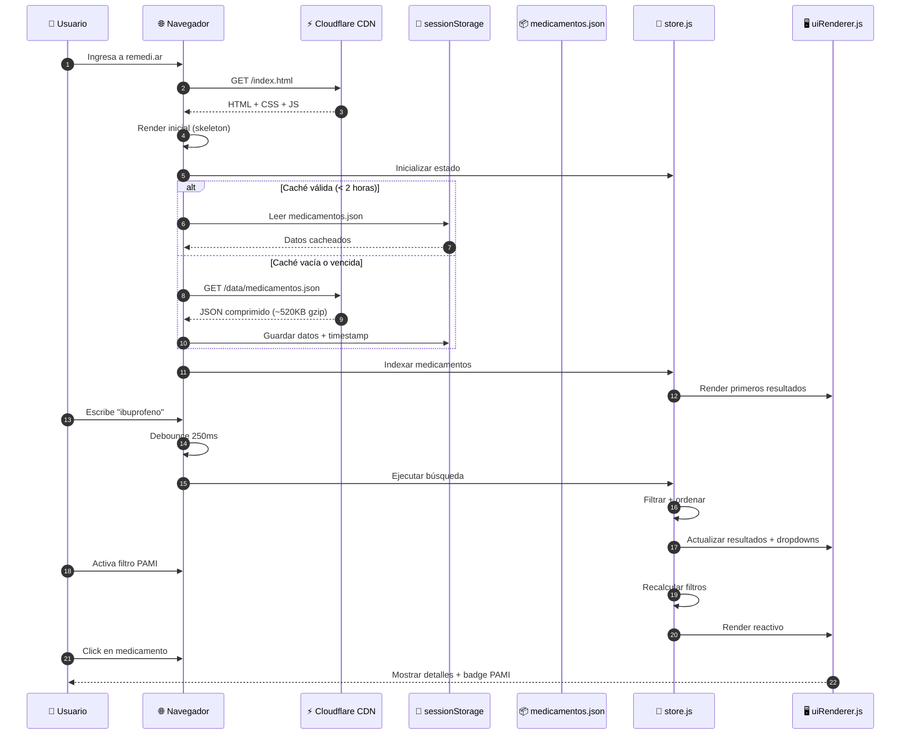
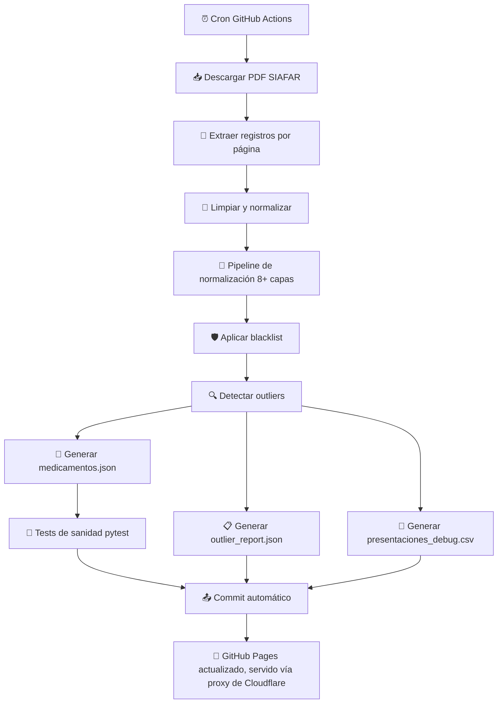
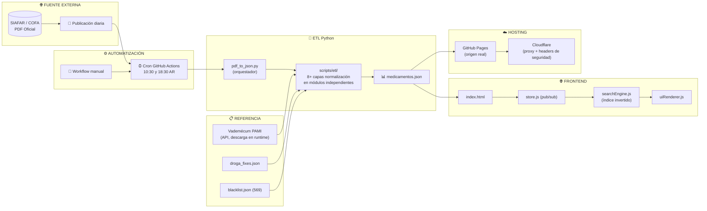
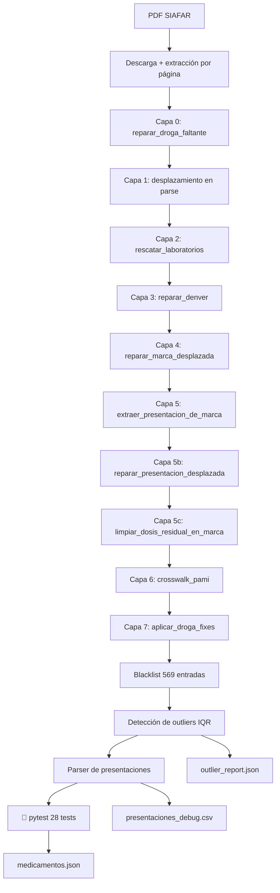
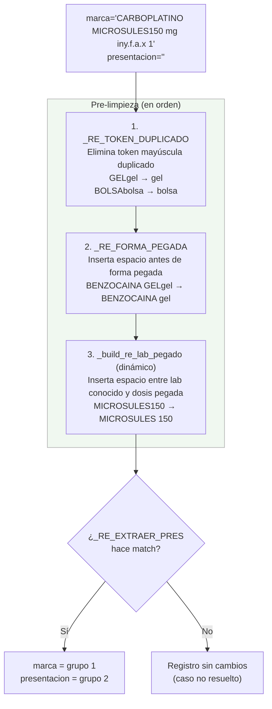
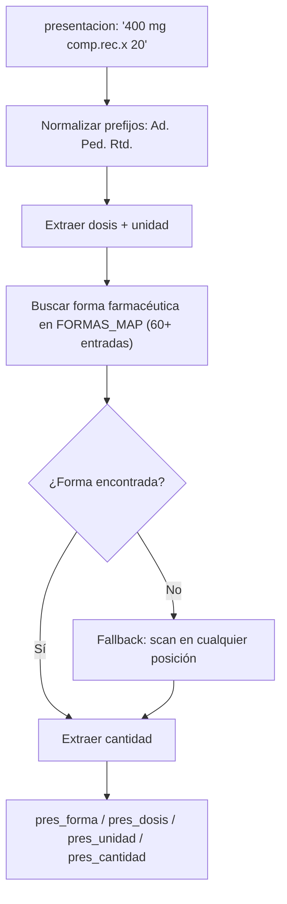
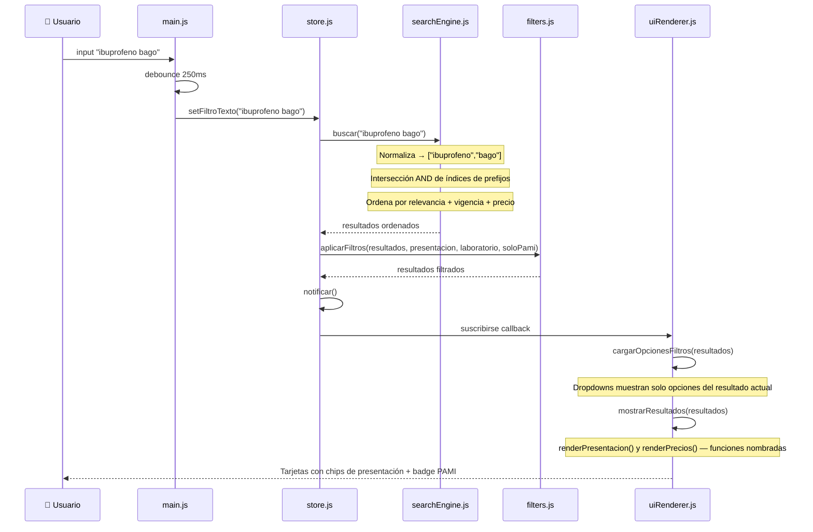
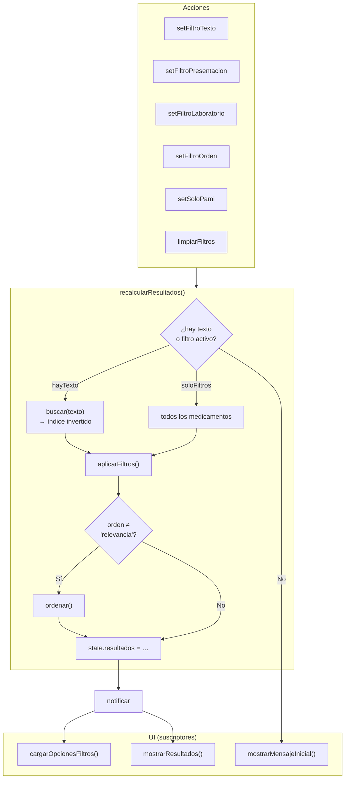
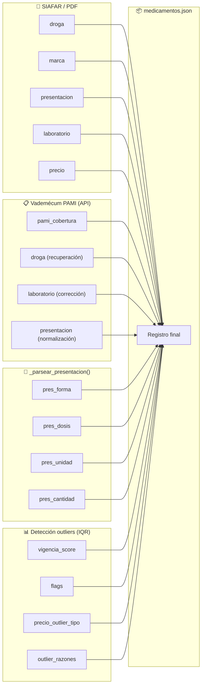

<p align="center">
  
</p>

# remedi.ar — Buscador de precios de medicamentos en Argentina

<p align="center">
  <strong>Buscador de precios de medicamentos en Argentina</strong><br>
  <em>Sistema open source que procesa datos oficiales de SIAFAR/COFA/PAMI y genera un comparador de precios con actualización automática dos veces al día.</em>
</p>

<p align="center">
  <a href="https://remedi.ar">https://remedi.ar</a> ·
  <a href="https://github.com/psbella/remediar">GitHub</a>
</p>

---

<p align="left">
<!-- Versión -->


<br>
<!-- Hosting & License -->


<br>
<!-- Valores -->


<br>
<!-- Frontend -->


<br>
<!-- Tecnologías -->


<br>
<!-- Backend / Automation -->


<br>
<!-- Datos -->


<br>
<!-- Diagramas -->

<br>
<!-- Features -->


</p>

---

# 📋 Tabla de Contenidos

- [✨ Demo en Vivo](#-demo-en-vivo)
- [📊 Dataset actual](#-dataset-actual)
- [🎯 Funcionamiento General](#-funcionamiento-general)
- [🧭 Principios del Proyecto](#-principios-del-proyecto)
- [👤 Flujo del Usuario](#-flujo-del-usuario)
- [🧠 Algoritmo de Búsqueda y Filtrado](#-algoritmo-de-búsqueda-y-filtrado)
- [🔄 Actualización Automática de Datos](#-actualización-automática-de-datos)
- [📦 Estructura de Datos JSON](#-estructura-de-datos-json)
- [⚡ Optimizaciones Implementadas](#-optimizaciones-implementadas)
- [⏱️ Tiempos de Respuesta](#️-tiempos-de-respuesta)
- [🏗️ Arquitectura del Sistema](#️-arquitectura-del-sistema)
- [📁 Estructura del Repositorio](#-estructura-del-repositorio)
- [🧰 Stack Tecnológico](#-stack-tecnológico)
- [🧠 Decisiones Técnicas](#-decisiones-técnicas)
- [💻 Ejecución Local](#-ejecución-local)
- [🐍 Scripts Python](#-scripts-python)
- [📊 Métricas y Rendimiento](#-métricas-y-rendimiento)
- [🔍 SEO y Metadatos](#-seo-y-metadatos)
- [🔒 Seguridad y Privacidad](#-seguridad-y-privacidad)
- [🔌 API No Oficial](#-api-no-oficial)
- [👥 Guía de Contribución](#-guía-de-contribución)
- [📊 Diagramas de Flujo Detallados](#-diagramas-de-flujo-detallados)
- [🧩 Referencia de Componentes Frontend](#-referencia-de-componentes-frontend)
- [🎨 Guía de Estilos CSS](#-guía-de-estilos-css)
- [🔧 Documentación de Workflows](#-documentación-de-workflows)
- [❓ Preguntas Frecuentes (FAQ)](#-preguntas-frecuentes-faq)
- [⚠️ Limitaciones conocidas](#️-limitaciones-conocidas)
- [🗺️ Roadmap](#️-roadmap)
- [📄 Licencia](#-licencia)
- [🙏 Fuente de Datos](#-fuente-de-datos)

---

# ✨ Demo en Vivo

| Entorno | URL | Propósito |
|---|---|---|
| GitHub Pages (dominio propio, DNS en Cloudflare) | [remedi.ar](https://remedi.ar) | Producción — alojado en GitHub |
| GitHub Pages (dominio por defecto) | [psbella.github.io/remediar](https://psbella.github.io/remediar/) | Mirror/respaldo |
| Cloudflare Workers | [remediar.pablo-s-bella.workers.dev](https://remediar.pablo-s-bella.workers.dev/) | Mirror/respaldo |

> **Headers de seguridad:** `remedi.ar` y `www.remedi.ar` están proxied (nube naranja) en Cloudflare, con GitHub Pages como origen. La CSP, `X-Frame-Options` y el resto de los headers de seguridad se aplican vía **Cloudflare Response Header Transform Rules** (dashboard), no desde el archivo `_headers` del repo — ese archivo solo lo procesa el mirror de Workers. Ver [`_headers`](./_headers) para el detalle de los valores replicados.

---

---

# 📊 Dataset actual

| Métrica | Valor |
|---|---|
| Registros | ~12.100 |
| Drogas únicas | ~1.740 |
| Tamaño JSON | ~2.5 MB |
| Tamaño gzip | ~520 KB |
| Con cobertura PAMI | ~5.900 (49%) |
| Entradas en blacklist | 569 |
| Cobertura parser de presentaciones | ~99.5% |
| Actualizaciones | 2 veces/día (lunes a viernes) |
| Tests de sanidad | 28 checks automáticos post-ETL |

---

# 🎯 Funcionamiento General

El sistema se compone de tres capas principales:

## 1️⃣ Extracción y procesamiento

- GitHub Actions ejecuta un workflow automático dos veces al día (lunes a viernes)
- Se descarga el PDF oficial desde SIAFAR / COFA
- Python extrae y normaliza los registros mediante un pipeline de 8+ capas
- Se cruzan los datos con el vademécum de PAMI para enriquecer cobertura
- Se genera `medicamentos.json`

---

## 2️⃣ Distribución

- El proyecto es 100% estático
- GitHub Pages sirve el contenido como origen (dominio propio `remedi.ar` vía DNS de Cloudflare, y el dominio por defecto `psbella.github.io/remediar`)
- Cloudflare actúa como proxy delante de `remedi.ar`/`www.remedi.ar`: CDN, TLS, y una Transform Rule que inyecta los headers de seguridad (GitHub Pages no soporta headers custom)
- Un mirror adicional corre en Cloudflare Workers (`remediar.pablo-s-bella.workers.dev`), sirviendo los mismos assets estáticos de forma independiente
- No existe backend persistente ni base de datos

---

## 3️⃣ Frontend SPA

- `index.html` carga la aplicación
- Los datos se descargan una sola vez y se indexan en memoria
- La búsqueda ocurre completamente del lado cliente
- El estado UI es reactivo mediante `store.js` (patrón pub/sub)

---

# 🧭 Principios del Proyecto

- Acceso libre a información de medicamentos
- Sin publicidad
- Analítica anónima, sin tracking de terceros
- Performance primero
- Mobile first
- Open source
- Infraestructura simple y transparente
- Datos públicos y auditables

---

# 👤 Flujo del Usuario



---

# 🧠 Algoritmo de Búsqueda y Filtrado

## Indexación inicial

`searchEngine.js` construye un índice invertido de prefijos sobre `droga`, `marca` y `laboratorio`. Por cada token de 2 o más caracteres se generan todos sus prefijos, mapeados a conjuntos de índices del array de medicamentos.

```javascript
for (const palabra of txt.split(/\s+/)) {
    for (let k = 2; k <= palabra.length; k++) {
        const pref = palabra.slice(0, k);
        if (!indice[pref]) indice[pref] = new Set();
        indice[pref].add(i);
    }
}
```

La búsqueda realiza una intersección AND entre todos los términos ingresados — "ibuprofeno bago" devuelve solo registros que contengan ambos tokens.

---

## Ranking de relevancia

Los resultados se ordenan por tres criterios en cascada:

1. **Relevancia textual** — score basado en el campo donde ocurre el match:

| Match | Score |
|---|---|
| Droga exacta | +100 |
| Droga empieza con el término | +80 |
| Droga contiene el término | +50 |
| Marca exacta | +40 |
| Marca empieza con el término | +25 |
| Marca contiene el término | +15 |
| Laboratorio contiene el término | +5 |

2. **vigencia_score** — productos con precios confiables primero
3. **precio** — ascendente como desempate final

Los registros con `vigencia_score < 50` siempre van al fondo, independientemente del score de relevancia.

---

# 🔄 Actualización Automática de Datos

## Workflow



---

## Pipeline de normalización (8+ capas)

El parser aplica correcciones en cascada para resolver los problemas estructurales del PDF de SIAFAR:

| Capa | Función | Descripción |
|---|---|---|
| 0 | `reparar_droga_faltante()` | Cuando el PDF omite la línea del principio activo, todos los campos se desplazan. Separa droga+marca fusionadas usando un diccionario de prefijos truncados |
| 1 | Detección en parse | Detecta registros con 4 campos en lugar de 5 durante la extracción del PDF |
| 2 | `rescatar_laboratorios()` | Recupera `laboratorio="Desconocido"` buscando el lab como sufijo en `presentacion` |
| 3 | `reparar_denver()` | Denver Farma usa droga+lab como nombre comercial; separa marca y presentacion fusionadas (variantes DENCR., DF) |
| 4 | `reparar_marca_desplazada()` | Cuando `marca` empieza con dígito y `presentacion` está vacía, invierte el desplazamiento |
| 5 | `extraer_presentacion_de_marca()` | Extrae la presentacion fusionada en el campo marca. Antes del regex de corte: (1) separa laboratorios pegados sin espacio (`_build_re_lab_pegado()`, dinámico por dataset); (2) separa formas farmacéuticas pegadas (`_RE_FORMA_PEGADA`); (3) elimina duplicados mayúscula+minúscula (`_RE_TOKEN_DUPLICADO`) |
| 5b | `reparar_presentacion_desplazada()` | Separa presentacion+lab fusionados en el campo lab (3 sub-patrones: 2A, 2B, 2C) |
| 5c | `limpiar_dosis_residual_en_marca()` | Limpia la dosis numérica que queda pegada al nombre del laboratorio en `marca` |
| 6 | `crosswalk_pami()` | Cruza contra el vademécum de PAMI (descargado en cada corrida desde la API pública de datos abiertos, ver más abajo): recupera droga vacía, corrige laboratorio, normaliza `presentacion`, agrega `pami_cobertura` |
| 7 | `aplicar_droga_fixes()` | Aplica correcciones manuales desde `data/droga_fixes.json` |

> Cada una de estas funciones vive en su propio módulo dentro de `scripts/etl/` (ver [Paquete `scripts/etl/`](#paquete-scriptsetl-capas-de-normalización)); `pdf_to_json.py` solo orquesta el orden de ejecución.

---

## Workflow GitHub Actions

```yaml
name: 🔃 Actualizar precios

on:
  schedule:
    - cron: '30 13,21 * * 1-5'
  workflow_dispatch:

jobs:
  update:
    runs-on: ubuntu-latest
    steps:
      - uses: actions/checkout@v4

      - uses: actions/setup-python@v5
        with:
          python-version: '3.11'
          cache: 'pip'

      - run: pip install -r requirements.txt

      - run: python scripts/pdf_to_json.py

      - name: Verificar sanidad del output
        run: pytest tests/ -v

      - name: Snapshot semanal (solo viernes)
        if: github.event_name == 'schedule'
        env:
          GITHUB_TOKEN: ${{ secrets.GITHUB_TOKEN }}
        run: |
          if [ "$(date +%u)" = "5" ]; then
            python scripts/snapshot_semanal.py
          fi

      - name: Commit y push
        run: |
          git config user.name "github-actions[bot]"
          git config user.email "actions@github.com"
          git add data/medicamentos.json
          git add data/outlier_report.json
          git add data/presentaciones_debug.csv
          git commit -m "Actualizar precios $(date +'%Y-%m-%d')" || echo "No changes"
          git pull --rebase origin main
          git push origin main
```

---

# 📦 Estructura de Datos JSON

## Ejemplo de registro

```json
{
  "droga": "ibuprofeno",
  "marca": "IBUPIRAC",
  "presentacion": "400 mg comp.x 20",
  "laboratorio": "Pfizer",
  "precio": 9800.50,
  "pami_cobertura": 55,
  "pres_forma": "COMPRIMIDOS",
  "pres_dosis": "400",
  "pres_unidad": "MG",
  "pres_cantidad": "20",
  "vigencia_score": 100,
  "flags": [],
  "precio_outlier_tipo": null,
  "outlier_razones": []
}
```

---

## Campos

| Campo | Tipo | Descripción |
|---|---|---|
| `droga` | string | Principio activo (nombre genérico) |
| `marca` | string | Nombre comercial |
| `presentacion` | string | Dosis, forma farmacéutica y cantidad |
| `laboratorio` | string | Laboratorio fabricante |
| `precio` | number | PVP en ARS (fuente: SIAFAR) |
| `pami_cobertura` | number\|null | Porcentaje de cobertura PAMI (ej: 55). Null si no está en el vademécum |
| `pres_forma` | string\|null | Forma farmacéutica parseada (ej: `"COMPRIMIDOS RECUBIERTOS"`, `"JARABE"`) |
| `pres_dosis` | string\|null | Dosis numérica (ej: `"400"`, `"500"`) |
| `pres_unidad` | string\|null | Unidad de la dosis (ej: `"MG"`, `"ML"`, `"UI"`) |
| `pres_cantidad` | string\|null | Cantidad de unidades (ej: `"20"`, `"100 ml"`) |
| `vigencia_score` | number | Score de confiabilidad del precio (0-100). < 50 = outlier |
| `flags` | array | Etiquetas de anomalía (`precio_bajo`, `precio_sospechoso`, `precio_obsoleto`) |
| `precio_outlier_tipo` | string\|null | Categoría del outlier detectado |
| `outlier_razones` | array | Descripción de por qué es outlier |

---

## Archivos de referencia

| Archivo | Descripción |
|---|---|
| `data/pami.xlsx` | Vademécum PAMI, descargado automáticamente en cada corrida desde la [API de datos abiertos de PAMI](https://datos.pami.org.ar/dataset/medicamentos-para-afiliados) (no se versiona en git). Usado para: (1) cobertura por marca+presentacion, (2) recuperar droga faltante, (3) corregir laboratorio, (4) normalizar el campo `presentacion` |
| `data/droga_fixes.json` | Correcciones manuales marca→droga para casos no resolubles con regex |
| `data/blacklist.json` | 569 registros excluidos manualmente. Las claves usan el formato `droga\|marca\|presentacion\|laboratorio` en minúsculas |
| `data/outlier_report.json` | Reporte detallado de outliers de la última corrida |
| `data/presentaciones_debug.csv` | Auditoría del parser: `presentacion_original` vs. campos parseados (`forma`, `dosis`, `unidad`, `cantidad`) |
| `.debug/medicamentos.pretty.json` | Versión formateada con `indent=2` del dataset, solo para debug local — **no se publica** en el sitio ni se versiona en git |

### Cómo agregar una corrección a `droga_fixes.json`

`droga_fixes.json` es editable manualmente — no hace falta tocar el código para cubrir nuevas marcas sin principio activo en el PDF.

Dos formatos soportados:

```json
// Solo droga (la marca ya está bien parseada)
"FORXIGA": "dapagliflozina"

// Droga + corrección de marca (droga y marca estaban fusionadas)
"DICLOFENAC POTÁSICO, PARACETAM KINALGIN P": {
  "droga": "diclofenac potásico, paracetamol",
  "marca": "KINALGIN P"
}
```

La clave es siempre el valor del campo `marca` o `droga` en mayúsculas tal como aparece en el JSON. El workflow lo aplica automáticamente en cada corrida.

---

# ⚡ Optimizaciones Implementadas

## ✅ Búsqueda en memoria

El JSON se carga una sola vez y se indexa en memoria con un índice invertido de prefijos. Sin requests adicionales para cada búsqueda.

## ✅ Estado centralizado

`store.js` controla búsqueda, filtros, ordenamiento y render reactivo con un patrón pub/sub manual — sin dependencias externas.

## ✅ Debounce

La búsqueda espera 250ms luego de la última tecla para no saturar el índice.

## ✅ Caché sessionStorage

Los datos se almacenan en `sessionStorage` con TTL de 2 horas. La clave `remedios_data_v2` permite invalidar el caché en deploys sin romper sesiones activas.

## ✅ Dropdowns contextuales

Al buscar un medicamento, los filtros de presentación y laboratorio se actualizan para mostrar solo las opciones disponibles en los resultados actuales.

## ✅ Mobile first

CSS optimizado para móviles, tablets y desktop sin frameworks externos.

## ✅ Renderizado progresivo

300 resultados por render para no bloquear el hilo principal. Los outliers (`vigencia_score < 50`) siempre aparecen al final, independientemente del orden seleccionado.

## ✅ Filtros sin texto

Seleccionar laboratorio o presentación desde el desplegable muestra resultados aunque el campo de búsqueda esté vacío.

## ✅ PWA completa

Service Worker con estrategia network-first para datos y cache-first para assets estáticos. Íconos en SVG + PNG (192×192 y 512×512) para instalación en todos los dispositivos.

## ✅ Seguridad en headers HTTP

CSP via header HTTP (no meta tag) con hash SHA256 del script inline de GA. `style-src` sin `unsafe-inline` (estilos migrados a CSS externo). `X-Frame-Options`, `X-Content-Type-Options`, `Referrer-Policy`, `Permissions-Policy` y `Access-Control-Allow-Origin: *` para el JSON público. ⚠️ En producción (`remedi.ar`/`www.remedi.ar`) estos headers los aplica una Cloudflare Response Header Transform Rule, no el archivo `_headers` del repo — [ver por qué](#por-qué-github-pages--cloudflare-como-proxy).

## ✅ Compartir medicamentos

Cada tarjeta tiene un botón "Compartir" que abre el menú nativo en mobile o copia el link al portapapeles en desktop. Cada medicamento tiene una URL única con hash (`remedi.ar/#droga--marca--laboratorio--presentacion`). Al abrir un link compartido, el medicamento aparece destacado arriba con glow teal y productos similares debajo. Los eventos de compartir se registran en GA4.

## ✅ Tests de sanidad automáticos

28 tests pytest corren después de cada actualización del ETL y antes del commit. Si alguno falla, el workflow se detiene y el sitio sigue sirviendo los datos anteriores. 12 validan umbrales de calidad de negocio (cantidad de registros, % de campos vacíos, rango de precios), 1 valida el contrato estructural completo del JSON contra un [JSON Schema versionado](./tests/medicamentos.schema.json), y 15 son tests unitarios de las funciones puras de scripts/etl/ — si el ETL cambia la forma del output o rompe una función de reparación, alguno de estos avisa.
```
============================= test session starts ==============================
platform linux -- Python 3.11.15, pytest-9.1.1, pluggy-1.6.0
collected 28 items
tests/test_etl_modulos.py::test_limpiar_precio_formato_argentino PASSED  [  3%]
tests/test_etl_modulos.py::test_limpiar_precio_valores_invalidos PASSED  [  7%]
tests/test_etl_modulos.py::test_es_precio PASSED                        [ 10%]
tests/test_etl_modulos.py::test_make_key_normaliza_case_y_espacios PASSED [ 14%]
tests/test_etl_modulos.py::test_filtrar_blacklist_excluye_por_key PASSED [ 17%]
tests/test_etl_modulos.py::test_filtrar_blacklist_vacia_no_toca_nada PASSED [ 21%]
tests/test_etl_modulos.py::test_calcular_stats_por_droga_mediana_correcta PASSED [ 25%]
tests/test_etl_modulos.py::test_evaluar_outlier_precio_invalido PASSED   [ 28%]
tests/test_etl_modulos.py::test_evaluar_outlier_precio_normal_no_marca_nada PASSED [ 32%]
tests/test_etl_modulos.py::test_evaluar_outlier_precio_criticamente_bajo PASSED [ 35%]
tests/test_etl_modulos.py::test_separar_droga_marca_con_prefijo_conocido PASSED [ 39%]
tests/test_etl_modulos.py::test_separar_droga_marca_sin_match_devuelve_none PASSED [ 42%]
tests/test_etl_modulos.py::test_reparar_denver_variante_a_presentacion_pegada_a_marca PASSED [ 46%]
tests/test_etl_modulos.py::test_reparar_denver_no_toca_otros_laboratorios PASSED [ 50%]
tests/test_etl_modulos.py::test_deduplicar_elimina_solo_duplicados_exactos PASSED [ 53%]
tests/test_etl_sanidad.py::test_cantidad_minima PASSED                   [ 57%]
tests/test_etl_sanidad.py::test_cantidad_maxima PASSED                   [ 60%]
tests/test_etl_sanidad.py::test_campos_presentes PASSED                  [ 64%]
tests/test_etl_sanidad.py::test_precios_positivos PASSED                 [ 67%]
tests/test_etl_sanidad.py::test_precio_mediana_razonable PASSED          [ 71%]
tests/test_etl_sanidad.py::test_drogas_vacias PASSED                     [ 75%]
tests/test_etl_sanidad.py::test_laboratorios_desconocidos PASSED        [ 78%]
tests/test_etl_sanidad.py::test_marcas_vacias PASSED                     [ 82%]
tests/test_etl_sanidad.py::test_vigencia_score_rango PASSED              [ 85%]
tests/test_etl_sanidad.py::test_pami_cobertura_rango PASSED              [ 89%]
tests/test_etl_sanidad.py::test_estructura_raiz PASSED                   [ 92%]
tests/test_etl_sanidad.py::test_fecha_presente PASSED                    [ 96%]
tests/test_schema.py::test_schema_valido PASSED                          [100%]
28 passed in 1.64s
```
---

# ⏱️ Tiempos de Respuesta

| Métrica | Valor |
|---|---|
| FCP | 0.8 - 1.2s |
| LCP | 1.5 - 2.0s |
| TTI | 1.8 - 2.5s |
| Búsqueda en índice | 25 - 100ms |
| TTFB | 50 - 150ms |

---

# 🏗️ Arquitectura del Sistema



---

# 📁 Estructura del Repositorio

```text
remediar/
├── index.html
├── style.css
├── manifest.json
├── requirements.txt
├── robots.txt
├── sitemap.xml
├── sw.js
├── privacidad.html
├── terminos.html
├── README.md
├── _headers
├── .nojekyll
├── .gitignore
│
├── img/
│   ├── favicon.svg
│   ├── logo_banner.svg
│   ├── icon-192.png
│   ├── icon-512.png
│   └── og-image.png
│
├── js/
│   ├── main.js
│   ├── store.js
│   ├── dataLoader.js
│   ├── filters.js
│   ├── searchEngine.js
│   ├── uiRenderer.js
│   └── utils.js
│
├── data/
│   ├── medicamentos.json
│   ├── outlier_report.json
│   ├── presentaciones_debug.csv
│   ├── blacklist.json
│   ├── droga_fixes.json
│   └── pami.xlsx          # descargado en runtime, no versionado
│
├── scripts/
│   ├── pdf_to_json.py       # orquestador: encadena las capas de etl/
│   ├── etl/
│   │   ├── config.py            # constantes y paths compartidos
│   │   ├── parser.py             # descarga del PDF y parseo a lista de medicamentos
│   │   ├── reparaciones.py       # capas de reparación de campos mal parseados
│   │   ├── droga_fixes.py        # fixes manuales + reparación de droga faltante
│   │   ├── presentacion.py       # extracción/parseo/debug de presentaciones
│   │   ├── pami.py               # crosswalk contra el vademécum PAMI
│   │   ├── blacklist.py          # carga y filtrado de la lista negra
│   │   ├── outliers.py           # detección de outliers y cálculo de vigencia
│   │   ├── enriquecimiento.py    # enriquecimiento de campos de presentación/dosis
│   │   └── utils.py              # helpers de parseo/limpieza básicos
│   └── snapshot_semanal.py
│
├── tests/
│   ├── conftest.py
│   ├── test_etl_sanidad.py
│   ├── test_schema.py
│   └── medicamentos.schema.json
│
└── .github/workflows/
    ├── update_prices.yml
    ├── maintenance-on.yml
    └── maintenance-off.yml
```

---

# 🧰 Stack Tecnológico

| Capa | Tecnología |
|---|---|
| Frontend | HTML5 + CSS3 + Vanilla JS (ES Modules) |
| Estado UI | Patrón pub/sub manual (`store.js`) |
| Backend ETL | Python 3.11 |
| Parsing PDF | PyMuPDF |
| Crosswalk PAMI | pandas + openpyxl |
| Datos | JSON estático |
| CI/CD | GitHub Actions |
| Testing | pytest |
| Lint | Ruff (Python) + ESLint (JS) — configurados, no bloquean CI todavía |
| Hosting | GitHub Pages (origen) + Cloudflare (proxy/DNS) + Cloudflare Workers (mirror) |
| SEO | JSON-LD + Open Graph + Twitter Cards |
| Caché | sessionStorage (TTL 2h) + Service Worker |
| Seguridad | CSP via header HTTP + SHA256 hash |
| PWA | Service Worker + Web App Manifest |

---

# 🧠 Decisiones Técnicas

## ¿Por qué Vanilla JS?

- Cero dependencias en runtime
- Mejor tiempo de carga
- Sin actualizaciones de seguridad por dependencias transitivas
- Mantenimiento sencillo a largo plazo

## ¿Por qué JSON plano y no base de datos?

- Hosting estático con costo prácticamente cero
- CDN extremadamente eficiente
- Menor complejidad operacional
- El dataset (~12.000 registros) cabe perfectamente en memoria

## ¿Por qué 8+ capas de normalización?

El PDF de SIAFAR no tiene un esquema tabular estricto. Distintos laboratorios omiten campos, fusionan droga+marca sin separador, o desplazan la presentación al campo laboratorio. Las capas se aplican en cascada de menor a mayor complejidad, garantizando que cada corrección no interfiera con las anteriores.

## ¿Por qué GitHub Pages + Cloudflare como proxy?

- GitHub Pages es gratuito, confiable, y ya aloja el repo — cero infraestructura extra que mantener
- **Importante**: GitHub Pages **no soporta un archivo `_headers`** para headers HTTP personalizados (esa convención es de Cloudflare Pages/Netlify, no de GitHub Pages). El archivo [`_headers`](./_headers) del repo documenta los valores deseados, pero quien los aplica de verdad en `remedi.ar`/`www.remedi.ar` es una **Cloudflare Response Header Transform Rule**, configurada en el dashboard (no en el repo) — ver la nota en la sección de Arquitectura
- Cloudflare como proxy (nube naranja) suma CDN global, HTTPS gestionado, y la posibilidad de inyectar esos headers sin tocar el origen
- El mirror en Cloudflare Workers (`remediar.pablo-s-bella.workers.dev`) sirve como respaldo independiente: al ser Workers Static Assets, sí procesa el `_headers` del repo nativamente, así que ese archivo no queda del todo huérfano

---

# 💻 Ejecución Local

## Python (servidor de desarrollo)

```bash
git clone https://github.com/psbella/remediar.git
cd remediar
python -m http.server 8000
```

## Node.js

```bash
npx http-server -p 8000 --cors -c-1
```

## Ejecutar el ETL manualmente

```bash
pip install -r requirements.txt
python scripts/pdf_to_json.py
```

## Ejecutar los tests

```bash
pytest tests/ -v
```

## Docker

```dockerfile
FROM nginx:alpine
COPY . /usr/share/nginx/html
```

```bash
docker build -t remediar .
docker run -p 8080:80 remediar
```

---

# 🐍 Scripts Python

| Script | Función |
|---|---|
| `scripts/pdf_to_json.py` | Orquestador: encadena las capas de `scripts/etl/` en orden y persiste `medicamentos.json`, `outlier_report.json` y `presentaciones_debug.csv`. Ya no contiene la lógica de las capas — solo el flujo. |
| `scripts/snapshot_semanal.py` | Genera un CSV con los precios confiables (`vigencia_score ≥ 50`) de la semana y lo sube como asset a la release mensual de GitHub (`historial-YYYY-MM`). Se ejecuta automáticamente cada viernes. |
| `tests/test_etl_sanidad.py` | 12 tests de sanidad sobre el output del ETL: cantidad de registros, campos obligatorios, rangos de precios, calidad de datos y estructura del JSON |

### Paquete `scripts/etl/` (capas de normalización)

| Módulo | Función |
|---|---|
| `etl/config.py` | Constantes y paths compartidos por todos los módulos del ETL |
| `etl/parser.py` | Descarga del PDF de SIAFAR, parseo a lista de medicamentos y deduplicación de registros exactos |
| `etl/reparaciones.py` | Capas de reparación de campos mal parseados desde el PDF (laboratorios desplazados, fusiones Denver Farma, marca desplazada, presentación desplazada) |
| `etl/droga_fixes.py` | Fixes manuales de droga y reparación de registros con droga faltante |
| `etl/presentacion.py` | Extracción de presentación fusionada en marca, limpieza de dosis residual y generación del debug de presentaciones |
| `etl/pami.py` | Crosswalk contra el vademécum PAMI vigente para recuperar droga y corregir laboratorio |
| `etl/blacklist.py` | Carga y filtrado de la lista negra de medicamentos |
| `etl/outliers.py` | Detección de precios outlier/obsoletos y cálculo de vigencia |
| `etl/enriquecimiento.py` | Enriquecimiento de registros con campos de presentación y dosis |
| `etl/utils.py` | Helpers de parseo y limpieza básicos |

---

# 📊 Métricas y Rendimiento

| Métrica | Valor |
|---|---|
| Lighthouse Performance | 94-96 |
| Accessibility | 98 |
| Best Practices | 100 |
| SEO | 100 |
| CLS | 0.02 |
| FID | 12ms |

---

# 🔍 SEO y Metadatos

## Implementaciones

- JSON-LD (`WebSite` + `SearchAction`)
- Open Graph
- Twitter Cards
- Sitemap.xml
- robots.txt con `crawl-delay` para bots agresivos

## Ejemplo JSON-LD

```json
{
  "@context": "https://schema.org",
  "@type": "WebSite",
  "name": "remedi.ar",
  "potentialAction": {
    "@type": "SearchAction",
    "target": "https://remedi.ar/?q={search_term_string}",
    "query-input": "required name=search_term_string"
  }
}
```

---

# 🔒 Seguridad y Privacidad

- No se recopilan datos personales
- No se utilizan cookies de tracking
- No existe backend persistente
- Todo el frontend es auditable públicamente
- **Content Security Policy** via header HTTP con hash SHA256 de los dos scripts inline ejecutables (config de Google Analytics y registro del Service Worker): `script-src 'self' 'sha256-...' 'sha256-...' https://www.googletagmanager.com`. El script JSON-LD no necesita hash: no es JavaScript ejecutable.
- **CORS** habilitado en `/data/medicamentos.json` para consumo externo (`Access-Control-Allow-Origin: *`)
- `robots.txt` bloquea explícitamente GPTBot y ClaudeBot
- Google Analytics configurado en modo anónimo — ver [política de privacidad](https://remedi.ar/privacidad.html)

---

# 🔌 API No Oficial

El JSON de medicamentos es público y accesible libremente bajo licencia MIT.

## Endpoints

| Método | URL |
|---|---|
| GET | https://remedi.ar/data/medicamentos.json |
| GET | https://raw.githubusercontent.com/psbella/remediar/main/data/medicamentos.json |

## JavaScript

```javascript
const response = await fetch('https://remedi.ar/data/medicamentos.json');
const { medicamentos } = await response.json();

// Filtrar por droga con cobertura PAMI
const conPami = medicamentos.filter(m => m.pami_cobertura > 0);

// Calcular copago PAMI
const copago = m => Math.round(m.precio * (1 - m.pami_cobertura / 100));

// Filtrar por forma farmacéutica
const comprimidos = medicamentos.filter(m => m.pres_forma?.includes('COMPRIMIDOS'));
```

## Python

```python
import pandas as pd

df = pd.read_json("https://remedi.ar/data/medicamentos.json")
meds = pd.json_normalize(df['medicamentos'])

# Filtrar solo los que tienen cobertura PAMI
con_pami = meds[meds['pami_cobertura'].notna()]
```

---

# 👥 Guía de Contribución

## Reportar un problema

- **¿Un precio, laboratorio o cobertura PAMI están mal?** Abrí un issue con el template ["🩺 Precio o dato incorrecto"](.github/ISSUE_TEMPLATE/dato_incorrecto.md) — es el tipo de reporte más útil para este proyecto.
- **¿Algo no funciona en la web?** Usá el template ["🐛 Bug del sitio"](.github/ISSUE_TEMPLATE/bug.md).
- **¿Una idea o mejora?** Template ["💡 Idea o mejora"](.github/ISSUE_TEMPLATE/idea.md) — revisá primero el [Roadmap](#️-roadmap) por si ya está anotado.

## Flujo

```bash
git clone https://github.com/psbella/remediar.git
git checkout -b feature/nueva-funcion
# hacer cambios
git commit -m "feat: descripción del cambio"
git push origin feature/nueva-funcion
# abrir Pull Request (se completa solo con el template del repo)
```

Antes de abrir el PR: si tocaste el ETL, corré `pytest tests/` y confirmá que pasen los 28 tests (12 de sanidad + 1 de schema + 15 unitarios de scripts/etl/); si tocaste JS/CSS/HTML, probá el cambio en el navegador, no alcanza con leer el diff. También conviene correr `ruff check .` (Python) y `eslint js/` (JS) — todavía no bloquean el CI, pero sirven para agarrar errores antes de mergear.

## Convenciones de commits

| Tipo | Uso |
|---|---|
| `feat` | Nueva funcionalidad |
| `fix` | Corrección de bug |
| `docs` | Documentación |
| `perf` | Performance |
| `chore` | Mantenimiento / limpieza |
| `security` | Cambios de seguridad |

## Sobre la rama `main`

`main` no tiene branch protection activa. Es una decisión consciente: el repo tiene un solo colaborador con acceso de escritura, y GitHub no permite eximir al bot de `github-actions` de las reglas de protección en cuentas personales — activarla hubiera roto el workflow automático que pushea 2 veces al día. Si en algún momento se suma otro colaborador con acceso de escritura, esto se reevalúa.

## ⚠️ Ojo con el Service Worker al tocar assets estáticos

Si modificás `index.html`, `style.css` o cualquier archivo en `js/`, **acordate de bumpear `CACHE_NAME` en `sw.js`** (ej. `remediar-v5` → `remediar-v6`). Esos archivos están precacheados por el Service Worker (`CACHE_STATIC`), así que sin el bump los usuarios que ya visitaron el sitio van a seguir viendo la versión vieja indefinidamente, sin ningún error visible — simplemente no se actualiza nada hasta que el navegador decida revalidar el cache por su cuenta.

---

# 📊 Diagramas de Flujo Detallados

## Pipeline ETL completo



---

## Detalle de la Capa 5: extraer_presentacion_de_marca



El regex `_build_re_lab_pegado` se construye dinámicamente en cada corrida a partir de los laboratorios ya presentes en el dataset. Esto evita mantener una lista hardcodeada que se desactualiza.

---

## Parser de presentaciones



| Campo generado | Ejemplo |
|---|---|
| `pres_forma` | `"COMPRIMIDOS RECUBIERTOS"` |
| `pres_dosis` | `"400"` |
| `pres_unidad` | `"MG"` |
| `pres_cantidad` | `"20"` |

Cobertura actual: **~99.5%**. El archivo `data/presentaciones_debug.csv` permite auditar los casos no resueltos después de cada corrida.

---

## Ciclo de vida de una búsqueda



---

## Flujo reactivo del store



---

## Anatomía de un registro



---

# 🧩 Referencia de Componentes Frontend

## store.js

- Estado global reactivo con patrón pub/sub (`suscribirse` / `notificar`)
- Filtros: texto, laboratorio, presentacion, orden, soloPami
- Sin texto ni filtros activos → `resultados = []` (muestra mensaje inicial)
- Con filtros activos y sin texto → parte del dataset completo y aplica filtros
- Ordenamiento con conciencia de vigencia: `vigencia_score < 50` siempre al fondo

## uiRenderer.js

- Render de tarjetas con principio activo en mayúsculas
- Chips de presentación: usa `pres_forma` / `pres_dosis` / `pres_unidad` / `pres_cantidad` del JSON cuando están disponibles; cae a `parsearPresentacion()` (JS) como fallback
- En modo PAMI activo, muestra el copago estimado como precio principal y el PVP como referencia secundaria
- Chip PAMI con formato "Cobertura PAMI 55% · $4.500"
- Skeleton loaders + mensajes de error/vacío
- Scroll-to-top automático al superar 300px de scroll
- Renderizado modular: `renderPresentacion(med)` y `renderPrecios(med, soloPami)` son funciones nombradas — sin IIFEs anónimas en template literals
- `hashMedicamento(med)`: genera hash único por medicamento (`droga--marca--laboratorio--presentacion`) para deep links
- `compartirMedicamento(med)`: `navigator.share` en mobile, fallback a clipboard en desktop, con evento GA4
- Tarjeta destacada con glow teal permanente y badge "Producto compartido" al abrir un link compartido
- Separador "Productos similares" entre la tarjeta destacada y los resultados por droga

## utils.js

- `normalizar()`: lowercase + quita tildes para búsqueda
- `formatearPrecio()`: formato ARS con `toLocaleString`
- `escapeHtml()`: escape de `&`, `<`, `>`, `"`, `'` para prevenir XSS
- `normalizarLaboratorio()`: resuelve laboratorios truncados por el PDF
- `parsearPresentacion()`: parser JS de fallback (60+ formas en `FORMAS_MAP`)
- `extraerFiltros()`: construye sets de presentaciones y laboratorios válidos para dropdowns

## dataLoader.js

- Caché con `sessionStorage` (clave `remedios_data_v2`, TTL 2 horas)
- Fetch con `priority: 'high'`
- Fallback silencioso si `sessionStorage` está bloqueado

## searchEngine.js

- Índice invertido de prefijos sobre `droga`, `marca` y `laboratorio`
- Búsqueda AND multi-término normalizada (sin tildes, lowercase)
- Ranking por relevancia textual (droga > marca > lab), `vigencia_score` y precio
- Registros con `vigencia_score < 50` degradados al fondo

## filters.js

- `aplicarFiltros()`: filtrado por presentación, laboratorio y PAMI
- `ordenar()`: ordenamiento con conciencia de vigencia (`vigencia_score < 50` siempre al fondo)
- `esValorCorrupto()`: detección de laboratorios con valores numéricos o de presentación en el campo lab

---

# 🎨 Guía de Estilos CSS

## Variables principales

```css
:root {
  --teal:          #008B8B;
  --teal-dark:     #005f5f;
  --teal-darker:   #003f3f;
  --teal-light:    #e6f2f2;
  --teal-accent:   #0e7490;
  --text-1:        #111111;
  --text-4:        #777777;
  --r-sm: 8px; --r-md: 12px; --r-lg: 16px;
}
```

## Responsive

Un único breakpoint mobile-first en `600px` — no hay un nivel intermedio de tablet separado, el layout de mobile se extiende hasta desktop.

| Breakpoint | Tamaño |
|---|---|
| Mobile | ≤ 600px |
| Desktop | > 600px |

---

# 🔧 Documentación de Workflows

| Workflow | Trigger | Función |
|---|---|---|
| `update_prices.yml` | Cron `30 13,21 * * 1-5` + manual | ETL principal: descarga PDF, genera JSON, corre tests, hace commit |
| `maintenance-on.yml` | Manual | Reemplaza `index.html` con página de mantenimiento |
| `maintenance-off.yml` | Manual | Restaura `index.html` desde backup |
| `codeql.yml` | Push/PR a `main` + cron semanal (lunes 06:00 UTC) | Análisis estático de seguridad (CodeQL) sobre JS y Python |
| `dependabot.yml` (config, no workflow) | Semanal | Propone actualizaciones de `requirements.txt` y de las actions usadas en los workflows |

| Parámetro | Valor |
|---|---|
| Schedule | 10:30 y 18:30 AR (lunes a viernes) |
| Runtime | Ubuntu latest |
| Python | 3.11 |
| Caché de dependencias | `cache: 'pip'` en `setup-python@v5` |
| Dependencias | Ver `requirements.txt` |
| Trigger manual | Sí (`workflow_dispatch`) |
| Pull antes de push | Sí (`git pull --rebase`) |
| Tests | pytest antes de cada commit |
| Snapshot semanal | Viernes — CSV subido a GitHub Releases (`historial-YYYY-MM`) |

---

# ❓ Preguntas Frecuentes (FAQ)

## ¿De dónde salen los datos?

Del PDF oficial publicado por SIAFAR / COFA dos veces al día, de lunes a viernes.

## ¿Qué es el vigencia_score?

Un score de 0 a 100 que indica la confiabilidad del precio. Se calcula usando estadística IQR (rango intercuartílico) por droga + detección de inconsistencias de escala. Un score < 50 indica que el precio es probable outlier (obsoleto, cero, o estadísticamente anómalo respecto a la mediana de la droga).

## ¿Qué significa el chip PAMI?

Muestra la cobertura y el copago estimado en un solo chip: **"Cobertura PAMI 55% · $4.500"**.

El copago se calcula como `precio × (1 - cobertura / 100)`.

```
PVP SIAFAR:       $10.000
Cobertura PAMI:   55%
Copago estimado:  $10.000 × (1 - 0.55) = $4.500
```

Es una aproximación — el copago real puede variar porque el porcentaje de cobertura es del vademécum PAMI y el precio base es el PVP actualizado de SIAFAR.

## ¿Cada cuánto se actualiza?

Dos veces al día, de lunes a viernes (10:30 y 18:30 hora Argentina).

## ¿Tiene publicidad?

No.

## ¿Tiene tracking?

No. Usamos Google Analytics en modo anónimo para entender el uso del sitio.

## ¿Se puede usar el JSON libremente?

Sí, bajo licencia MIT. El endpoint está habilitado con `Access-Control-Allow-Origin: *`.

## ¿Cómo funciona el link para compartir un medicamento?

Cada medicamento tiene una URL única con hash: `remedi.ar/#droga--marca--laboratorio--presentacion`. Al abrirlo, la app muestra ese medicamento destacado arriba y productos similares debajo. El botón "Compartir" en cada tarjeta abre el menú nativo en mobile o copia el link en desktop.

## ¿Hay historial de precios?

Sí, desde el primer viernes de implementación. Cada viernes se genera un snapshot CSV con los precios confiables de la semana y se sube como asset a la release mensual de GitHub (`historial-YYYY-MM`). Los snapshots están disponibles públicamente en la sección [Releases](https://github.com/psbella/remediar/releases) del repositorio.

---

# ⚠️ Limitaciones conocidas

| Limitación | Descripción |
|---|---|
| ~9 registros sin presentación | El PDF de SIAFAR no incluye la presentación para estas marcas (KETOSTERIL, FRENALER D, DEXALERGIN, VIXALERG, KINALGIN P, ASFARADIL, FEMIDEN, SIGNORINA, VAXNEUVANCE). No son errores del parser — el dato simplemente no está en la fuente. |
| `pami_cobertura` es aproximado | El porcentaje proviene del vademécum PAMI (que se actualiza con menor frecuencia) aplicado sobre el PVP actual de SIAFAR. El copago real puede diferir. |
| Precios de SIAFAR en ARS | Con la inflación argentina, los precios pueden quedar desactualizados entre corridas. El `vigencia_score` ayuda a identificar los registros más sospechosos. |
| PDF de SIAFAR sin esquema fijo | Distintos laboratorios aplican su propia semántica al PDF. El pipeline de 8+ capas resuelve los patrones conocidos; pueden aparecer casos nuevos en futuras corridas. |
| SSL de SIAFAR | El servidor de SIAFAR tiene un certificado con chain incompleta. La verificación SSL usa `certifi` como CA bundle. |

---

# 🗺️ Roadmap

## Corto plazo

- ~~Corrección de verificación SSL en descarga de SIAFAR~~ ✅
- ~~Tests automatizados del ETL~~ ✅
- ~~Refactor IIFEs en uiRenderer.js~~ ✅
- ~~Compartir medicamentos con deep link~~ ✅
- ~~Snapshots semanales de precios en GitHub Releases~~ ✅
- Filtro por forma farmacéutica en la UI (usando `pres_forma`, ya disponible en el JSON)
- Historial de precios (visualización en frontend)

## Mediano plazo

- Integración con API REST de ANMAT (trámite en curso — respuesta esperada 10/07/2026)
- IOMA como segunda fuente de crosswalk
- API REST pública documentada
- Dashboard estadístico de variación de precios
- Instagram con contenido generado automáticamente

## Largo plazo

- Evolución histórica de precios
- App móvil nativa
- Integración con farmacias en tiempo real

---

# 📄 Licencia

[MIT License](https://opensource.org/license/mit). Uso libre para proyectos personales y comerciales con atribución. Texto completo en [`LICENSE`](./LICENSE).

---

# 🙏 Fuente de Datos

Datos proporcionados por [SIAFAR / COFA](https://siafar.com/precios/pdf/). Cobertura PAMI desde el [vademécum oficial del PAMI](https://datos.pami.org.ar/dataset/medicamentos-para-afiliados).

---

## 🌐 Enlaces del Proyecto

| Recurso | URL |
|---|---|
| Producción | https://remedi.ar |
| GitHub Pages (dominio por defecto) | https://psbella.github.io/remediar/ |
| Mirror (Cloudflare Workers) | https://remediar.pablo-s-bella.workers.dev/ |
| Repositorio | https://github.com/psbella/remediar |
| Actions / CI | https://github.com/psbella/remediar/actions |
| medicamentos.json | https://remedi.ar/data/medicamentos.json |
| Sitemap | https://remedi.ar/sitemap.xml |
| Política de privacidad | https://remedi.ar/privacidad.html |
| Términos y condiciones | https://remedi.ar/terminos.html |

---

<p align="center">
  <strong>Hecho con ❤️ para que los medicamentos sean más accesibles en Argentina.</strong>
</p>