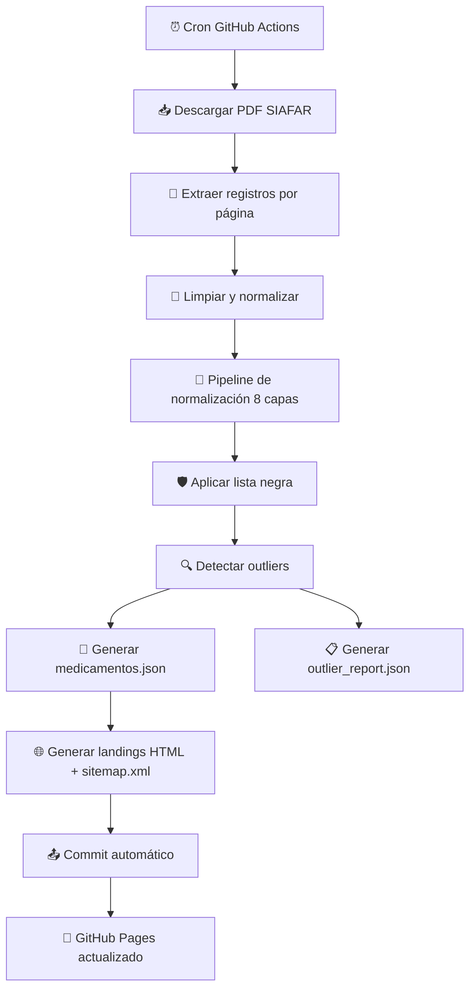
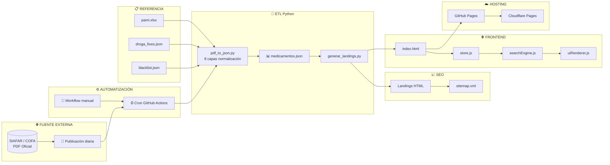
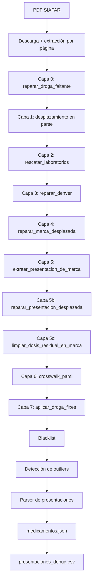
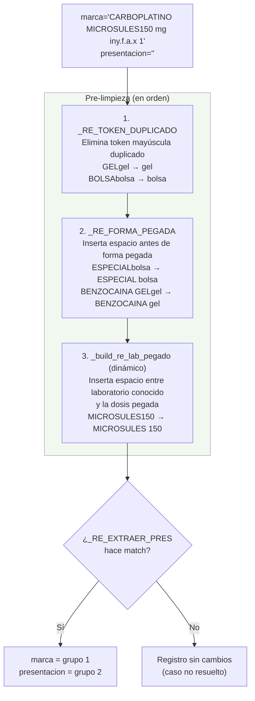
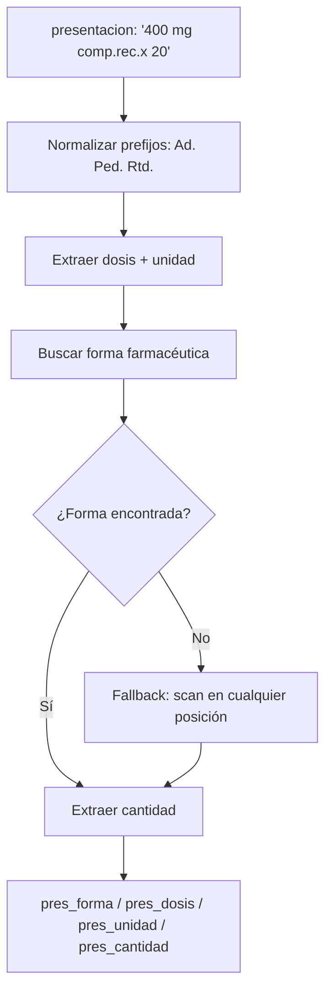
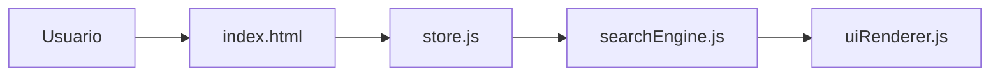
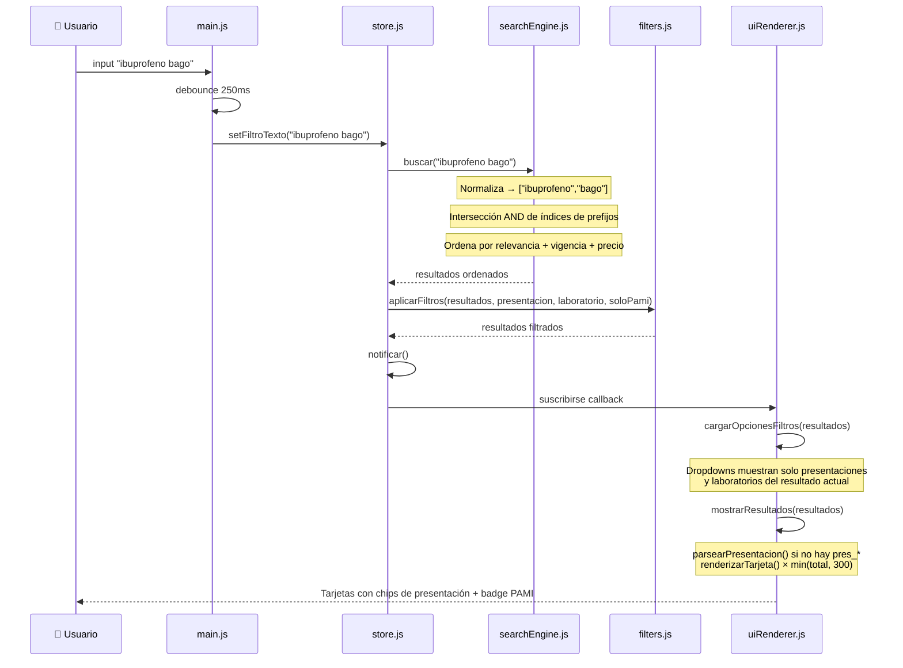
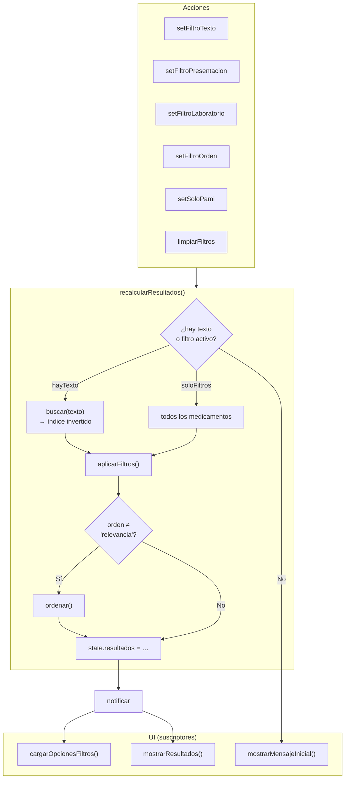
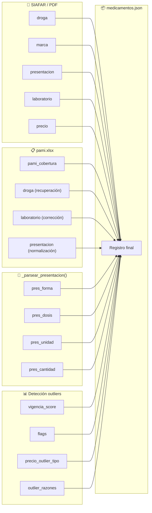

<p align="center">
  
</p>

#  remediar — Buscador de precios de medicamentos en Argentina

<!-- SEO -->
<p align="center">
  <strong>Buscador de precios de medicamentos en Argentina</strong><br>
  <em>Sistema open source que procesa datos oficiales de SIAFAR/COFA y genera un comparador de precios de medicamentos con actualización automática dos veces al día.</em>
</p>

<p align="center">
  <a href="https://remedi.ar">https://remedi.ar</a> ·
  <a href="https://github.com/psbella/remediar">GitHub</a>
</p>

---
<p align="center">

<!-- Hosting & License -->


<br>

<!-- Valores -->


<br>

<!-- Frontend -->


<br>

<!-- Tecnologías -->


<br>

<!-- Backend / Automation -->


<br>

<!-- Diagramas -->


</p>

---

# 📋 Tabla de Contenidos

- [✨ Demo en Vivo](#-demo-en-vivo)
- [📊 Dataset actual](#-dataset-actual)
- [🎯 Funcionamiento General](#-funcionamiento-general)
- [🧭 Principios del Proyecto](#-principios-del-proyecto)
- [👤 Flujo del Usuario](#-flujo-del-usuario)
- [🧠 Algoritmo de Búsqueda y Filtrado](#-algoritmo-de-búsqueda-y-filtrado)
- [🔄 Actualización Automática de Datos](#-actualización-automática-de-datos)
- [📦 Estructura de Datos JSON](#-estructura-de-datos-json)
- [⚡ Optimizaciones Implementadas](#-optimizaciones-implementadas)
- [⏱️ Tiempos de Respuesta](#️-tiempos-de-respuesta)
- [🏗️ Arquitectura del Sistema](#️-arquitectura-del-sistema)
- [📁 Estructura del Repositorio](#-estructura-del-repositorio)
- [🧰 Stack Tecnológico](#-stack-tecnológico)
- [🧠 Decisiones Técnicas](#-decisiones-técnicas)
- [💻 Ejecución Local](#-ejecución-local)
- [🐍 Scripts Python](#-scripts-python)
- [📊 Métricas y Rendimiento](#-métricas-y-rendimiento)
- [🔍 SEO y Metadatos](#-seo-y-metadatos)
- [🔒 Seguridad y Privacidad](#-seguridad-y-privacidad)
- [📚 Documentación Completa](#-documentación-completa)
- [🔌 API No Oficial](#-api-no-oficial)
- [👥 Guía de Contribución](#-guía-de-contribución)
- [📊 Diagramas de Flujo Detallados](#-diagramas-de-flujo-detallados)
- [🧩 Referencia de Componentes Frontend](#-referencia-de-componentes-frontend)
- [🎨 Guía de Estilos CSS](#-guía-de-estilos-css)
- [🔧 Documentación de Workflows](#-documentación-de-workflows)
- [❓ Preguntas Frecuentes (FAQ)](#-preguntas-frecuentes-faq)
- [🗺️ Roadmap](#️-roadmap)
- [📄 Licencia](#-licencia)
- [🙏 Fuente de Datos](#-fuente-de-datos)

---

# ✨ Demo en Vivo

| Entorno | URL | Propósito |
|---|---|---|
| GitHub Pages | https://psbella.github.io/remediar/ | Desarrollo y respaldo |
| Cloudflare Pages | https://remedi.ar | Producción principal |

---

# 📊 Dataset actual

| Métrica | Valor |
|---|---|
| Registros | ~12.100 |
| Drogas únicas | ~1.700 |
| Landings SEO | 56+ |
| Tamaño JSON | ~2.5 MB |
| Tamaño gzip | ~520 KB |
| Con cobertura PAMI | ~5.900 (49%) |
| Cobertura parser de presentaciones | 99,5% |
| Actualizaciones | 2 veces/día (lunes a viernes) |

---

# 🎯 Funcionamiento General

El sistema se compone de tres capas principales:

## 1️⃣ Extracción y procesamiento

- GitHub Actions ejecuta un workflow automático dos veces al día (lunes a viernes)
- Se descarga el PDF oficial desde SIAFAR / COFA
- Python extrae y normaliza los registros mediante un pipeline de 8 capas
- Se cruzan los datos con el vademécum de PAMI para enriquecer cobertura
- Se genera `medicamentos.json`
- Se crean 56+ landings HTML estáticas SEO

---

## 2️⃣ Distribución

- El proyecto es 100% estático
- GitHub Pages funciona como backup
- Cloudflare Pages distribuye el contenido globalmente mediante CDN
- No existe backend persistente ni base de datos tradicional

---

## 3️⃣ Frontend SPA

- `index.html` carga la aplicación
- Los datos se descargan una sola vez
- Se indexan en memoria
- La búsqueda ocurre completamente del lado cliente
- El estado UI es reactivo mediante `store.js`

---

# 🧭 Principios del Proyecto

- Acceso libre a información de medicamentos
- Sin publicidad invasiva
- Sin tracking
- Performance primero
- Mobile first
- Open source
- Infraestructura simple y transparente
- Datos públicos y auditables

---

# 👤 Flujo del Usuario


---

# 🧠 Algoritmo de Búsqueda y Filtrado

## Indexación inicial

`searchEngine.js` construye un índice invertido de prefijos sobre `droga`, `marca` y `laboratorio`. Por cada token de 2 o más caracteres se generan todos sus prefijos, mapeados a conjuntos de índices del array de medicamentos.

```javascript
// Fragmento real de searchEngine.js
for (const palabra of txt.split(/\s+/)) {
    for (let k = 2; k <= palabra.length; k++) {
        const pref = palabra.slice(0, k);
        if (!indice[pref]) indice[pref] = new Set();
        indice[pref].add(i);
    }
}
```

La búsqueda realiza una intersección AND entre todos los términos ingresados, de modo que "ibuprofeno bago" solo devuelve registros que contengan ambos tokens.

---

## Ranking de relevancia

Los resultados se ordenan por tres criterios en cascada:

1. **Relevancia textual** — score basado en el campo donde ocurre el match:

| Match | Score |
|---|---|
| Droga exacta | +100 |
| Droga empieza con el término | +80 |
| Droga contiene el término | +50 |
| Marca exacta | +40 |
| Marca empieza con el término | +25 |
| Marca contiene el término | +15 |
| Laboratorio contiene el término | +5 |

2. **vigencia_score** — productos con precios confiables primero
3. **precio** — ascendente como desempate final

Los registros con `vigencia_score < 50` siempre van al fondo, independientemente del score de relevancia.

---

# 🔄 Actualización Automática de Datos

## Workflow



---

## Pipeline de normalización (8 capas)

El parser aplica correcciones en cascada para resolver los problemas estructurales del PDF de SIAFAR:

| Capa | Función | Descripción |
|---|---|---|
| 0 | `reparar_droga_faltante()` | Cuando el PDF omite la línea del principio activo, todos los campos se desplazan. Separa droga+marca fusionadas usando un diccionario de 50 prefijos truncados |
| 1 | Detección en parse | Detecta registros con 4 campos en lugar de 5 durante la extracción del PDF |
| 2 | `rescatar_laboratorios()` | Recupera `laboratorio="Desconocido"` buscando el lab como sufijo en `presentacion` |
| 3 | `reparar_denver()` | Denver Farma usa droga+lab como nombre comercial; separa marca y presentacion fusionadas (variantes DENCR., DF) |
| 4 | `reparar_marca_desplazada()` | Cuando `marca` empieza con dígito y `presentacion` está vacía, invierte el desplazamiento |
| 5 | `extraer_presentacion_de_marca()` | Extrae la presentacion fusionada en el campo marca. Antes de aplicar el regex de corte: (1) separa laboratorios genéricos pegados sin espacio a la dosis (`_build_re_lab_pegado()`, dinámico por dataset); (2) separa formas farmacéuticas pegadas sin espacio al texto previo (`_RE_FORMA_PEGADA`); (3) elimina duplicados de token en mayúscula+minúscula (`_RE_TOKEN_DUPLICADO`, ej. `GELgel → gel`). Cubre `BOLSA`, `VIAL`, `SPRAY`, `GEL`, `PCOMP` y otras formas no estándar del PDF de SIAFAR |
| 5b | `reparar_presentacion_desplazada()` | Separa presentacion+lab fusionados en el campo lab (3 sub-patrones: 2A, 2B, 2C) |
| 5c | `limpiar_dosis_residual_en_marca()` | Limpia la dosis numérica que queda pegada al nombre del laboratorio en `marca` cuando la Capa 5b ya separó la forma pero dejó la dosis sin limpiar (ej. `"CIPROFLOXACINA SANT GALL500 MG"` → `"CIPROFLOXACINA SANT GALL"`) |
| 6 | `crosswalk_pami()` | Cruza contra `data/pami.xlsx` por marca+presentacion: (1) recupera droga vacía cuando SIAFAR la omite, (2) corrige el laboratorio, (3) normaliza el campo `presentacion` usando el texto del vademécum PAMI cuando hay match, (4) agrega `pami_cobertura` |
| 7 | `aplicar_droga_fixes()` | Aplica correcciones manuales desde `data/droga_fixes.json` (marca → droga, con soporte para corrección simultánea de marca) |

---

## Workflow GitHub Actions

```yaml
name: Actualizar precios

on:
  schedule:
    - cron: '30 13,21 * * 1-5'
  workflow_dispatch:

jobs:
  update:
    runs-on: ubuntu-latest
    steps:
      - uses: actions/checkout@v4

      - uses: actions/setup-python@v5
        with:
          python-version: '3.11'

      - run: |
          python -m pip install --upgrade pip
          pip install pymupdf pandas openpyxl

      - run: python scripts/pdf_to_json.py

      - run: python scripts/generar_landings.py

      - name: Commit y push
        run: |
          git config user.name "github-actions[bot]"
          git config user.email "actions@github.com"
          git pull --rebase origin main
          git add data/medicamentos.json
          git add data/outlier_report.json
          git add data/droga_fixes.json
          git add data/pami.xlsx
          git add *.html
          git add sitemap.xml
          git commit -m "Actualizar precios $(date +'%Y-%m-%d')" || echo "No changes"
          git push origin main
```

---

# 📦 Estructura de Datos JSON

## Ejemplo de registro

```json
{
  "droga": "ibuprofeno",
  "marca": "IBUPIRAC",
  "presentacion": "400 mg comp.x 20",
  "laboratorio": "Pfizer",
  "precio": 9800.50,
  "pami_cobertura": 55,
  "pres_forma": "COMPRIMIDOS",
  "pres_dosis": "400",
  "pres_unidad": "MG",
  "pres_cantidad": "20",
  "vigencia_score": 100,
  "flags": [],
  "precio_outlier_tipo": null,
  "outlier_razones": []
}
```

---

## Campos

| Campo | Tipo | Descripción |
|---|---|---|
| `droga` | string | Principio activo (nombre genérico) |
| `marca` | string | Nombre comercial |
| `presentacion` | string | Dosis, forma farmacéutica y cantidad |
| `laboratorio` | string | Laboratorio fabricante |
| `precio` | number | PVP en ARS (fuente: SIAFAR) |
| `pami_cobertura` | number\|null | Porcentaje de cobertura PAMI (ej: 55). Null si no está en el vademécum |
| `pres_forma` | string\|null | Forma farmacéutica parseada (ej: `"COMPRIMIDOS RECUBIERTOS"`, `"JARABE"`) |
| `pres_dosis` | string\|null | Dosis numérica (ej: `"400"`, `"500"`) |
| `pres_unidad` | string\|null | Unidad de la dosis (ej: `"MG"`, `"ML"`, `"UI"`) |
| `pres_cantidad` | string\|null | Cantidad de unidades (ej: `"20"`, `"100 ml"`) |
| `vigencia_score` | number | Score de confiabilidad del precio (0-100). < 50 = outlier |
| `flags` | array | Etiquetas de anomalía (`precio_bajo`, `precio_sospechoso`, `precio_obsoleto`) |
| `precio_outlier_tipo` | string\|null | Categoría del outlier detectado |
| `outlier_razones` | array | Descripción de por qué es outlier |

---

## Archivos de referencia

| Archivo | Descripción |
|---|---|
| `data/pami.xlsx` | Vademécum PAMI. Usado para: (1) cobertura por marca+presentacion, (2) recuperar droga faltante, (3) corregir laboratorio, (4) normalizar el campo `presentacion` |
| `data/droga_fixes.json` | Correcciones manuales marca→droga para casos no resolubles con regex |
| `data/blacklist.json` | Registros excluidos manualmente del dataset. Las claves usan el formato `droga\|marca\|presentacion\|laboratorio` en minúsculas. Las entradas con `droga="-"` (resultado del mismo bug de truncamiento del PDF) son inválidas y deben eliminarse — de lo contrario bloquean medicamentos válidos que hoy tienen droga correcta |
| `data/outlier_report.json` | Reporte detallado de outliers de la última corrida |
| `data/presentaciones_debug.csv` | Auditoría del parser: `presentacion_original` vs. campos parseados (`forma`, `dosis`, `unidad`, `cantidad`) |

### Cómo agregar una corrección a `droga_fixes.json`

`droga_fixes.json` es editable manualmente — no hace falta tocar el código para cubrir nuevas marcas sin principio activo en el PDF.

Dos formatos soportados:

```json
// Solo droga (la marca ya está bien parseada)
"FORXIGA": "dapagliflozina"

// Droga + corrección de marca (droga y marca estaban fusionadas)
"DICLOFENAC POTÁSICO, PARACETAM KINALGIN P": {
  "droga": "diclofenac potásico, paracetamol",
  "marca": "KINALGIN P"
}
```

La clave es siempre el valor del campo `marca` o `droga` en mayúsculas tal como aparece en el JSON. El workflow lo aplica automáticamente en cada corrida.

---

# ⚡ Optimizaciones Implementadas

## ✅ Búsqueda en memoria

El JSON se carga una sola vez y se indexa.

---

## ✅ Estado centralizado

`store.js` controla búsqueda, filtros, ordenamiento y render reactivo.

---

## ✅ Debounce

La búsqueda espera 250ms luego de la última tecla.

---

## ✅ Caché

Los datos se almacenan en `sessionStorage` durante 4 horas.

---

## ✅ Dropdowns contextuales

Al buscar un medicamento, los filtros de presentación y laboratorio se actualizan para mostrar solo las opciones disponibles en los resultados actuales.

---

## ✅ Mobile first

CSS optimizado para móviles, tablets y desktop.

---

## ✅ Renderizado progresivo

300 resultados por render para no bloquear el hilo principal. Sin botón "Ver más" — los outliers (`vigencia_score < 50`) siempre aparecen al final, independientemente del orden seleccionado.

---

## ✅ Filtros sin texto

Seleccionar laboratorio o presentación desde el desplegable muestra resultados aunque el campo de búsqueda esté vacío. El store arranca con el dataset completo y aplica los filtros activos.

---

## ✅ Landings SEO sin outliers

Las páginas estáticas por droga filtran automáticamente los registros con `vigencia_score < 50` para no mostrar precios obsoletos.

---

# ⏱️ Tiempos de Respuesta

| Métrica | Valor |
|---|---|
| FCP | 0.8 - 1.2s |
| LCP | 1.5 - 2.0s |
| TTI | 1.8 - 2.5s |
| Búsqueda | 25 - 100ms |
| TTFB | 50 - 150ms |

---

# 🏗️ Arquitectura del Sistema



---

# 📁 Estructura del Repositorio

```text
remediar/
├── index.html
├── style.css
├── manifest.json
├── robots.txt
├── sitemap.xml
├── privacidad.html
├── terminos.html
├── README.md
├── _headers
├── .nojekyll
│
├── img/
│   └── favicon.svg
│
├── js/
│   ├── main.js
│   ├── dataLoader.js
│   ├── filters.js
│   ├── searchEngine.js
│   ├── uiRenderer.js
│   ├── utils.js
│   └── core/
│       └── store.js
│
├── data/
│   ├── medicamentos.json
│   ├── outlier_report.json
│   ├── blacklist.json
│   ├── droga_fixes.json
│   └── pami.xlsx
│
├── scripts/
│   ├── pdf_to_json.py
│   └── generar_landings.py
│
├── .github/workflows/
│   └── update-prices.yml
│
└── [56+ landings HTML]
```

---

# 🧰 Stack Tecnológico

| Capa | Tecnología |
|---|---|
| Frontend | HTML5 + CSS3 + Vanilla JS |
| Backend ETL | Python 3.11 |
| Parsing PDF | PyMuPDF |
| Crosswalk PAMI | pandas + openpyxl |
| Datos | JSON |
| CI/CD | GitHub Actions |
| Hosting | GitHub Pages + Cloudflare |
| SEO | JSON-LD + Open Graph |
| Caché | sessionStorage |

---

# 🧠 Decisiones Técnicas

## ¿Por qué Vanilla JS?

- Menor tamaño final
- Mejor tiempo de carga
- Sin dependencias pesadas
- SEO más simple
- Mantenimiento sencillo

## ¿Por qué JSON plano y no base de datos?

- Hosting estático
- Costos prácticamente cero
- CDN extremadamente eficiente
- Menor complejidad operacional

## ¿Por qué 8 capas de normalización?

El PDF de SIAFAR no tiene un esquema tabular estricto. Distintos laboratorios omiten campos, fusionan droga+marca sin separador, o desplazan la presentación al campo laboratorio. Las capas se aplican en cascada de menor a mayor complejidad, garantizando que cada corrección no interfiera con las anteriores.

## ¿Por qué Cloudflare Pages?

- CDN global
- Excelente latencia en Argentina
- Deploy automático
- HTTPS gratuito

---

# 💻 Ejecución Local

## Python

```bash
git clone https://github.com/psbella/remediar.git
cd remediar
python -m http.server 8000
```

## Node.js

```bash
npx http-server -p 8000 --cors -c-1
```

## Docker

```dockerfile
FROM nginx:alpine
COPY . /usr/share/nginx/html
```

```bash
docker build -t remediar .
docker run -p 8080:80 remediar
```

---

# 🐍 Scripts Python

| Script | Función |
|---|---|
| `pdf_to_json.py` | Descarga PDF; aplica pipeline de 8 capas de normalización; crosswalk con PAMI (`pami_cobertura`); aplica blacklist; detecta outliers; genera `medicamentos.json` y `outlier_report.json` |
| `generar_landings.py` | Crea landings SEO estáticas por droga (filtrando outliers), regenera `sitemap.xml` con fecha del día |

---

# 📊 Métricas y Rendimiento

| Métrica | Valor |
|---|---|
| Lighthouse Performance | 94-96 |
| Accessibility | 98 |
| Best Practices | 100 |
| SEO | 100 |
| CLS | 0.02 |
| FID | 12ms |

---

# 🔍 SEO y Metadatos

## Implementaciones

- JSON-LD (Drug, Offer, BreadcrumbList)
- Open Graph
- Twitter Cards
- Sitemap.xml
- robots.txt
- Landings estáticas indexables por droga

---

## Ejemplo JSON-LD

```json
{
  "@context": "https://schema.org",
  "@type": "Drug",
  "name": "Ibuprofeno",
  "activeIngredient": "Ibuprofeno"
}
```

---

# 🔒 Seguridad y Privacidad

- No se recopilan datos personales
- No se utilizan cookies de tracking
- No existe autenticación en el frontend
- No existe backend persistente
- No se comparte información con terceros
- Todo el frontend puede auditarse públicamente
- Content Security Policy estricta declarada en `index.html`: `default-src 'self'`, sin fuentes externas ni iframes
- `robots.txt` bloquea explícitamente GPTBot y ClaudeBot para proteger el contenido de scrapers de entrenamiento de modelos de lenguaje

---

# 📚 Documentación Completa

| Documento | Descripción | Link |
|---|---|---|
| API No Oficial | Consumo externo de `medicamentos.json` | [Ver sección](#-api-no-oficial) |
| Guía de Contribución | Cómo colaborar con el proyecto | [Ver sección](#-guía-de-contribución) |
| Diagramas Mermaid | Arquitectura y flujos internos | [Ver sección](#-diagramas-de-flujo-detallados) |
| Referencia Frontend | Componentes y módulos JS | [Ver sección](#-referencia-de-componentes-frontend) |
| Guía CSS | Variables, breakpoints y estilos | [Ver sección](#-guía-de-estilos-css) |
| Workflows | Automatización y CI/CD | [Ver sección](#-documentación-de-workflows) |
| FAQ | Preguntas frecuentes | [Ver sección](#-preguntas-frecuentes-faq) |
| Roadmap | Funcionalidades futuras | [Ver sección](#️-roadmap) |

---

## 🌐 Enlaces del Proyecto

| Recurso | URL |
|---|---|
| Producción | https://remedi.ar |
| GitHub Pages | https://psbella.github.io/remediar/ |
| Repositorio GitHub | https://github.com/psbella/remediar |
| Actions / CI | https://github.com/psbella/remediar/actions |
| medicamentos.json (CDN) | https://remedi.ar/data/medicamentos.json |
| medicamentos.json (GitHub Raw) | https://raw.githubusercontent.com/psbella/remediar/main/data/medicamentos.json |
| Sitemap | https://remedi.ar/sitemap.xml |
| robots.txt | https://remedi.ar/robots.txt |
| Política de privacidad | https://remedi.ar/privacidad.html |
| Términos y condiciones | https://remedi.ar/terminos.html |

---

## 📦 Archivos Importantes

| Archivo | Función |
|---|---|
| `index.html` | SPA principal |
| `style.css` | Estilos globales |
| `js/core/store.js` | Estado reactivo |
| `js/searchEngine.js` | Motor de búsqueda |
| `js/uiRenderer.js` | Renderizado frontend + badge PAMI |
| `data/medicamentos.json` | Dataset principal |
| `data/pami.xlsx` | Vademécum PAMI (cobertura por marca+presentacion) |
| `data/droga_fixes.json` | Correcciones manuales de droga |
| `data/blacklist.json` | Registros excluidos |
| `scripts/pdf_to_json.py` | ETL principal (pipeline de 8 capas) |
| `scripts/generar_landings.py` | Generador de landings SEO |
| `.github/workflows/update-prices.yml` | Automatización |

---

# 🔌 API No Oficial

## Endpoints

| Método | URL |
|---|---|
| GET | https://remedi.ar/data/medicamentos.json |
| GET | https://raw.githubusercontent.com/psbella/remediar/main/data/medicamentos.json |

---

## JavaScript

```javascript
const response = await fetch('https://remedi.ar/data/medicamentos.json');
const { medicamentos } = await response.json();

// Filtrar por droga con cobertura PAMI
const conPami = medicamentos.filter(m => m.pami_cobertura > 0);

// Calcular copago PAMI
const copago = m => Math.round(m.precio * (1 - m.pami_cobertura / 100));

// Filtrar por forma farmacéutica
const comprimidos = medicamentos.filter(m => m.pres_forma?.includes('COMPRIMIDOS'));
```

---

## Python

```python
import pandas as pd

df = pd.read_json("https://remedi.ar/data/medicamentos.json")
meds = pd.json_normalize(df['medicamentos'])

# Filtrar solo los que tienen cobertura PAMI
con_pami = meds[meds['pami_cobertura'].notna()]
```

---

# 👥 Guía de Contribución

## Flujo

```bash
git checkout -b feature/nueva-funcion
git commit -m "feat: agregar filtro"
git push
```

## Convenciones de commits

| Tipo | Ejemplo |
|---|---|
| `feat` | Nueva funcionalidad |
| `fix` | Corrección de bug |
| `docs` | Documentación |
| `perf` | Performance |

---

# 📊 Diagramas de Flujo Detallados

## Pipeline ETL completo



---

## Detalle de la Capa 5: extraer_presentacion_de_marca

La Capa 5 es la más compleja del pipeline — antes de aplicar el regex de corte, aplica tres pasos de pre-limpieza para normalizar el campo `marca` cuando trae texto del PDF fusionado sin espacios.



El regex `_build_re_lab_pegado` se construye dinámicamente en cada corrida a partir de los laboratorios ya presentes en el dataset, usando la última palabra alfabética significativa de cada nombre (ej. `"Microsules Arg."` → `"Microsules"`, `"Delta Farma"` → `"Farma"`). Esto evita mantener una lista hardcodeada.

---


Después del pipeline de 8 capas, el ETL aplica `_parsear_presentacion()` sobre el campo `presentacion` de cada registro y agrega los resultados como campos estructurados en el JSON de producción.



| Campo generado | Ejemplo |
|---|---|
| `pres_forma` | `"COMPRIMIDOS RECUBIERTOS"` |
| `pres_dosis` | `"400"` |
| `pres_unidad` | `"MG"` |
| `pres_cantidad` | `"20"` |

Cobertura actual: **99,5%** (295 casos sin parsear son formas genuinamente ambiguas: sabores de caramelos, kits, dispositivos). El archivo `data/presentaciones_debug.csv` permite auditar los casos no resueltos después de cada corrida.

---

## Frontend



---

## Ciclo de vida de una búsqueda



---

## Flujo reactivo del store



---

## Anatomía de un registro




## store.js

- Estado global reactivo con patrón pub/sub (`suscribirse` / `notificar`)
- Filtros: texto, laboratorio, presentacion, orden, soloPami
- Sin texto ni filtros activos → `resultados = []` (muestra mensaje inicial, no lista completa)
- Con filtros activos y sin texto → parte del dataset completo y aplica filtros
- Ordenamiento con conciencia de vigencia: `vigencia_score < 50` siempre al fondo
- Soporte para búsqueda sin texto cuando hay filtros activos (laboratorio, presentacion, PAMI)

## uiRenderer.js

- Render de tarjetas con principio activo en mayúsculas
- Chips de presentación: usa `pres_forma` / `pres_dosis` / `pres_unidad` / `pres_cantidad` del JSON cuando están disponibles; cae a `parsearPresentacion()` (JS) como fallback
- En modo PAMI activo, invierte la jerarquía visual: muestra el copago estimado como precio principal y el PVP como referencia secundaria
- Chip PAMI con formato "Cobertura PAMI 55% · $4.500" (porcentaje + copago estimado)
- Dropdowns contextuales: al buscar un medicamento, los selectores de presentación y laboratorio se actualizan para mostrar solo las opciones disponibles en los resultados actuales
- Skeleton loaders
- Mensajes de error/vacío
- Scroll-to-top automático al superar 300px de scroll

## utils.js

- `normalizar()`: lowercase + quita tildes para búsqueda
- `formatearPrecio()`: formato ARS con `toLocaleString`
- `normalizarLaboratorio()`: resuelve laboratorios truncados por el PDF (ej. `"laboratorio gra"` → `"Laboratorio Grafo"`)
- `parsearPresentacion()`: parser JS de fallback que descompone el string de presentación en `{ dosis, forma, cantidad }`. Cubre 60+ formas farmacéuticas mediante `FORMAS_MAP`. Se usa cuando el JSON no trae los campos `pres_*` pre-calculados por el ETL
- `extraerFiltros()`: construye los sets de presentaciones y laboratorios válidos para los dropdowns, filtrando valores corruptos

## dataLoader.js

- Caché con `sessionStorage` (clave `remedios_data_v2`)
- TTL de 4 horas
- Fetch con `priority: 'high'`

## searchEngine.js

- Índice invertido de prefijos sobre `droga`, `marca` y `laboratorio`
- Búsqueda AND multi-término normalizada (sin tildes, lowercase)
- Ranking por relevancia textual (droga > marca > lab), `vigencia_score` y precio
- Los registros con `vigencia_score < 50` siempre se degrada al fondo del resultado

---

# 🎨 Guía de Estilos CSS

## Variables principales

```css
:root {
  --teal:        #00bfa5;
  --teal-light:  #e0f7f4;
  --teal-darker: #00897b;
  --text-1:      #1a2e2e;
  --text-4:      #7a9696;
  --border-radius: 12px;
}
```

## Responsive

| Breakpoint | Tamaño |
|---|---|
| Mobile | < 640px |
| Tablet | 641px - 1024px |
| Desktop | > 1024px |

---

# 🔧 Documentación de Workflows

| Parámetro | Valor |
|---|---|
| Schedule | 10:30 y 18:30 ARG (lunes a viernes) |
| Runtime | Ubuntu latest |
| Python | 3.11 |
| Dependencias | pymupdf, pandas, openpyxl |
| Trigger manual | Sí (`workflow_dispatch`) |
| Pull antes de commit | Sí (`git pull --rebase`) |

---

# ❓ Preguntas Frecuentes (FAQ)

## ¿De dónde salen los datos?

Del PDF oficial publicado por SIAFAR / COFA dos veces al día.

## ¿Qué es el vigencia_score?

Un score de 0 a 100 que indica la confiabilidad del precio. Un score < 50 indica que el precio es probable outlier (obsoleto, cero, o estadísticamente anómalo respecto a la mediana de la droga). Las landings SEO y el frontend filtran estos registros automáticamente.

## ¿Qué significa el chip PAMI?

Muestra la cobertura y el copago estimado en un solo chip: **"Cobertura PAMI 55% · $4.500"**.

El copago se calcula como `precio × (1 - cobertura / 100)`.

**Ejemplo:**
```
PVP SIAFAR:       $10.000
Cobertura PAMI:   55%
Copago estimado:  $10.000 × (1 - 0.55) = $4.500
```

Es una aproximación — el copago real puede variar porque el porcentaje de cobertura es del vademécum PAMI y el precio base es el PVP actualizado de SIAFAR.

## ¿Cada cuánto se actualiza?

Dos veces al día, de lunes a viernes.

## ¿Tiene publicidad?

No.

## ¿Tiene tracking?

No.

## ¿Se puede usar el JSON libremente?

Sí, bajo licencia MIT.

---

# ⚠️ Limitaciones conocidas

| Limitación | Descripción |
|---|---|
| ~9 registros sin presentación | El PDF de SIAFAR no incluye la presentación para estas marcas (KETOSTERIL, FRENALER D, DEXALERGIN, VIXALERG, KINALGIN P, ASFARADIL, FEMIDEN, SIGNORINA, VAXNEUVANCE). No son errores del parser — el dato simplemente no está en la fuente. |
| `pami_cobertura` es aproximado | El porcentaje de cobertura proviene del vademécum PAMI (que se actualiza con menor frecuencia) aplicado sobre el PVP actual de SIAFAR. El copago real puede diferir por actualizaciones de precios o cambios en la cobertura. |
| Precios de SIAFAR en ARS | Con la inflación argentina, los precios pueden quedar desactualizados entre corridas. El `vigencia_score` ayuda a identificar los registros más sospechosos. |
| PDF de SIAFAR sin esquema fijo | Distintos laboratorios aplican su propia semántica al PDF (nombre comercial como droga, presentación fusionada con marca, etc.). El pipeline de 8 capas resuelve los patrones conocidos; pueden aparecer casos nuevos en futuras corridas. |
| Cobertura PAMI parcial | El vademécum de PAMI no cubre todos los medicamentos del dataset de SIAFAR. Los registros sin `pami_cobertura` simplemente no están en el vademécum. |

---

# 🗺️ Roadmap

## Corto plazo

- Filtro por forma farmacéutica en la UI (usando `pres_forma`, ya disponible en el JSON)
- `medicamentos.pretty.json` con `indent=2` para debug humano
- Historial de precios
- IOMA como segunda fuente de crosswalk

## Mediano plazo

- API REST pública
- Dashboard estadístico
- Evolución histórica de precios

## Largo plazo

- Integración farmacias tiempo real
- App móvil
- Geolocalización

---

# 📄 Licencia

MIT License. Uso libre para proyectos personales y comerciales.

---

# 🙏 Fuente de Datos

Datos proporcionados por SIAFAR / COFA. Cobertura PAMI desde el vademécum oficial del PAMI.

---

<p align="center">
  <strong>Hecho con ❤️ para que los medicamentos sean más accesibles en Argentina.</strong>
</p>