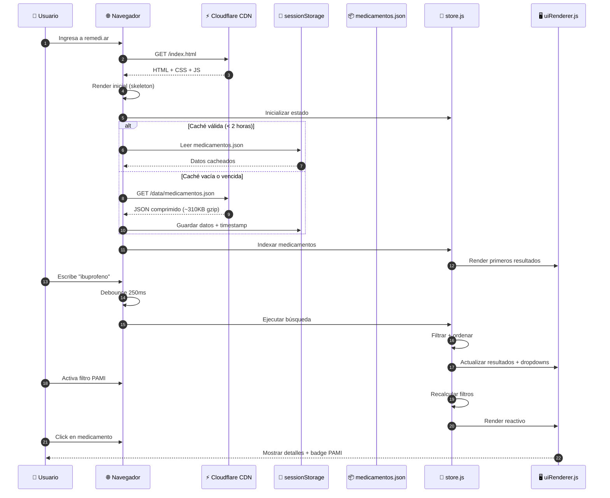
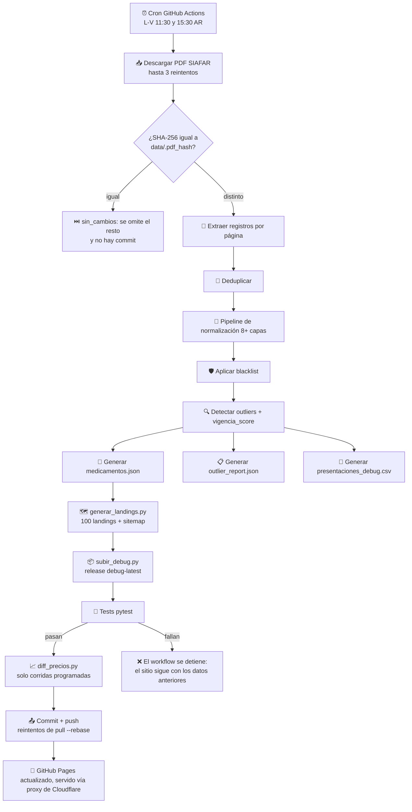
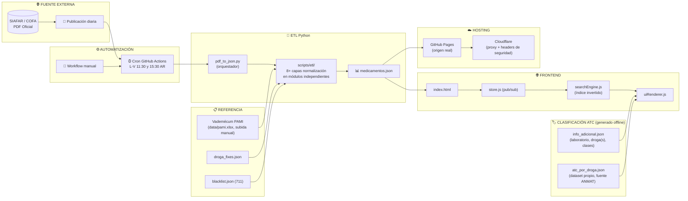
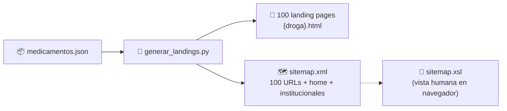
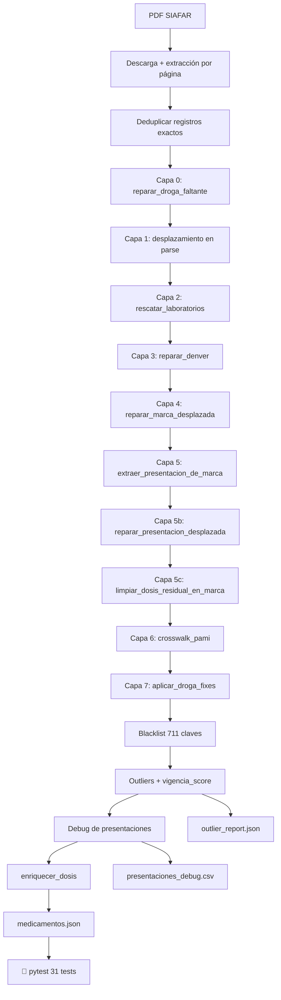
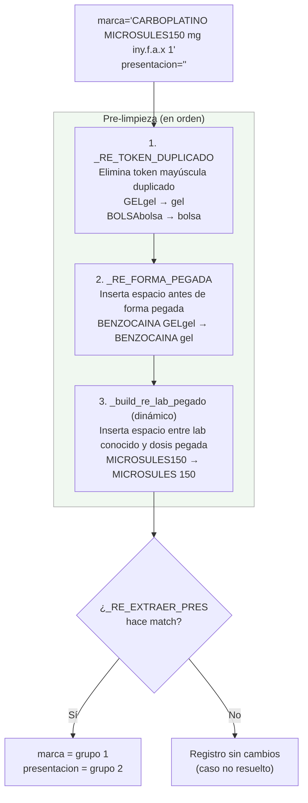
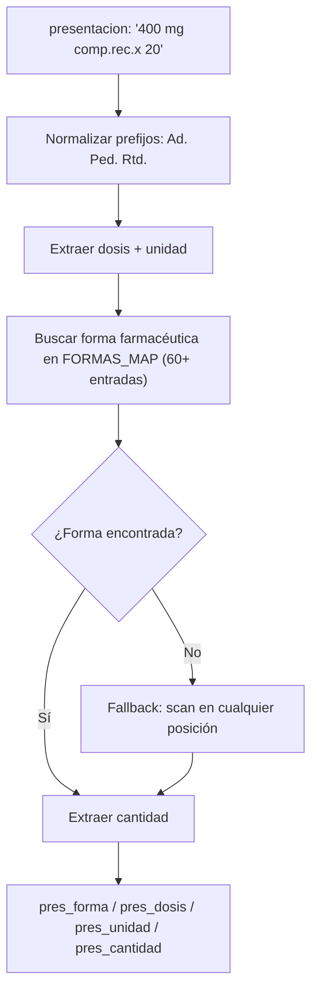
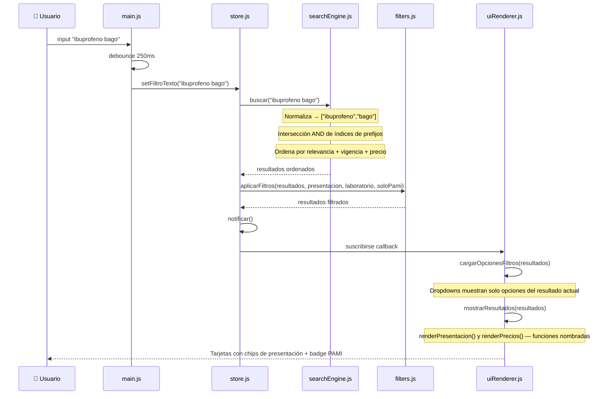
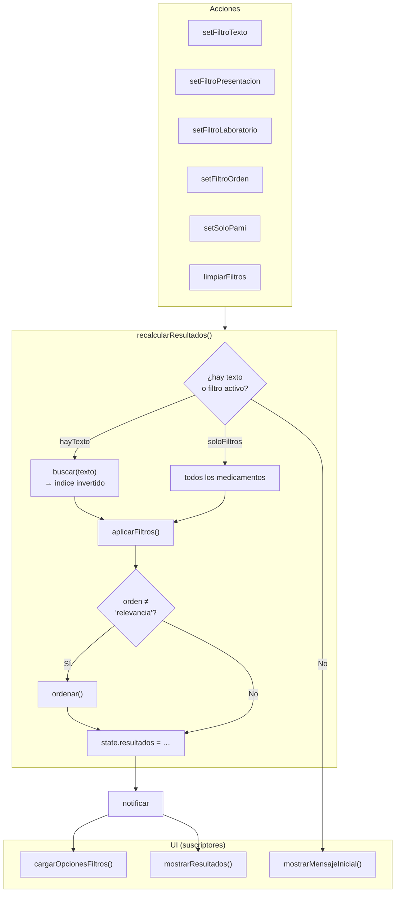
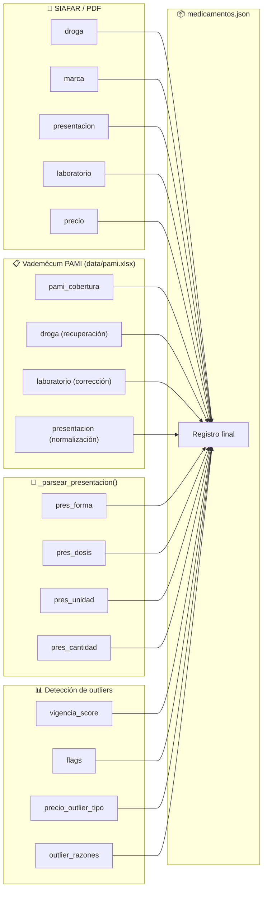

<p align="center">
  
</p>

# remedi.ar — Buscador de precios de medicamentos en Argentina

<p align="center">
  <strong>Buscador de precios de medicamentos en Argentina</strong><br>
  <em>Sistema open source que procesa datos oficiales de SIAFAR/COFA/PAMI y genera un comparador de precios con actualización automática dos veces por día hábil.</em>
</p>

<p align="center">
  <a href="https://remedi.ar">https://remedi.ar</a> ·
  <a href="https://github.com/psbella/remediar">GitHub</a>
</p>

---

<p align="left">
<!-- Versión -->


<br>
<!-- Hosting & License -->


<br>
<!-- Valores -->


<br>
<!-- Frontend -->


<br>
<!-- Tecnologías -->


<br>
<!-- Backend / Automation -->


<br>
<!-- Datos -->

<br>
<!-- Diagramas -->

<br>
<!-- Features -->


</p>

---

> 🇬🇧 **[English version](./README.en.md)**

> **Estado de este documento:** revisado el 2026-10-07 contra la versión **2.5.3** de `main` (más los cambios "Sin publicar" del [CHANGELOG](./CHANGELOG.md)). Las cifras se midieron sobre el `data/medicamentos.json` generado el 2026-10-06 16:38 (hora de Argentina). Si el código cambia, este archivo se actualiza junto con él; ante cualquier duda, el código manda.

---

# 📋 Tabla de Contenidos

- [✨ Demo en Vivo](#-demo-en-vivo)
- [📊 Dataset actual](#-dataset-actual)
- [🎯 Funcionamiento General](#-funcionamiento-general)
- [🧭 Principios del Proyecto](#-principios-del-proyecto)
- [👤 Flujo del Usuario](#-flujo-del-usuario)
- [🧠 Algoritmo de Búsqueda y Filtrado](#-algoritmo-de-búsqueda-y-filtrado)
- [🔄 Actualización Automática de Datos](#-actualización-automática-de-datos)
- [📦 Estructura de Datos JSON](#-estructura-de-datos-json)
- [⚡ Optimizaciones Implementadas](#-optimizaciones-implementadas)
- [⏱️ Tiempos de Respuesta](#️-tiempos-de-respuesta)
- [🏗️ Arquitectura del Sistema](#️-arquitectura-del-sistema)
- [📁 Estructura del Repositorio](#-estructura-del-repositorio)
- [🧰 Stack Tecnológico](#-stack-tecnológico)
- [🧠 Decisiones Técnicas](#-decisiones-técnicas)
- [💻 Ejecución Local](#-ejecución-local)
- [🐍 Scripts Python](#-scripts-python)
- [📊 Métricas y Rendimiento](#-métricas-y-rendimiento)
- [🔍 SEO y Metadatos](#-seo-y-metadatos)
- [🔒 Seguridad y Privacidad](#-seguridad-y-privacidad)
- [🔌 API No Oficial](#-api-no-oficial)
- [👥 Guía de Contribución](#-guía-de-contribución)
- [📊 Diagramas de Flujo Detallados](#-diagramas-de-flujo-detallados)
- [🧩 Referencia de Componentes Frontend](#-referencia-de-componentes-frontend)
- [🎨 Guía de Estilos CSS](#-guía-de-estilos-css)
- [🔧 Documentación de Workflows](#-documentación-de-workflows)
- [❓ Preguntas Frecuentes (FAQ)](#-preguntas-frecuentes-faq)
- [⚠️ Limitaciones conocidas](#️-limitaciones-conocidas)
- [🗺️ Roadmap](#️-roadmap)
- [📄 Licencia](#-licencia)
- [🙏 Fuente de Datos](#-fuente-de-datos)

---

# ✨ Demo en Vivo

| Entorno | URL | Propósito |
|---|---|---|
| GitHub Pages (dominio propio, DNS en Cloudflare) | [remedi.ar](https://remedi.ar) | Producción — alojado en GitHub |
| GitHub Pages (dominio por defecto) | [psbella.github.io/remediar](https://psbella.github.io/remediar/) | **No es un mirror:** como el repo tiene un [`CNAME`](./CNAME), esa URL redirige a `remedi.ar` |
| Cloudflare Workers | [remediar.pablo-s-bella.workers.dev](https://remediar.pablo-s-bella.workers.dev/) | Mirror estático ([`wrangler.toml`](./wrangler.toml)). Se despliega **a mano** (`npx wrangler deploy`), así que puede ir detrás de `main` |

> **Headers de seguridad:** `remedi.ar` y `www.remedi.ar` están proxied (nube naranja) en Cloudflare, con GitHub Pages como origen. La CSP, `X-Frame-Options` y el resto de los headers de seguridad se aplican vía **Cloudflare Response Header Transform Rules** (dashboard), no desde el archivo `_headers` del repo — ese archivo solo lo procesa el mirror de Workers. Ver [`_headers`](./_headers) para el detalle de los valores replicados.

---

---

# 📊 Dataset actual

Medido el 2026-10-07 sobre la corrida del 2026-10-06 16:38 (hora de Argentina).

| Métrica | Valor |
|---|---|
| Registros | 13.129 |
| Principios activos distintos (campo `droga`) | 1.819 |
| Laboratorios (valores distintos, incluye variantes truncadas del PDF) | 198 |
| Tamaño JSON | ~3,9 MB |
| Tamaño gzip | ~310 KB |
| Con cobertura PAMI | 6.890 (52,5 %); coberturas presentes: 40, 50, 60, 80 y 100 % |
| Con precio a verificar (`vigencia_score < 50`) | 107 |
| Claves en `blacklist.json` | 711 (679 excluidas en la última corrida) |
| Registros con presentación parseada (`pres_forma`) | 12.931 (98,5 %) |
| Entradas en `info_adicional.json` | 11.085 (2.855 inferidas por principio activo) |
| Variaciones de precio en `data/historico/precios.json` | 6.970 |
| Landing pages / URLs en `sitemap.xml` | 100 / 104 |
| Actualizaciones | 2 veces por día hábil (11:30 y 15:30 hora de Argentina), solo si SIAFAR publicó un PDF distinto |
| Tests automáticos | 31 (se corren post-ETL, antes del commit) |

---

# 🎯 Funcionamiento General

El sistema se compone de tres capas principales:

## 1️⃣ Extracción y procesamiento

- GitHub Actions ejecuta un workflow automático dos veces al día (lunes a viernes: `30 14` y `30 18` UTC, es decir 11:30 y 15:30 hora de Argentina)
- Se descarga el PDF oficial desde SIAFAR / COFA (hasta 3 reintentos). Si su SHA-256 coincide con `data/.pdf_hash`, no hubo publicación nueva: se omite el resto del pipeline y no se hace commit
- Python extrae y normaliza los registros mediante un pipeline de 8+ capas
- Se cruzan los datos con el vademécum de PAMI (`data/pami.xlsx`, versionado y actualizado a mano ~1 vez por mes) para enriquecer cobertura
- Se genera `medicamentos.json`

---

## 2️⃣ Distribución

- El proyecto es 100% estático
- GitHub Pages sirve el contenido como origen (dominio propio `remedi.ar` vía DNS de Cloudflare; el dominio por defecto `psbella.github.io/remediar` redirige al propio por el `CNAME`)
- Cloudflare actúa como proxy delante de `remedi.ar`/`www.remedi.ar`: CDN, TLS, y una Transform Rule que inyecta los headers de seguridad (GitHub Pages no soporta headers custom)
- Un mirror adicional corre en Cloudflare Workers (`remediar.pablo-s-bella.workers.dev`), sirviendo los mismos assets estáticos de forma independiente (se despliega a mano, no desde el workflow)
- No existe backend persistente ni base de datos

---

## 3️⃣ Frontend SPA

- `index.html` carga la aplicación
- Los datos se descargan una sola vez y se indexan en memoria
- La búsqueda ocurre completamente del lado cliente
- El estado UI es reactivo mediante `store.js` (patrón pub/sub)

---

# 🧭 Principios del Proyecto

- Acceso libre a información de medicamentos
- Sin publicidad
- Analítica de uso con Google Analytics 4 (cookies propias, sin datos personales y sin publicidad)
- Performance primero
- Mobile first
- Open source
- Infraestructura simple y transparente
- Datos públicos y auditables

---

# 👤 Flujo del Usuario


```mermaid
sequenceDiagram
    autonumber

    participant U as 👤 Usuario
    participant B as 🌐 Navegador
    participant CDN as ⚡ Cloudflare CDN
    participant CACHE as 💾 sessionStorage
    participant JSON as 📦 medicamentos.json
    participant STORE as 🧠 store.js
    participant UI as 🖥️ uiRenderer.js

    U->>B: Ingresa a remedi.ar

    B->>CDN: GET /index.html
    CDN-->>B: HTML + CSS + JS

    B->>B: Render inicial (skeleton)
    B->>STORE: Inicializar estado

    alt Caché válida (< 2 horas)
        B->>CACHE: Leer medicamentos.json
        CACHE-->>B: Datos cacheados
    else Caché vacía o vencida
        B->>CDN: GET /data/medicamentos.json
        CDN-->>B: JSON comprimido (~310KB gzip)
        B->>CACHE: Guardar datos + timestamp
    end

    B->>STORE: Indexar medicamentos
    STORE->>UI: Render primeros resultados

    U->>B: Escribe "ibuprofeno"

    B->>B: Debounce 250ms
    B->>STORE: Ejecutar búsqueda

    STORE->>STORE: Filtrar + ordenar
    STORE->>UI: Actualizar resultados + dropdowns

    U->>B: Activa filtro PAMI
    STORE->>STORE: Recalcular filtros
    STORE->>UI: Render reactivo

    U->>B: Click en medicamento
    UI-->>U: Mostrar detalles + badge PAMI
```

---

# 🧠 Algoritmo de Búsqueda y Filtrado

## Indexación inicial

`searchEngine.js` construye un índice invertido de prefijos sobre `droga`, `marca` y `laboratorio`. Por cada token de 2 o más caracteres se generan todos sus prefijos, mapeados a conjuntos de índices del array de medicamentos.

```javascript
for (const palabra of txt.split(/\s+/)) {
    for (let k = 2; k <= palabra.length; k++) {
        const pref = palabra.slice(0, k);
        if (!indice[pref]) indice[pref] = new Set();
        indice[pref].add(i);
    }
}
```

La búsqueda realiza una intersección AND entre todos los términos ingresados — "ibuprofeno bago" devuelve solo registros que contengan ambos tokens.

---

## Ranking de relevancia

Los resultados se ordenan por tres criterios en cascada:

1. **Relevancia textual** — score basado en el campo donde ocurre el match:

| Match | Score |
|---|---|
| Droga exacta | +100 |
| Droga empieza con el término | +80 |
| Droga contiene el término | +50 |
| Marca exacta | +40 |
| Marca empieza con el término | +25 |
| Marca contiene el término | +15 |
| Laboratorio contiene el término | +5 |

2. **vigencia_score** — productos con precios confiables primero
3. **precio** — ascendente como desempate final

Los registros con `vigencia_score < 50` siempre van al fondo, independientemente del score de relevancia: en el código, esa separación es la **primera** comparación del ordenamiento. Con varios términos, la relevancia textual se calcula con el **primer término**; los demás solo restringen el conjunto (intersección AND).

La lista se muestra con un tope de **300 tarjetas**; el contador indica el total real.

---

# 🔄 Actualización Automática de Datos

## Workflow


```mermaid
flowchart TD

    A[⏰ Cron GitHub Actions<br/>L-V 11:30 y 15:30 AR]
    B[📥 Descargar PDF SIAFAR<br/>hasta 3 reintentos]
    HS{¿SHA-256 igual a<br/>data/.pdf_hash?}
    SK[⏭️ sin_cambios: se omite el resto<br/>y no hay commit]
    C[📄 Extraer registros por página]
    DD[🧹 Deduplicar]
    N1[🔧 Pipeline de normalización 8+ capas]
    BL[🛡️ Aplicar blacklist]
    E[🔍 Detectar outliers + vigencia_score]
    F[💾 Generar medicamentos.json]
    R[📋 Generar outlier_report.json]
    CSV[🔬 Generar presentaciones_debug.csv]
    L[🗺️ generar_landings.py<br/>100 landings + sitemap]
    DBG[📦 subir_debug.py<br/>release debug-latest]
    T[🧪 Tests pytest]
    DF[📈 diff_precios.py<br/>solo corridas programadas]
    H[📤 Commit + push<br/>reintentos de pull --rebase]
    I[🚀 GitHub Pages actualizado, servido vía proxy de Cloudflare]

    A --> B --> HS
    HS -- igual --> SK
    HS -- distinto --> C
    C --> DD --> N1 --> BL --> E
    E --> F
    E --> R
    E --> CSV
    F --> L --> DBG --> T
    T -- fallan --> X[❌ El workflow se detiene:<br/>el sitio sigue con los datos anteriores]
    T -- pasan --> DF --> H
    H --> I
```

---

## Pipeline de normalización (8+ capas)

El parser aplica correcciones en cascada para resolver los problemas estructurales del PDF de SIAFAR:

| Capa | Función | Descripción |
|---|---|---|
| 0 | `reparar_droga_faltante()` | Cuando el PDF omite la línea del principio activo, todos los campos se desplazan. Separa droga+marca fusionadas usando un diccionario de prefijos truncados |
| 1 | Detección en parse | Detecta registros con 4 campos en lugar de 5 durante la extracción del PDF |
| 2 | `rescatar_laboratorios()` | Recupera `laboratorio="Desconocido"` buscando el lab como sufijo en `presentacion` |
| 3 | `reparar_denver()` | Denver Farma usa droga+lab como nombre comercial; separa marca y presentacion fusionadas (variantes DENCR., DF) |
| 4 | `reparar_marca_desplazada()` | Cuando `marca` empieza con dígito y `presentacion` está vacía, invierte el desplazamiento |
| 5 | `extraer_presentacion_de_marca()` | Extrae la presentacion fusionada en el campo marca. Antes del regex de corte: (1) separa laboratorios pegados sin espacio (`_build_re_lab_pegado()`, dinámico por dataset); (2) separa formas farmacéuticas pegadas (`_RE_FORMA_PEGADA`); (3) elimina duplicados mayúscula+minúscula (`_RE_TOKEN_DUPLICADO`) |
| 5b | `reparar_presentacion_desplazada()` | Separa presentacion+lab fusionados en el campo lab (3 sub-patrones: 2A, 2B, 2C) |
| 5c | `limpiar_dosis_residual_en_marca()` | Limpia la dosis numérica que queda pegada al nombre del laboratorio en `marca` |
| 6 | `crosswalk_pami()` | Cruza contra el vademécum de PAMI (`data/pami.xlsx`, versionado y subido a mano cuando PAMI lo actualiza; si el archivo falta, el cruce se omite con un aviso en el log): recupera droga vacía, corrige laboratorio, normaliza `presentacion`, agrega `pami_cobertura` (descarta valores fuera de 0-100). Matchea por marca+presentación, por dosis/cantidad y por marca base + dosis |
| 7 | `aplicar_droga_fixes()` | Aplica correcciones manuales desde `data/droga_fixes.json` |

> **Orden real de ejecución** en `pdf_to_json.py`: descarga → parseo (Capa 1) → deduplicación de registros exactos → Capa 0 → 2 → 3 → 4 → 5 → 5b → 5c → 6 → 7 → blacklist → `calcular_vigencia` → debug de presentaciones → `enriquecer_dosis` (agrega `pres_forma`, `pres_dosis`, `pres_unidad`, `pres_cantidad`, con rescates desde la marca y desde PAMI) → persistencia. La Capa 1 es la detección de líneas de 4 campos que ocurre dentro del parseo (`parser.py`).
>
> Cada una de estas funciones vive en su propio módulo dentro de `scripts/etl/` (ver [Paquete `scripts/etl/`](#paquete-scriptsetl-capas-de-normalización)); `pdf_to_json.py` solo orquesta el orden de ejecución.

---

## Outliers y `vigencia_score`

Los umbrales viven en `scripts/etl/config.py` (`OUTLIER_CONFIG`). Solo se detectan precios **anormalmente bajos**:

| Condición | Flag | `vigencia_score` | `precio_outlier_tipo` |
|---|---|---|---|
| Precio inválido o ≤ 0 | `precio_obsoleto` | 20 | `invalido` |
| Precio < $1.800 | `precio_bajo` | ≤ 45 | `bajo_absoluto` |
| Precio < 10 % de la mediana de su droga | `precio_obsoleto` | 20 | `bajo_critico` |
| Droga con ≥ 3 registros y precio < 25 % de la mediana | `precio_sospechoso` | ≤ 35 | `bajo_relativo` |
| Droga con ≥ 3 registros y precio bajo el *fence* de Tukey (Q1 − 1,5·IQR) | `precio_sospechoso` | ≤ 40 | `bajo_iqr` |
| Precio por unidad < 20 % de la mediana del grupo droga+marca | `precio_sospechoso` | ≤ 35 | `inconsistencia_escala` |

Un registro sin anomalías tiene `vigencia_score = 100`. En el frontend, `< 50` significa "precio a verificar".

---

## Workflow GitHub Actions

`.github/workflows/actualizar-precios.yml`, tal como está en `main`:

```yaml
name: 🔃 Actualizar precios
on:
  schedule:
    - cron: '30 14 * * 1-5'  # 11:30 Argentina
    - cron: '30 18 * * 1-5'  # 18:30 Argentina
  workflow_dispatch:

permissions:
  contents: write

concurrency:
  group: repo-main-write
  cancel-in-progress: false

jobs:
  update:
    runs-on: ubuntu-latest
    timeout-minutes: 15
    steps:
      - name: Checkout
        uses: actions/checkout@3d3c42e5aac5ba805825da76410c181273ba90b1 # v7
      - name: Setup Python
        uses: actions/setup-python@5fda3b95a4ea91299a34e894583c3862153e4b97 # v7.0.0
        with:
          python-version: '3.11'
          cache: 'pip'
      - name: Instalar dependencias
        run: pip install -r requirements.txt
      - name: Ejecutar pdf_to_json.py
        id: pdf_to_json
        run: python scripts/pdf_to_json.py
      - name: Generar landings + sitemap
        if: steps.pdf_to_json.outputs.sin_cambios != 'true'
        run: python scripts/generar_landings.py
      - name: Subir debug a GitHub Releases
        if: steps.pdf_to_json.outputs.sin_cambios != 'true'
        env:
          GITHUB_TOKEN: ${{ secrets.GITHUB_TOKEN }}
        run: python scripts/subir_debug.py
      - name: Verificar sanidad del output
        if: steps.pdf_to_json.outputs.sin_cambios != 'true'
        run: pytest tests/ -v
      - name: Diff de precios
        if: github.event_name == 'schedule' && steps.pdf_to_json.outputs.sin_cambios != 'true'
        env:
          GITHUB_TOKEN: ${{ secrets.GITHUB_TOKEN }}
        run: python scripts/diff_precios.py
      - name: Commit y push
        if: steps.pdf_to_json.outputs.sin_cambios != 'true'
        run: |
          git config user.name "github-actions[bot]"
          git config user.email "actions@github.com"
          git add data/medicamentos.json
          git add data/historico/precios.json
          git add data/outlier_report.json
          git add data/presentaciones_debug.csv
          git add data/.pdf_hash
          git add *.html
          git add sitemap.xml
          git commit -m "Actualizar precios $(TZ="America/Argentina/Buenos_Aires" date +'%Y-%m-%d')" || echo "No changes"

          # Reintenta pull --rebase + push hasta 3 veces: el concurrency group
          # de arriba serializa las corridas de ESTE workflow entre si, asi que
          # el unico conflicto posible es un push manual a main mientras corre
          # el job. Si el rebase queda a medias, se aborta antes de reintentar
          # -- si el conflicto es real (mismo archivo, misma linea), esto no
          # lo resuelve solo: agota los 3 intentos y falla el job a proposito,
          # para que alguien lo mire (probado ambos casos antes de mergear).
          intentos=0
          hasta=3
          while [ "$intentos" -lt "$hasta" ]; do
            intentos=$((intentos + 1))
            if git pull --rebase origin "${{ github.ref_name }}" && git push origin "${{ github.ref_name }}"; then
              echo "Push OK en el intento $intentos."
              exit 0
            fi
            echo "Intento $intentos de $hasta fallo (rebase o push). Abortando rebase si quedo a medias..."
            git rebase --abort 2>/dev/null || true
            sleep $((intentos * 5))
          done
          echo "No se pudo pushear despues de $hasta intentos."
          exit 1
```

> ⚠️ **Ojo con el horario:** `30 18 * * 1-5` está en UTC y equivale a **15:30** hora de Argentina (UTC−3); el comentario `# 18:30 Argentina` del archivo no coincide con eso (y las landings generadas dicen "10:30 y 18:00 hs"). Si la intención era 18:30, el cron correcto sería `30 21 * * 1-5`.

---

# 📦 Estructura de Datos JSON

## Ejemplo de registro

```json
{
  "droga": "ibuprofeno",
  "marca": "IBUPIRAC",
  "presentacion": "400 mg comp.x 20",
  "laboratorio": "Pfizer",
  "precio": 9800.50,
  "pami_cobertura": 60,
  "pres_forma": "COMPRIMIDOS",
  "pres_dosis": "400",
  "pres_unidad": "MG",
  "pres_cantidad": "20",
  "vigencia_score": 100,
  "flags": [],
  "precio_outlier_tipo": null,
  "outlier_razones": []
}
```

---

## Campos

| Campo | Tipo | Descripción |
|---|---|---|
| `droga` | string | Principio activo (nombre genérico) |
| `marca` | string | Nombre comercial |
| `presentacion` | string | Dosis, forma farmacéutica y cantidad |
| `laboratorio` | string | Laboratorio fabricante |
| `precio` | number | PVP en ARS (fuente: SIAFAR) |
| `pami_cobertura` | number (opcional) | Porcentaje de cobertura PAMI (40, 50, 60, 80 o 100). **La clave no existe** si el producto no está en el vademécum |
| `pres_forma` | string\|null | Forma farmacéutica parseada (ej: `"COMPRIMIDOS RECUBIERTOS"`, `"JARABE"`) |
| `pres_dosis` | string\|null | Dosis numérica (ej: `"400"`, `"500"`) |
| `pres_unidad` | string\|null | Unidad de la dosis (ej: `"MG"`, `"ML"`, `"UI"`) |
| `pres_cantidad` | string\|null | Cantidad de unidades (ej: `"20"`, `"100 ml"`) |
| `vigencia_score` | number | Score de confiabilidad del precio (0-100). < 50 = outlier |
| `flags` | array | Etiquetas de anomalía (`precio_bajo`, `precio_sospechoso`, `precio_obsoleto`) |
| `precio_outlier_tipo` | string\|null | Categoría del outlier detectado |
| `outlier_razones` | array | Descripción de por qué es outlier |

---

## Archivos de referencia

| Archivo | Descripción |
|---|---|
| `data/pami.xlsx` | Vademécum PAMI, **versionado en git y subido a mano** (PAMI lo actualiza ~1 vez por mes; no se descarga en cada corrida para no depender de la disponibilidad de su portal en CI). Fuente: [datos abiertos de PAMI](https://datos.pami.org.ar/dataset/medicamentos-para-afiliados). Usado para: (1) cobertura por marca+presentacion, (2) recuperar droga faltante, (3) corregir laboratorio, (4) normalizar el campo `presentacion` |
| `data/droga_fixes.json` | Correcciones manuales marca→droga para casos no resolubles con regex |
| `data/blacklist.json` | 711 claves excluidas manualmente (se edita desde el panel admin). Las claves usan el formato `droga\|marca\|presentacion\|laboratorio` en minúsculas |
| `data/outlier_report.json` | Reporte detallado de outliers de la última corrida |
| `data/.pdf_hash` | SHA-256 del último PDF procesado. Si el PDF nuevo es idéntico, el workflow omite el resto del pipeline |
| `data/historico/precios.json` | Histórico **incremental**: solo altas, bajas y cambios de precio de cada corrida programada (`scripts/diff_precios.py`, solo registros con `vigencia_score ≥ 50`). Hoy es un dato publicado; el sitio todavía no lo muestra |
| `data/presentaciones_debug.csv` | Auditoría del parser: `presentacion_original` vs. campos parseados (`forma`, `dosis`, `unidad`, `cantidad`) |
| `.debug/medicamentos.pretty.json` | Versión formateada con `indent=2` del dataset, solo para debug local — **no se publica** en el sitio ni se versiona en git |

### Nuevos datasets v2.4.0+ (ATC e Info Adicional)

[#nuevos-datasets-v240-atc-e-info-adicional](#nuevos-datasets-v240-atc-e-info-adicional)

| Archivo | Descripción |
|---|---|
| `data/atc/atc_por_droga.json` | Mapeo droga → código ATC. WHOCC. Usado por modal +Info. |
| `data/atc/atc_niveles.json` | Jerarquía ATC Nivel1-4. Decodificación en interfaz. |
| `data/info-adicional/info_adicional.json` | Laboratorio, drogas, ATC, clases terapéuticas. Carga en segundo plano. Las entradas con `"inferido": true` se derivan del principio activo, no del producto. |
| `data/info-adicional/faltantes_atc.csv` | Composiciones que todavía no tienen ATC, ordenadas por cantidad de medicamentos afectados (`scripts/listar_droga_sin_info.py`). |

### Cómo agregar una corrección a `droga_fixes.json`

`droga_fixes.json` es editable manualmente — no hace falta tocar el código para cubrir nuevas marcas sin principio activo en el PDF.

Dos formatos soportados:

```json
// Solo droga (la marca ya está bien parseada)
"FORXIGA": "dapagliflozina"

// Droga + corrección de marca (droga y marca estaban fusionadas)
"DICLOFENAC POTÁSICO, PARACETAM KINALGIN P": {
  "droga": "diclofenac potásico, paracetamol",
  "marca": "KINALGIN P"
}
```

La clave es siempre el valor del campo `marca` o `droga` en mayúsculas tal como aparece en el JSON. El workflow lo aplica automáticamente en cada corrida.

---

# ⚡ Optimizaciones Implementadas

## ✅ Modal +Info con clasificación ATC

[#-modal-info-con-clasificación-atc](#-modal-info-con-clasificación-atc)

Cada medicamento muestra "+ info" que abre modal con laboratorio, drogas, clases terapéuticas y ATC (ANMAT + WHOCC). Datos on-demand desde `data/info-adicional/info_adicional.json`. v2.4.0 via `js/infoAdicional.js` + `js/atcClasificacion.js`.

## ✅ Búsqueda en memoria

El JSON se carga una sola vez y se indexa en memoria con un índice invertido de prefijos. Sin requests adicionales para cada búsqueda.

## ✅ Estado centralizado

`store.js` controla búsqueda, filtros, ordenamiento y render reactivo con un patrón pub/sub manual — sin dependencias externas.

## ✅ Debounce

La búsqueda espera 250ms luego de la última tecla para no saturar el índice.

## ✅ Caché sessionStorage

Los datos se almacenan en `sessionStorage` con TTL de 2 horas. La clave `remedios_data_v2` permite invalidar el caché en deploys sin romper sesiones activas.

## ✅ Dropdowns contextuales

Al buscar un medicamento, los filtros de presentación y laboratorio se actualizan para mostrar solo las opciones disponibles en los resultados actuales.

## ✅ Mobile first

CSS optimizado para móviles, tablets y desktop sin frameworks externos.

## ✅ Renderizado acotado

Como máximo 300 tarjetas por consulta para no bloquear el hilo principal (el contador muestra el total real). Los outliers (`vigencia_score < 50`) siempre aparecen al final, independientemente del orden seleccionado.

## ✅ Filtros sin texto

Seleccionar laboratorio o presentación desde el desplegable muestra resultados aunque el campo de búsqueda esté vacío.

## ✅ PWA completa

Service Worker con estrategia network-first para datos y cache-first para assets estáticos. Íconos en SVG + PNG (192×192 y 512×512) para instalación en todos los dispositivos.

## ✅ Seguridad en headers HTTP

CSP via header HTTP (no meta tag) con hashes SHA256 de los scripts inline ejecutables (config de GA y registro del Service Worker, más un hash transitorio del GA anterior). `style-src` sin `unsafe-inline` (estilos migrados a CSS externo). `X-Frame-Options`, `X-Content-Type-Options`, `Referrer-Policy`, `Permissions-Policy` y `Access-Control-Allow-Origin: *` para el JSON público (declarado en `_headers`; GitHub Pages además lo sirve con CORS abierto por defecto — verificable con `curl -sI https://remedi.ar/data/medicamentos.json`). ⚠️ En producción (`remedi.ar`/`www.remedi.ar`) estos headers los aplica una Cloudflare Response Header Transform Rule, no el archivo `_headers` del repo — [ver por qué](#por-qué-github-pages--cloudflare-como-proxy).

## ✅ Compartir medicamentos

Cada tarjeta tiene un botón "Compartir" que abre el menú nativo en mobile o copia el link al portapapeles en desktop. Cada medicamento tiene una URL única con hash (`remedi.ar/#droga--marca--laboratorio--presentacion`). Al abrir un link compartido, el medicamento aparece destacado arriba con glow teal y productos similares debajo. Los eventos de compartir se registran en GA4.

## ✅ Tests de sanidad automáticos

31 tests pytest corren después de cada actualización del ETL y antes del commit. Si alguno falla, el workflow se detiene y el sitio sigue sirviendo los datos anteriores. 12 validan umbrales de calidad de negocio (cantidad de registros, % de campos vacíos, rango de precios), 1 valida el contrato estructural completo del JSON contra un [JSON Schema versionado](./tests/medicamentos.schema.json), y 18 son tests unitarios de las funciones puras de scripts/etl/ — si el ETL cambia la forma del output o rompe una función de reparación, alguno de estos avisa.
```
============================= test session starts ==============================
platform linux -- Python 3.11.15, pytest-9.1.1, pluggy-1.6.0
collected 31 items
tests/test_etl_modulos.py::test_limpiar_precio_formato_argentino PASSED  [  3%]
tests/test_etl_modulos.py::test_limpiar_precio_valores_invalidos PASSED  [  6%]
tests/test_etl_modulos.py::test_es_precio PASSED                        [  9%]
tests/test_etl_modulos.py::test_make_key_normaliza_case_y_espacios PASSED [ 12%]
tests/test_etl_modulos.py::test_parece_corrupta_texto_limpio_no_marca_nada PASSED [ 16%]
tests/test_etl_modulos.py::test_parece_corrupta_detecta_mojibake_clasico PASSED [ 19%]
tests/test_etl_modulos.py::test_parece_corrupta_detecta_variantes_que_el_filtro_viejo_no_veia PASSED [ 22%]
tests/test_etl_modulos.py::test_filtrar_blacklist_excluye_por_key PASSED [ 25%]
tests/test_etl_modulos.py::test_filtrar_blacklist_vacia_no_toca_nada PASSED [ 29%]
tests/test_etl_modulos.py::test_calcular_stats_por_droga_mediana_correcta PASSED [ 32%]
tests/test_etl_modulos.py::test_evaluar_outlier_precio_invalido PASSED   [ 35%]
tests/test_etl_modulos.py::test_evaluar_outlier_precio_normal_no_marca_nada PASSED [ 38%]
tests/test_etl_modulos.py::test_evaluar_outlier_precio_criticamente_bajo PASSED [ 41%]
tests/test_etl_modulos.py::test_separar_droga_marca_con_prefijo_conocido PASSED [ 45%]
tests/test_etl_modulos.py::test_separar_droga_marca_sin_match_devuelve_none PASSED [ 48%]
tests/test_etl_modulos.py::test_reparar_denver_variante_a_presentacion_pegada_a_marca PASSED [ 51%]
tests/test_etl_modulos.py::test_reparar_denver_no_toca_otros_laboratorios PASSED [ 54%]
tests/test_etl_modulos.py::test_deduplicar_elimina_solo_duplicados_exactos PASSED [ 58%]
tests/test_etl_sanidad.py::test_cantidad_minima PASSED                  [ 61%]
tests/test_etl_sanidad.py::test_cantidad_maxima PASSED                  [ 64%]
tests/test_etl_sanidad.py::test_campos_presentes PASSED                 [ 67%]
tests/test_etl_sanidad.py::test_precios_positivos PASSED                [ 70%]
tests/test_etl_sanidad.py::test_precio_mediana_razonable PASSED         [ 74%]
tests/test_etl_sanidad.py::test_drogas_vacias PASSED                    [ 77%]
tests/test_etl_sanidad.py::test_laboratorios_desconocidos PASSED        [ 80%]
tests/test_etl_sanidad.py::test_marcas_vacias PASSED                    [ 83%]
tests/test_etl_sanidad.py::test_vigencia_score_rango PASSED             [ 87%]
tests/test_etl_sanidad.py::test_pami_cobertura_rango PASSED             [ 90%]
tests/test_etl_sanidad.py::test_estructura_raiz PASSED                  [ 93%]
tests/test_etl_sanidad.py::test_fecha_presente PASSED                   [ 96%]
tests/test_schema.py::test_schema_valido PASSED                         [100%]
31 passed in 1.58s
```
---

# ⏱️ Tiempos de Respuesta

Este proyecto no publica tiempos "de referencia" fijos: dependen del dispositivo, la red y el momento de la medición. Lo que sí es verificable en el código y los datos:

| Dato | Valor |
|---|---|
| Descarga única de `medicamentos.json` | ~310 KB con gzip (~3,9 MB descomprimido) |
| Caché de datos en el navegador | `sessionStorage`, TTL 2 h (`remedios_data_v2`), más el Service Worker |
| Debounce de búsqueda | 250 ms |
| Búsqueda | 100 % en memoria, sin requests por consulta |
| Resultados renderizados por consulta | máximo 300 |

Para medir tiempos reales, usá [PageSpeed Insights](https://pagespeed.web.dev/analysis?url=https%3A%2F%2Fremedi.ar) (datos de laboratorio y de campo) o Lighthouse desde Chrome DevTools.

---

# 🏗️ Arquitectura del Sistema


```mermaid
flowchart LR

    subgraph ONE["🌐 FUENTE EXTERNA"]
        A[("SIAFAR / COFA\nPDF Oficial")]
        B["📄 Publicación diaria"]
    end

    subgraph TWO["⚙️ AUTOMATIZACIÓN"]
        C["⏰ Cron GitHub Actions\nL-V 11:30 y 15:30 AR"]
        D["🔄 Workflow manual"]
    end

    subgraph THREE["🐍 ETL Python"]
        E["pdf_to_json.py\n(orquestador)"]
        E2["scripts/etl/\n8+ capas normalización\nen módulos independientes"]
        G["📊 medicamentos.json"]
    end

    subgraph REF["📋 REFERENCIA"]
        H["Vademécum PAMI\n(data/pami.xlsx, subida manual)"]
        I["droga_fixes.json"]
        J["blacklist.json (711)"]
    end

    subgraph ATC["🏷️ CLASIFICACIÓN ATC (generado offline)"]
        H2["info_adicional.json\n(laboratorio, droga(s), clases)"]
        I2["atc_por_droga.json\n(dataset propio, fuente ANMAT)"]
    end

    subgraph FIVE["🌐 FRONTEND"]
        K["index.html"]
        L["store.js (pub/sub)"]
        M["searchEngine.js\n(índice invertido)"]
        N["uiRenderer.js"]
    end

    subgraph SEVEN["☁️ HOSTING"]
        Q["GitHub Pages\n(origen real)"]
        R["Cloudflare\n(proxy + headers de seguridad)"]
    end

    A --> B
    B --> C
    D --> C
    C --> E
    E --> E2
    H --> E2
    I --> E2
    J --> E2
    E2 --> G
    G --> K
    K --> L
    L --> M
    M --> N
    H2 --> N
    I2 --> N
    G --> Q
    Q --> R
```

---

# 📁 Estructura del Repositorio

```text
remediar/
├── index.html
├── manifest.json
├── requirements.txt
├── pyproject.toml        # config de Ruff
├── package.json          # versión del sitio + axe-core/puppeteer para los chequeos
├── package-lock.json
├── eslint.config.js
├── robots.txt
├── sitemap.xml           # generado por scripts/generar_landings.py
├── sitemap.xsl           # transforma sitemap.xml en tabla HTML legible en el navegador
├── sw.js
├── privacidad.html
├── terminos.html
├── about.html
├── admin-panel.html      # panel interno (outliers/lista negra), noindex, auth por GitHub PAT
├── mantenimiento.html    # pagina de mantenimiento, se copia a index.html vía workflow
├── {droga}.html          # 100 landing pages SEO (una por droga), generadas
├── README.md, README.en.md
├── CHANGELOG.md, ROADMAP.md, CONTRIBUTING.md, SECURITY.md, LICENSE
├── _headers              # headers esperados (los aplica Cloudflare en prod)
├── wrangler.toml         # mirror en Cloudflare Workers
├── .assetsignore         # qué NO sube Wrangler como asset
├── CNAME, .nojekyll      # GitHub Pages
├── humans.txt, favicon.ico
├── .gitignore
│
├── css/
│   ├── style.css
│   ├── admin-panel.css
│   └── mantenimiento.css
│
├── img/
│   ├── favicon.svg
│   ├── logo_banner.svg
│   ├── icon-192.png
│   ├── icon-512.png
│   └── og-image.png
│
├── js/
│   ├── main.js
│   ├── store.js
│   ├── dataLoader.js
│   ├── filters.js
│   ├── searchEngine.js
│   ├── uiRenderer.js
│   ├── utils.js
│   ├── about.js
│   ├── admin-panel.js
│   ├── atcClasificacion.js          # jerarquía ATC por droga para el modal +Info
│   ├── infoAdicional.js             # modal "+Info" (laboratorio, droga, clases terapéuticas)
│   └── landing.js                   # compartido por las 100 landing pages y las páginas institucionales
│
├── data/
│   ├── medicamentos.json
│   ├── outlier_report.json
│   ├── presentaciones_debug.csv
│   ├── blacklist.json
│   ├── droga_fixes.json
│   ├── pami.xlsx                    # versionado, se sube a mano (~1 vez por mes)
│   ├── .pdf_hash                    # SHA-256 del último PDF procesado
│   ├── historico/
│   │   └── precios.json             # variaciones de precio incrementales (diff_precios.py)
│   ├── atc/
│   │   ├── atc_por_droga.json       # clasificación ATC por droga
│   │   └── atc_niveles.json         # jerarquía Nivel1-4
│   └── info-adicional/
│       ├── info_adicional.json      # laboratorio, drogas, clases terapéuticas
│       ├── faltantes_atc.csv        # composiciones sin ATC (reporte)
│       └── enriquecer_info_adicional_por_droga.py
│
├── scripts/
│   ├── pdf_to_json.py               # orquestador ETL
│   ├── generar_landings.py          # genera 100 landings + sitemap.xml
│   ├── diff_precios.py              # histórico incremental de precios
│   ├── github_release_helper.py     # helper de releases
│   ├── subir_debug.py
│   ├── traducir_atc_who.py          # completa atc_por_droga.json con el índice ATC/DDD de la OMS
│   ├── aplicar_atc_tabla_oms.py     # completa el ATC de info_adicional.json desde una tabla ATC
│   ├── listar_droga_sin_info.py     # reporte de composiciones sin ATC
│   ├── checks/
│   │   ├── a11y-check.mjs
│   │   └── headers-check.mjs
│   ├── mantenimiento/
│   │   └── fix_blacklist_encoding.py
│   └── etl/
│       ├── config.py
│       ├── parser.py
│       ├── reparaciones.py
│       ├── droga_fixes.py
│       ├── presentacion.py
│       ├── pami.py
│       ├── blacklist.py
│       ├── outliers.py
│       ├── enriquecimiento.py
│       └── utils.py
│
├── tests/
│   ├── conftest.py
│   ├── test_etl_modulos.py          # 18 tests unitarios de scripts/etl/
│   ├── test_etl_sanidad.py          # 12 tests de sanidad del output
│   ├── test_schema.py               # 1 test de contrato (JSON Schema)
│   └── medicamentos.schema.json
│
└── .github/
    ├── workflows/
    │   ├── actualizar-precios.yml
    │   ├── maintenance-on.yml
    │   ├── maintenance-off.yml
    │   ├── accessibility.yml
    │   ├── js-syntax-check.yml
    │   ├── headers-check.yml
    │   └── codeql.yml
    ├── ISSUE_TEMPLATE/              # bug, dato_incorrecto, idea
    ├── PULL_REQUEST_TEMPLATE.md
    └── dependabot.yml
```

---

# 🧰 Stack Tecnológico

| Capa | Tecnología |
|---|---|
| Frontend | HTML5 + CSS3 + Vanilla JS (ES Modules) |
| Estado UI | Patrón pub/sub manual (`store.js`) |
| Backend ETL | Python 3.11 |
| Parsing PDF | PyMuPDF |
| Crosswalk PAMI | pandas + openpyxl |
| Datos | JSON estático |
| CI/CD | GitHub Actions |
| Testing | pytest |
| Lint | Ruff (Python) + ESLint (JS) — configurados para correr a mano; no corren en CI |
| Hosting | GitHub Pages (origen) + Cloudflare (proxy/DNS) + Cloudflare Workers (mirror) |
| SEO | JSON-LD + Open Graph + Twitter Cards |
| Caché | sessionStorage (TTL 2h) + Service Worker |
| Seguridad | CSP via header HTTP + hashes SHA256 |
| Analítica | Google Analytics 4 |
| PWA | Service Worker + Web App Manifest |

---

# 🧠 Decisiones Técnicas

## ¿Por qué Vanilla JS?

- Cero dependencias en runtime
- Mejor tiempo de carga
- Sin actualizaciones de seguridad por dependencias transitivas
- Mantenimiento sencillo a largo plazo

## ¿Por qué JSON plano y no base de datos?

- Hosting estático con costo prácticamente cero
- CDN extremadamente eficiente
- Menor complejidad operacional
- El dataset (~13.000 registros) cabe perfectamente en memoria

## ¿Por qué 8+ capas de normalización?

El PDF de SIAFAR no tiene un esquema tabular estricto. Distintos laboratorios omiten campos, fusionan droga+marca sin separador, o desplazan la presentación al campo laboratorio. Las capas se aplican en cascada de menor a mayor complejidad, garantizando que cada corrección no interfiera con las anteriores.

## ¿Por qué GitHub Pages + Cloudflare como proxy?

- GitHub Pages es gratuito, confiable, y ya aloja el repo — cero infraestructura extra que mantener
- **Importante**: GitHub Pages **no soporta un archivo `_headers`** para headers HTTP personalizados (esa convención es de Cloudflare Pages/Netlify, no de GitHub Pages). El archivo [`_headers`](./_headers) del repo documenta los valores deseados, pero quien los aplica de verdad en `remedi.ar`/`www.remedi.ar` es una **Cloudflare Response Header Transform Rule**, configurada en el dashboard (no en el repo) — ver la nota en la sección de Arquitectura
- Cloudflare como proxy (nube naranja) suma CDN global, HTTPS gestionado, y la posibilidad de inyectar esos headers sin tocar el origen
- El mirror en Cloudflare Workers (`remediar.pablo-s-bella.workers.dev`) sirve como respaldo independiente (se despliega a mano): al ser Workers Static Assets, sí procesa el `_headers` del repo nativamente, así que ese archivo no queda del todo huérfano

---

# 💻 Ejecución Local

## Python (servidor de desarrollo)

```bash
git clone https://github.com/psbella/remediar.git
cd remediar
python -m http.server 8000
```

## Node.js

```bash
npx http-server -p 8000 --cors -c-1
```

## Ejecutar el ETL manualmente

```bash
pip install -r requirements.txt
python scripts/pdf_to_json.py
```

## Ejecutar los tests

```bash
pytest tests/ -v
```

## Chequeos de calidad (opcionales)

```bash
# Lint (configurados; no corren en CI)
pip install ruff && ruff check .
npm install && npx eslint js/

# Accesibilidad con axe-core
npm install && npm run a11y        # páginas núcleo
A11Y_FULL=1 npm run a11y           # todas las .html de la raíz
```

## Docker (ejemplo)

El repo no incluye un `Dockerfile`; si querés servir el sitio estático con nginx, alcanza con esto:

```dockerfile
FROM nginx:alpine
COPY . /usr/share/nginx/html
```

```bash
docker build -t remediar .
docker run -p 8080:80 remediar
```

---

# 🐍 Scripts Python

| Script | Función |
|---|---|
| `scripts/pdf_to_json.py` | Orquestador: encadena las capas de `scripts/etl/` en orden y persiste `medicamentos.json`, `outlier_report.json` y `presentaciones_debug.csv`. Ya no contiene la lógica de las capas — solo el flujo. Si el PDF no cambió (mismo SHA-256), corta antes de parsear. |
| `scripts/diff_precios.py` | Compara `data/medicamentos.json` contra el de `HEAD` (el commit anterior) y agrega las variaciones — altas, bajas y cambios de precio — a `data/historico/precios.json`. Solo considera registros con `vigencia_score ≥ 50`. Corre en cada corrida programada, antes del commit. Reemplazó al antiguo `snapshot_semanal.py` (una foto semanal subida a GitHub Releases) en la 2.5.0. |
| `scripts/generar_landings.py` | Genera las 100 landing pages estáticas (una por droga) a partir de `medicamentos.json`, y regenera `sitemap.xml` con las 100 URLs. Ver [Landing pages (long-tail SEO)](#landing-pages-long-tail-seo). |
| `scripts/github_release_helper.py` | Funciones compartidas para crear/obtener releases de GitHub y subir/reemplazar/verificar assets. Usado por `subir_debug.py`, no se ejecuta directamente. |
| `scripts/checks/headers-check.mjs` | Compara los headers HTTP que sirven `remedi.ar` y `www.remedi.ar` contra el bloque `/*` de `_headers`. A diferencia de `a11y-check.mjs`, **sale con error** si hay divergencia: es un chequeo de seguridad. |
| `scripts/checks/a11y-check.mjs` | Chequeo de accesibilidad con axe-core + Puppeteer contra las páginas estáticas servidas localmente. No bloquea el CI (mismo criterio que Ruff/ESLint en este repo) — avisa, no rompe el build. |
| `scripts/mantenimiento/fix_blacklist_encoding.py` | Reparación puntual de entradas con encoding corrupto en `blacklist.json`, vía cross-reference e historial de git. Ejecución manual, no forma parte del pipeline automático. |
| `scripts/traducir_atc_who.py` | Completa `data/atc/atc_por_droga.json` con el índice oficial ATC/DDD de la OMS (WHOCC): genera candidatos en español por reglas de sufijo INN, los cruza solo contra drogas que existen en `medicamentos.json` y requieren revisión manual (`--dry-run` disponible). |
| `scripts/aplicar_atc_tabla_oms.py` | Parsea una tabla HTML de códigos ATC y completa el campo `atc` de `info_adicional.json` para principios activos simples que aparecen **una sola vez** en la tabla (sin ambigüedad). No toca `clases_terapeuticas`. |
| `scripts/listar_droga_sin_info.py` | Genera `data/info-adicional/faltantes_atc.csv`: las composiciones sin ATC, ordenadas por cantidad de medicamentos afectados. |
| `data/info-adicional/enriquecer_info_adicional_por_droga.py` | Extiende `info_adicional.json` por consenso de principio activo: si todas las entradas de AlfaBeta para una droga simple coinciden, copia ATC y clases a los productos sin dato y los marca `"inferido": true`. No propaga laboratorio ni vigencia. |
| `tests/test_etl_sanidad.py` | 12 tests de sanidad sobre el output del ETL: cantidad de registros, campos obligatorios, rangos de precios, calidad de datos y estructura del JSON |
| `tests/test_etl_modulos.py` | 18 tests unitarios de las funciones puras de `scripts/etl/` |
| `tests/test_schema.py` | 1 test de contrato: valida el JSON completo contra `tests/medicamentos.schema.json` |

### Paquete `scripts/etl/` (capas de normalización)

| Módulo | Función |
|---|---|
| `etl/config.py` | Constantes y paths compartidos por todos los módulos del ETL |
| `etl/parser.py` | Descarga del PDF de SIAFAR, parseo a lista de medicamentos y deduplicación de registros exactos |
| `etl/reparaciones.py` | Capas de reparación de campos mal parseados desde el PDF (laboratorios desplazados, fusiones Denver Farma, marca desplazada, presentación desplazada) |
| `etl/droga_fixes.py` | Fixes manuales de droga y reparación de registros con droga faltante |
| `etl/presentacion.py` | Extracción de presentación fusionada en marca, limpieza de dosis residual y generación del debug de presentaciones |
| `etl/pami.py` | Crosswalk contra el vademécum PAMI vigente para recuperar droga y corregir laboratorio |
| `etl/blacklist.py` | Carga y filtrado de la lista negra de medicamentos |
| `etl/outliers.py` | Detección de precios outlier/obsoletos y cálculo de vigencia |
| `etl/enriquecimiento.py` | Enriquecimiento de registros con campos de presentación y dosis |
| `etl/utils.py` | Helpers de parseo y limpieza básicos |

---

# 📊 Métricas y Rendimiento

Las puntuaciones de Lighthouse y los Core Web Vitals no se publican como cifras fijas en este README: cambian con cada medición y el README no puede indicar cuándo ni en qué condiciones se tomaron. Lo que el repositorio verifica automáticamente en CI:

| Chequeo | Cómo | ¿Bloquea? |
|---|---|---|
| Accesibilidad (WCAG vía axe-core) | `accessibility.yml` + `a11y-check.mjs` | No (avisa) |
| Sintaxis de todo el JS | `js-syntax-check.yml` (`node --check`) | Sí |
| Headers de seguridad en producción | `headers-check.yml` | Falla si hay divergencia |
| Calidad del dataset | `pytest` (31 tests) | Sí: impide el commit |
| Seguridad estática | `codeql.yml` | — |

Para el rendimiento percibido, la métrica de interactividad vigente de Core Web Vitals es **INP** (reemplazó a FID en marzo de 2024); medila con [PageSpeed Insights](https://pagespeed.web.dev/analysis?url=https%3A%2F%2Fremedi.ar).

---

# 🔍 SEO y Metadatos

## Implementaciones

- JSON-LD (`WebSite` + `Organization` + `SearchAction`) en la home
- Open Graph
- Twitter Cards
- Sitemap.xml (+ visor HTML vía XSL, ver más abajo)
- robots.txt con `crawl-delay` para bots agresivos
- 100 landing pages estáticas para long-tail SEO (ver más abajo)

## Landing pages (long-tail SEO)

Además de la SPA (`index.html`), el sitio publica **100 páginas estáticas**, una por droga (`omeprazol.html`, `metformina.html`, `ibuprofeno.html`, etc.), pensadas para capturar búsquedas del tipo *"precio de X en Argentina"* que no indexan bien contra una SPA con contenido cargado por JS.

- Generadas por `scripts/generar_landings.py` a partir de `data/medicamentos.json` — no se editan a mano
- Cada landing incluye: resumen de precios (mín/prom/máx), tabla de productos, FAQ, medicamentos relacionados, JSON-LD (`Drug` + `AggregateOffer`, `FAQPage` y `BreadcrumbList`), y metadatos Open Graph/Twitter propios
- Comparten `js/landing.js` (volver arriba, scroll de tabla, buscador de footer) en vez de JS inline, cubierto por `script-src 'self'` en la CSP sin necesidad de hash
- El mismo script regenera `sitemap.xml` con las 100 URLs (prioridad `0.9`) + home (`1.0`) + páginas institucionales (`0.5`/`0.3`)
- Un mapeo manual (`SLUG_A_DROGA_REAL` en el script) resuelve los casos donde el slug de la URL no coincide textualmente con el campo `droga` del dataset (tildes, combos con coma, truncamientos del PDF de origen)


```mermaid
flowchart LR
    A["📦 medicamentos.json"]
    B["🐍 generar_landings.py"]
    C["📄 100 landing pages\n{droga}.html"]
    D["🗺️ sitemap.xml\n100 URLs + home + institucionales"]
    E["🎨 sitemap.xsl\n(vista humana en navegador)"]

    A --> B
    B --> C
    B --> D
    D -.->|"<?xml-stylesheet?>"| E
```

Se ejecuta automáticamente como parte de `actualizar-precios.yml`, inmediatamente después de `pdf_to_json.py` — es decir, las 100 landings y el sitemap se regeneran en cada corrida en la que SIAFAR publicó un PDF distinto (no solo cuando cambia el catálogo de drogas). `robots.txt` bloquea `/scripts/` y `/logs/`, pone `Crawl-delay` a AhrefsBot y SemrushBot y bloquea a MJ12bot, GPTBot y ClaudeBot.

## Sitemap legible (`sitemap.xsl`)

`sitemap.xml` referencia una hoja de estilos XSL (`<?xml-stylesheet type="text/xsl" href="/sitemap.xsl"?>`) que transforma el XML en una tabla HTML cuando se abre en un navegador. Los crawlers (Google incluido) ignoran esa instrucción y parsean el XML crudo sin cambios — es puramente para inspección manual (Search Console, debugging). Ver el XML sin la vista con `view-source:` antes de la URL.

## Ejemplo JSON-LD

```json
{
  "@context": "https://schema.org",
  "@type": "WebSite",
  "name": "remedi.ar",
  "potentialAction": {
    "@type": "SearchAction",
    "target": {
      "@type": "EntryPoint",
      "urlTemplate": "https://remedi.ar/?q={search_term_string}"
    },
    "query-input": "required name=search_term_string"
  }
}
```

---

# 🔒 Seguridad y Privacidad

## Privacidad

- No hay cuentas, formularios ni backend, y no se recopilan datos personales
- El sitio usa **Google Analytics 4**, que instala cookies propias (un identificador aleatorio) para estadísticas de uso. No hay publicidad ni cookies publicitarias
- La URL que se reporta a GA es `origen + ruta` (sin parámetros ni *hash*), de modo que las búsquedas y los productos compartidos no viajan en la URL
- Al usar el botón "Compartir" se envía a GA el nombre de la droga y la marca del medicamento
- El detalle completo está en la [política de privacidad](https://remedi.ar/privacidad.html)
- Todo el frontend es auditable públicamente

## Headers y CSP

- **Content Security Policy** via header HTTP: `default-src 'self'`; `script-src 'self'` más hashes SHA256 de los scripts inline ejecutables de `index.html` (config de Google Analytics, registro del Service Worker y un hash transitorio del GA anterior) y `https://www.googletagmanager.com`; `style-src 'self'` (sin `unsafe-inline`). El script JSON-LD no necesita hash: no es JavaScript ejecutable. Si se edita un script inline, hay que actualizar el hash en `_headers` **y** en la Transform Rule de Cloudflare
- `X-Frame-Options: DENY`, `X-Content-Type-Options: nosniff`, `Referrer-Policy`, `Permissions-Policy` y HSTS
- En producción los aplica una Cloudflare Response Header Transform Rule (no el archivo `_headers`). `headers-check.yml` compara semanalmente producción contra `_headers` y falla si divergen. Los `Cache-Control` por tipo de asset de `_headers` **no** están replicados en producción
- **CORS** abierto en `/data/medicamentos.json` para consumo externo (`Access-Control-Allow-Origin: *`)
- `robots.txt` bloquea explícitamente GPTBot y ClaudeBot

## Panel admin y rama `main`

- `admin-panel.html` (`noindex`) es la única superficie con permisos de escritura: edita `blacklist.json` vía la API de GitHub. Requiere un Personal Access Token que se ingresa a mano y vive solo en memoria del navegador (nunca en el repo ni en `localStorage`); sin token no se puede ejecutar ninguna acción. Se sirve con la misma CSP que el resto del sitio
- `main` no tiene branch protection, a propósito (ver [Sobre la rama `main`](#sobre-la-rama-main))
- Modelo de amenazas y cómo reportar una vulnerabilidad: [`SECURITY.md`](./SECURITY.md). CodeQL y Dependabot (`pip`, `github-actions`, `npm`) están activos; todas las acciones están fijadas por SHA de commit

---

# 🔌 API No Oficial

El JSON de medicamentos es público y accesible libremente bajo licencia MIT.

## Endpoints

| Método | URL |
|---|---|
| GET | https://remedi.ar/data/medicamentos.json |
| GET | https://raw.githubusercontent.com/psbella/remediar/main/data/medicamentos.json |

## JavaScript

```javascript
const response = await fetch('https://remedi.ar/data/medicamentos.json');
const { medicamentos } = await response.json();

// Filtrar por droga con cobertura PAMI
const conPami = medicamentos.filter(m => m.pami_cobertura > 0);

// Calcular copago PAMI
const copago = m => Math.round(m.precio * (1 - m.pami_cobertura / 100));

// Filtrar por forma farmacéutica
const comprimidos = medicamentos.filter(m => m.pres_forma?.includes('COMPRIMIDOS'));
```

## Python

```python
import pandas as pd

df = pd.read_json("https://remedi.ar/data/medicamentos.json")
meds = pd.json_normalize(df['medicamentos'])

# Filtrar solo los que tienen cobertura PAMI
con_pami = meds[meds['pami_cobertura'].notna()]
```

---

# 👥 Guía de Contribución

## Reportar un problema

- **¿Un precio, laboratorio o cobertura PAMI están mal?** Abrí un issue con el template ["🩺 Precio o dato incorrecto"](.github/ISSUE_TEMPLATE/dato_incorrecto.md) — es el tipo de reporte más útil para este proyecto.
- **¿Algo no funciona en la web?** Usá el template ["🐛 Bug del sitio"](.github/ISSUE_TEMPLATE/bug.md).
- **¿Una idea o mejora?** Template ["💡 Idea o mejora"](.github/ISSUE_TEMPLATE/idea.md) — revisá primero el [Roadmap](#️-roadmap) por si ya está anotado.

## Flujo

```bash
git clone https://github.com/psbella/remediar.git
git checkout -b feature/nueva-funcion
# hacer cambios
git commit -m "feat: descripción del cambio"
git push origin feature/nueva-funcion
# abrir Pull Request (se completa solo con el template del repo)
```

Antes de abrir el PR: si tocaste el ETL, corré `pytest tests/` y confirmá que pasen los 31 tests (12 de sanidad + 1 de schema + 18 unitarios de scripts/etl/); si tocaste JS/CSS/HTML, probá el cambio en el navegador, no alcanza con leer el diff. También conviene correr `ruff check .` (Python) y `eslint js/` (JS) — todavía no bloquean el CI, pero sirven para agarrar errores antes de mergear.

## Convenciones de commits

| Tipo | Uso |
|---|---|
| `feat` | Nueva funcionalidad |
| `fix` | Corrección de bug |
| `docs` | Documentación |
| `perf` | Performance |
| `refactor` | Reestructuración sin cambio de comportamiento |
| `chore` | Mantenimiento / limpieza |
| `security` | Cambios de seguridad |

## Sobre la rama `main`

`main` no tiene branch protection activa. Es una decisión consciente: el repo tiene un solo colaborador con acceso de escritura, y GitHub no permite eximir al bot de `github-actions` de las reglas de protección en cuentas personales — activarla hubiera roto el workflow automático que pushea 2 veces al día. Si en algún momento se suma otro colaborador con acceso de escritura, esto se reevalúa.

## ⚠️ Ojo con el Service Worker al tocar assets estáticos

Si modificás `index.html`, `css/style.css` o cualquier archivo en `js/`, **acordate de bumpear `CACHE_NAME` en `sw.js`** (hoy `remediar-v36`; ej. `remediar-v36` → `remediar-v37`). Esos archivos están precacheados por el Service Worker (`CACHE_STATIC`), así que sin el bump los usuarios que ya visitaron el sitio van a seguir viendo la versión vieja indefinidamente, sin ningún error visible — simplemente no se actualiza nada hasta que el navegador decida revalidar el cache por su cuenta.

---

# 📊 Diagramas de Flujo Detallados

## Pipeline ETL completo


```mermaid
flowchart TD

    A[PDF SIAFAR]
    B[Descarga + extracción por página]
    DD[Deduplicar registros exactos]
    C0[Capa 0: reparar_droga_faltante]
    C1[Capa 1: desplazamiento en parse]
    C2[Capa 2: rescatar_laboratorios]
    C3[Capa 3: reparar_denver]
    C4[Capa 4: reparar_marca_desplazada]
    C5[Capa 5: extraer_presentacion_de_marca]
    C5B[Capa 5b: reparar_presentacion_desplazada]
    C5C[Capa 5c: limpiar_dosis_residual_en_marca]
    C6[Capa 6: crosswalk_pami]
    C7[Capa 7: aplicar_droga_fixes]
    BL[Blacklist 711 claves]
    OUT[Outliers + vigencia_score]
    PRES[Debug de presentaciones]
    ENR[enriquecer_dosis]
    T[🧪 pytest 31 tests]
    JSON[medicamentos.json]
    DEBUG[presentaciones_debug.csv]
    REPORT[outlier_report.json]

    A --> B
    B --> DD
    DD --> C0
    C0 --> C1
    C1 --> C2
    C2 --> C3
    C3 --> C4
    C4 --> C5
    C5 --> C5B
    C5B --> C5C
    C5C --> C6
    C6 --> C7
    C7 --> BL
    BL --> OUT
    OUT --> PRES
    PRES --> ENR
    ENR --> JSON
    JSON --> T
    PRES --> DEBUG
    OUT --> REPORT
```

---

## Detalle de la Capa 5: extraer_presentacion_de_marca


```mermaid
flowchart TD
    IN["marca='CARBOPLATINO MICROSULES150 mg iny.f.a.x 1'\npresentacion=''"]

    subgraph PRE["Pre-limpieza (en orden)"]
        A["1. _RE_TOKEN_DUPLICADO\nElimina token mayúscula duplicado\nGELgel → gel\nBOLSAbolsa → bolsa"]
        B["2. _RE_FORMA_PEGADA\nInserta espacio antes de forma pegada\nBENZOCAINA GELgel → BENZOCAINA gel"]
        C["3. _build_re_lab_pegado (dinámico)\nInserta espacio entre lab conocido y dosis pegada\nMICROSULES150 → MICROSULES 150"]
    end

    D{"¿_RE_EXTRAER_PRES\nhace match?"}
    E["marca = grupo 1\npresentacion = grupo 2"]
    F["Registro sin cambios\n(caso no resuelto)"]

    IN --> A --> B --> C --> D
    D -- Sí --> E
    D -- No --> F

    style PRE fill:#f0f8f0,stroke:#aaa
```

El regex `_build_re_lab_pegado` se construye dinámicamente en cada corrida a partir de los laboratorios ya presentes en el dataset. Esto evita mantener una lista hardcodeada que se desactualiza.

---

## Parser de presentaciones


```mermaid
flowchart TD
    P["presentacion: '400 mg comp.rec.x 20'"]
    P1["Normalizar prefijos: Ad. Ped. Rtd."]
    P2["Extraer dosis + unidad"]
    P3["Buscar forma farmacéutica en FORMAS_MAP (60+ entradas)"]
    P4{"¿Forma encontrada?"}
    P5["Fallback: scan en cualquier posición"]
    P6["Extraer cantidad"]
    P7["pres_forma / pres_dosis / pres_unidad / pres_cantidad"]

    P --> P1 --> P2 --> P3 --> P4
    P4 -- Sí --> P6
    P4 -- No --> P5 --> P6
    P6 --> P7
```

| Campo generado | Ejemplo |
|---|---|
| `pres_forma` | `"COMPRIMIDOS RECUBIERTOS"` |
| `pres_dosis` | `"400"` |
| `pres_unidad` | `"MG"` |
| `pres_cantidad` | `"20"` |

Cobertura actual: **~98,5 %** (12.931 de 13.129 registros tienen `pres_forma`). El archivo `data/presentaciones_debug.csv` permite auditar los casos no resueltos después de cada corrida.

---

## Ciclo de vida de una búsqueda


```mermaid
sequenceDiagram
    participant U as 👤 Usuario
    participant M as main.js
    participant S as store.js
    participant SE as searchEngine.js
    participant F as filters.js
    participant R as uiRenderer.js

    U->>M: input "ibuprofeno bago"
    M->>M: debounce 250ms
    M->>S: setFiltroTexto("ibuprofeno bago")

    S->>SE: buscar("ibuprofeno bago")
    Note over SE: Normaliza → ["ibuprofeno","bago"]
    Note over SE: Intersección AND de índices de prefijos
    Note over SE: Ordena por relevancia + vigencia + precio
    SE-->>S: resultados ordenados

    S->>F: aplicarFiltros(resultados, presentacion, laboratorio, soloPami)
    F-->>S: resultados filtrados

    S->>S: notificar()
    S->>R: suscribirse callback

    R->>R: cargarOpcionesFiltros(resultados)
    Note over R: Dropdowns muestran solo opciones del resultado actual
    R->>R: mostrarResultados(resultados)
    Note over R: renderPresentacion() y renderPrecios() — funciones nombradas
    R-->>U: Tarjetas con chips de presentación + badge PAMI
```

---

## Flujo reactivo del store


```mermaid
flowchart TD
    subgraph ACCIONES["Acciones"]
        A1[setFiltroTexto]
        A2[setFiltroPresentacion]
        A3[setFiltroLaboratorio]
        A4[setFiltroOrden]
        A5[setSoloPami]
        A6[limpiarFiltros]
    end

    subgraph RECALC["recalcularResultados()"]
        R1{"¿hay texto\no filtro activo?"}
        R2["buscar(texto)\n→ índice invertido"]
        R3["todos los medicamentos"]
        R4["aplicarFiltros()"]
        R5{"orden ≠\n'relevancia'?"}
        R6["ordenar()"]
        R7["state.resultados = …"]
    end

    subgraph UI["UI (suscriptores)"]
        U1["cargarOpcionesFiltros()"]
        U2["mostrarResultados()"]
        U3["mostrarMensajeInicial()"]
    end

    ACCIONES --> RECALC
    R1 -- No --> U3
    R1 -- hayTexto --> R2 --> R4
    R1 -- soloFiltros --> R3 --> R4
    R4 --> R5
    R5 -- Sí --> R6 --> R7
    R5 -- No --> R7
    R7 --> notificar
    notificar --> U1
    notificar --> U2
```

---

## Anatomía de un registro


```mermaid
flowchart LR
    subgraph SIAFAR["📄 SIAFAR / PDF"]
        S1[droga]
        S2[marca]
        S3[presentacion]
        S4[laboratorio]
        S5[precio]
    end

    subgraph PAMI["📋 Vademécum PAMI (data/pami.xlsx)"]
        P1[pami_cobertura]
        P2["droga (recuperación)"]
        P3["laboratorio (corrección)"]
        P4["presentacion (normalización)"]
    end

    subgraph PARSER["🔧 _parsear_presentacion()"]
        PR1[pres_forma]
        PR2[pres_dosis]
        PR3[pres_unidad]
        PR4[pres_cantidad]
    end

    subgraph OUTLIER["📊 Detección de outliers"]
        O1[vigencia_score]
        O2[flags]
        O3[precio_outlier_tipo]
        O4[outlier_razones]
    end

    subgraph JSON["📦 medicamentos.json"]
        J[Registro final]
    end

    S1 & S2 & S3 & S4 & S5 --> J
    P1 & P2 & P3 & P4 --> J
    PR1 & PR2 & PR3 & PR4 --> J
    O1 & O2 & O3 & O4 --> J
```

---

# 🧩 Referencia de Componentes Frontend

## store.js

- Estado global reactivo con patrón pub/sub (`suscribirse` / `notificar`)
- Filtros: texto, laboratorio, presentacion, orden, soloPami
- Sin texto ni filtros activos → `resultados = []` (muestra mensaje inicial)
- Con filtros activos y sin texto → parte del dataset completo y aplica filtros
- Ordenamiento con conciencia de vigencia: `vigencia_score < 50` siempre al fondo

## uiRenderer.js

- Render de tarjetas con principio activo en mayúsculas
- Chips de presentación: usa `pres_forma` / `pres_dosis` / `pres_unidad` / `pres_cantidad` del JSON cuando están disponibles; cae a `parsearPresentacion()` (JS) como fallback
- En modo PAMI activo, muestra el copago estimado como precio principal y el PVP como referencia secundaria
- Chip PAMI con formato "Cobertura PAMI 60% · $4.000"
- Skeleton loaders + mensajes de error/vacío
- Scroll-to-top automático al superar 300px de scroll
- Renderizado modular: `renderPresentacion(med)` y `renderPrecios(med, soloPami)` son funciones nombradas — sin IIFEs anónimas en template literals
- `hashMedicamento(med)`: genera hash único por medicamento (`droga--marca--laboratorio--presentacion`) para deep links
- `compartirMedicamento(med)`: `navigator.share` en mobile, fallback a clipboard en desktop, con evento GA4
- Tarjeta destacada con glow teal permanente y badge "Producto compartido" al abrir un link compartido
- Separador "Productos similares" entre la tarjeta destacada y los resultados por droga

## utils.js

- `normalizar()`: lowercase + quita tildes para búsqueda
- `formatearPrecio()`: formato ARS con `toLocaleString`
- `escapeHtml()`: escape de `&`, `<`, `>`, `"`, `'` para prevenir XSS
- `normalizarLaboratorio()`: resuelve laboratorios truncados por el PDF
- `parsearPresentacion()`: parser JS de fallback (60+ formas en `FORMAS_MAP`)
- `extraerFiltros()`: construye sets de presentaciones y laboratorios válidos para dropdowns
- `calcularEstadisticas()`: totales de medicamentos, drogas y cobertura PAMI (los usan `about.html` y la franja de números de la home)

## dataLoader.js

- Caché con `sessionStorage` (clave `remedios_data_v2`, TTL 2 horas)
- Fetch con `priority: 'high'`
- Fallback silencioso si `sessionStorage` está bloqueado

## searchEngine.js

- Índice invertido de prefijos sobre `droga`, `marca` y `laboratorio`
- Búsqueda AND multi-término normalizada (sin tildes, lowercase)
- Ranking por relevancia textual (droga > marca > lab), `vigencia_score` y precio
- Registros con `vigencia_score < 50` degradados al fondo
- La relevancia textual se calcula con el primer término de la búsqueda

## infoAdicional.js

- Carga en segundo plano `data/info-adicional/info_adicional.json` (caché `sessionStorage`, clave `info_adicional_v1`, TTL 2 h)
- Es un dato secundario: si falla la carga, devuelve `{}` y la lista principal sigue intacta

## atcClasificacion.js

- Carga `atc_niveles.json` y `atc_por_droga.json` y resuelve la jerarquía ATC de cada principio activo (`obtenerClasificacionPorDroga()`)
- Normaliza nombres de droga: sales pegadas, truncamientos conocidos, ácidos y combinaciones con reglas de excepción

## landing.js y about.js

- `landing.js`: comportamiento compartido por las 100 landings y las páginas institucionales (volver arriba, scroll de tabla, buscador del footer)
- `about.js`: carga los números dinámicos de `about.html`

## admin-panel.js

- Panel interno de outliers y lista negra (ver [Seguridad](#-seguridad-y-privacidad)); lee/escribe `blacklist.json` vía la API de GitHub

## filters.js

- `aplicarFiltros()`: filtrado por presentación, laboratorio y PAMI
- `ordenar()`: ordenamiento con conciencia de vigencia (`vigencia_score < 50` siempre al fondo)
- Usa `esLaboratorioCorrupto()` (de `utils.js`): los laboratorios con valores numéricos o de presentación en el campo lab nunca matchean un filtro de laboratorio

---

# 🎨 Guía de Estilos CSS

## Variables principales

```css
:root {
  --teal:          #007E7E;
  --teal-dark:     #005f5f;
  --teal-darker:   #003f3f;
  --teal-light:    #e6f2f2;
  --teal-accent:   #0e7490;
  --text-1:        #111111;
  --text-4:        #666666;
  --r-sm: 8px; --r-md: 12px; --r-lg: 16px;
}
```

## Responsive

Breakpoint principal mobile-first en `600px` — no hay un nivel intermedio de tablet separado, el layout de mobile se extiende hasta desktop (hay además algún ajuste puntual en `900px`).

| Breakpoint | Tamaño |
|---|---|
| Mobile | ≤ 600px |
| Desktop | > 600px |

---

# 🔧 Documentación de Workflows

Todas las acciones están fijadas por SHA de commit.

| Workflow | Trigger | Función |
|---|---|---|
| `actualizar-precios.yml` | Cron `30 14 * * 1-5` y `30 18 * * 1-5` (UTC; 11:30 y 15:30 hora de Argentina) + manual | ETL principal: descarga PDF, genera JSON, landings y sitemap, sube debug, corre tests, calcula el diff de precios (solo corridas programadas) y hace commit. Si el PDF no cambió, todos los pasos posteriores a `pdf_to_json.py` se saltean |
| `maintenance-on.yml` | Manual | Reemplaza `index.html` con la página de mantenimiento (backup en `index.html.bak`) |
| `maintenance-off.yml` | Manual | Restaura `index.html` desde el backup |
| `codeql.yml` | Push/PR a `main` + cron semanal (sábado 01:33 UTC) | Análisis estático de seguridad (CodeQL) sobre JS, Python y los propios workflows de GitHub Actions |
| `js-syntax-check.yml` | Push/PR a `main` que toque `js/**` o `scripts/checks/**` + manual | Corre `node --check` sobre todo el JS. A diferencia de ESLint/axe en este repo, SÍ bloquea el build — un error de sintaxis rompe la carga de JS en todo el sitio, no es una cuestión de estilo |
| `headers-check.yml` | Push a `main` que toque `_headers` o `scripts/checks/headers-check.mjs` + cron semanal (domingo 06:00 UTC) + manual | Corre `scripts/checks/headers-check.mjs`. Como js-syntax-check, es un chequeo de seguridad y falla ante cualquier divergencia (no solo avisa como accessibility.yml) |
| `accessibility.yml` | Push/PR a `main` que toque cualquier `*.html`, `css/style.css`, `js/**` o el propio check + cron semanal (domingo 05:00 UTC) + manual | Corre `scripts/checks/a11y-check.mjs` (axe-core + Puppeteer). Modo rápido (`index.html`, `about.html`, `terminos.html`, `privacidad.html`) en push/PR/manual; modo completo (todas las .html) solo en la corrida semanal. `admin-panel.html` queda excluido siempre. No bloquea el build — avisa, no rompe |
| `dependabot.yml` (config, no workflow) | Semanal | Propone actualizaciones de `requirements.txt` (pip), de las actions usadas en los workflows (`github-actions`) y de `package.json` (`npm` — `axe-core`/`puppeteer`, usados solo por `a11y-check.mjs`) |

`actualizar-precios`, `maintenance-on` y `maintenance-off` comparten el grupo de concurrencia `repo-main-write` para no escribir en `main` al mismo tiempo.

| Parámetro de `actualizar-precios.yml` | Valor |
|---|---|
| Schedule | 11:30 y 15:30 AR (lunes a viernes) |
| Runtime | Ubuntu latest |
| Timeout | 15 minutos |
| Python | 3.11 (`cache: 'pip'` en `setup-python`) |
| Dependencias | Ver `requirements.txt` |
| Trigger manual | Sí (`workflow_dispatch`) |
| Pull antes de push | Sí (`git pull --rebase`, con reintentos) |
| Tests | pytest antes de cada commit |
| Histórico de precios | `diff_precios.py` en cada corrida programada (incremental, en `data/historico/precios.json`) |

---

# ❓ Preguntas Frecuentes (FAQ)

## ¿De dónde salen los datos?

Del PDF oficial publicado por SIAFAR / COFA. El workflow lo consulta dos veces por día hábil y solo reprocesa si el PDF cambió.

## ¿Qué es el vigencia_score?

Un score de 0 a 100 que indica la confiabilidad del precio. Se calcula con la mediana y el rango intercuartílico (IQR) de cada droga, un piso de precio absoluto y la detección de inconsistencias de escala (ver la tabla de umbrales en [Actualización Automática de Datos](#-actualización-automática-de-datos)). Un score < 50 indica que el precio es probable outlier (obsoleto, cero, o estadísticamente anómalo respecto a la mediana de la droga).

## ¿Qué significa el chip PAMI?

Muestra la cobertura y el copago estimado en un solo chip: **"Cobertura PAMI 60% · $4.000"**.

El copago se calcula como `precio × (1 - cobertura / 100)`.

```
PVP SIAFAR:       $10.000
Cobertura PAMI:   60%
Copago estimado:  $10.000 × (1 - 0.60) = $4.000
```

Es una aproximación — el copago real puede variar porque el porcentaje de cobertura es del vademécum PAMI y el precio base es el PVP actualizado de SIAFAR.

## ¿Cada cuánto se actualiza?

Dos veces por día hábil (11:30 y 15:30 hora Argentina), de lunes a viernes. Si SIAFAR no publicó un PDF nuevo, no se actualiza nada.

## ¿Tiene publicidad?

No.

## ¿Tiene tracking?

No se recopilan datos personales ni hay publicidad. Sí usamos Google Analytics 4 (con cookies propias) para entender el uso del sitio; las URLs que se reportan no incluyen parámetros de búsqueda. Ver la [política de privacidad](https://remedi.ar/privacidad.html).

## ¿Se puede usar el JSON libremente?

Sí, bajo licencia MIT. El endpoint está habilitado con `Access-Control-Allow-Origin: *`.

## ¿Cómo funciona el link para compartir un medicamento?

Cada medicamento tiene una URL única con hash: `remedi.ar/#droga--marca--laboratorio--presentacion`. Al abrirlo, la app muestra ese medicamento destacado arriba y productos similares debajo. El botón "Compartir" en cada tarjeta abre el menú nativo en mobile o copia el link en desktop.

## ¿Hay historial de precios?

Sí, como dato (todavía no hay visualización en el sitio). Desde la versión 2.5.0, cada corrida programada agrega a `data/historico/precios.json` solo lo que cambió respecto de la corrida anterior (altas, bajas y variaciones de precio, con su fecha), y ese archivo se versiona en el propio repo. Antes de eso se publicaba un snapshot semanal en la sección [Releases](https://github.com/psbella/remediar/releases) (`historial-YYYY-MM`).

---

# ⚠️ Limitaciones conocidas

| Limitación | Descripción |
|---|---|
| 11 registros sin presentación | 7 son marcas para las que el PDF de SIAFAR no trae la presentación (ASFARADIL, DEXALERGIN, FEMIDEN, KETOSTERIL, SIGNORINA, VAXNEUVANCE, VIXALERG): el dato no está en la fuente. Los otros 4 son casos que el parser todavía no resuelve: la presentación quedó dentro de `marca` (`COMP.REC.X 10`, `COMP.REC.X 28`, `COMP.X 30`, `CÁPS. X 30`). |
| `pami.xlsx` se actualiza a mano | El vademécum se sube manualmente ~1 vez por mes. Si no se refresca, la cobertura puede quedar desfasada; si el archivo falta, el cruce con PAMI se omite. |
| Solo días hábiles y solo si cambió el PDF | No hay actualizaciones los fines de semana, y se reprocesa únicamente cuando SIAFAR publica un PDF distinto. |
| Tope de 300 tarjetas | Cada consulta renderiza como máximo 300 resultados; el contador muestra el total. |
| Mirror de Workers manual | Se despliega a mano (`npx wrangler deploy`), así que puede ir detrás de `main`. |
| `pami_cobertura` es aproximado | El porcentaje proviene del vademécum PAMI (que se actualiza con menor frecuencia) aplicado sobre el PVP actual de SIAFAR. El copago real puede diferir. |
| Precios de SIAFAR en ARS | Con la inflación argentina, los precios pueden quedar desactualizados entre corridas. El `vigencia_score` ayuda a identificar los registros más sospechosos. |
| PDF de SIAFAR sin esquema fijo | Distintos laboratorios aplican su propia semántica al PDF. El pipeline de 8+ capas resuelve los patrones conocidos; pueden aparecer casos nuevos en futuras corridas. |
| SSL de SIAFAR | El servidor de SIAFAR tiene un certificado con chain incompleta. La verificación SSL usa `certifi` como CA bundle. |

---

# 🗺️ Roadmap

## Corto plazo

- ~~Corrección de verificación SSL en descarga de SIAFAR~~ ✅
- ~~Tests automatizados del ETL~~ ✅
- ~~Refactor IIFEs en uiRenderer.js~~ ✅
- ~~Compartir medicamentos con deep link~~ ✅
- ~~Histórico incremental de precios (`diff_precios.py`)~~ ✅
- Filtro por forma farmacéutica en la UI (usando `pres_forma`, ya disponible en el JSON)
- Historial de precios (visualización en frontend)

## Mediano plazo

- Integración con API REST de precios de medicamentos (gestión de acceso vía Ley 27.275 en curso, derivada al Ministerio de Salud el 14/07/2026)
- IOMA como segunda fuente de crosswalk
- API REST pública documentada
- Dashboard estadístico de variación de precios
- Instagram con contenido generado automáticamente

## Largo plazo

- Evolución histórica de precios
- App móvil nativa
- Integración con farmacias en tiempo real

---

# 📄 Licencia

[MIT License](https://opensource.org/license/mit). Uso libre para proyectos personales y comerciales con atribución. Texto completo en [`LICENSE`](./LICENSE).

---

# 🙏 Fuente de Datos

Datos proporcionados por [SIAFAR / COFA](https://siafar.com/precios/pdf/) (precios) y el [vademécum oficial de PAMI](https://datos.pami.org.ar/dataset/medicamentos-para-afiliados) (cobertura).

La información complementaria de cada producto (laboratorio, drogas, clases terapéuticas) proviene de datos de AlfaBeta; las entradas marcadas `inferido` se derivan del principio activo. La clasificación ATC parte de la [página oficial de códigos ATC de ANMAT](https://www.anmat.gob.ar/atc/CodigosATC.asp), extraída al dataset propio [Codigos-ATC-ANMAT](https://github.com/psbella/Codigos-ATC-ANMAT) (`data/atc/atc_por_droga.json` / `atc_niveles.json`). Se completa con el índice oficial [ATC/DDD de la WHO Collaborating Centre for Drug Statistics Methodology (WHOCC)](https://atcddd.fhi.no/atc_ddd_index/), obtenido vía el scraper [fabkury/atcd](https://github.com/fabkury/atcd) (licencia [CC BY-NC-SA 4.0](https://creativecommons.org/licenses/by-nc-sa/4.0/), uso no comercial). Los nombres de droga en inglés se cruzan contra el dataset local mediante reglas de sufijo INN estándar (ver `scripts/traducir_atc_who.py`).

---

## 🌐 Enlaces del Proyecto

| Recurso | URL |
|---|---|
| Producción | https://remedi.ar |
| GitHub Pages (dominio por defecto, redirige a producción) | https://psbella.github.io/remediar/ |
| Mirror (Cloudflare Workers, deploy manual) | https://remediar.pablo-s-bella.workers.dev/ |
| Repositorio | https://github.com/psbella/remediar |
| Actions / CI | https://github.com/psbella/remediar/actions |
| medicamentos.json | https://remedi.ar/data/medicamentos.json |
| Sitemap | https://remedi.ar/sitemap.xml |
| Política de privacidad | https://remedi.ar/privacidad.html |
| Términos y condiciones | https://remedi.ar/terminos.html |
| Cómo funciona | https://remedi.ar/about.html |

---

<p align="center">
  <strong>Hecho con ❤️ para que los medicamentos sean más accesibles en Argentina.</strong>
</p>

